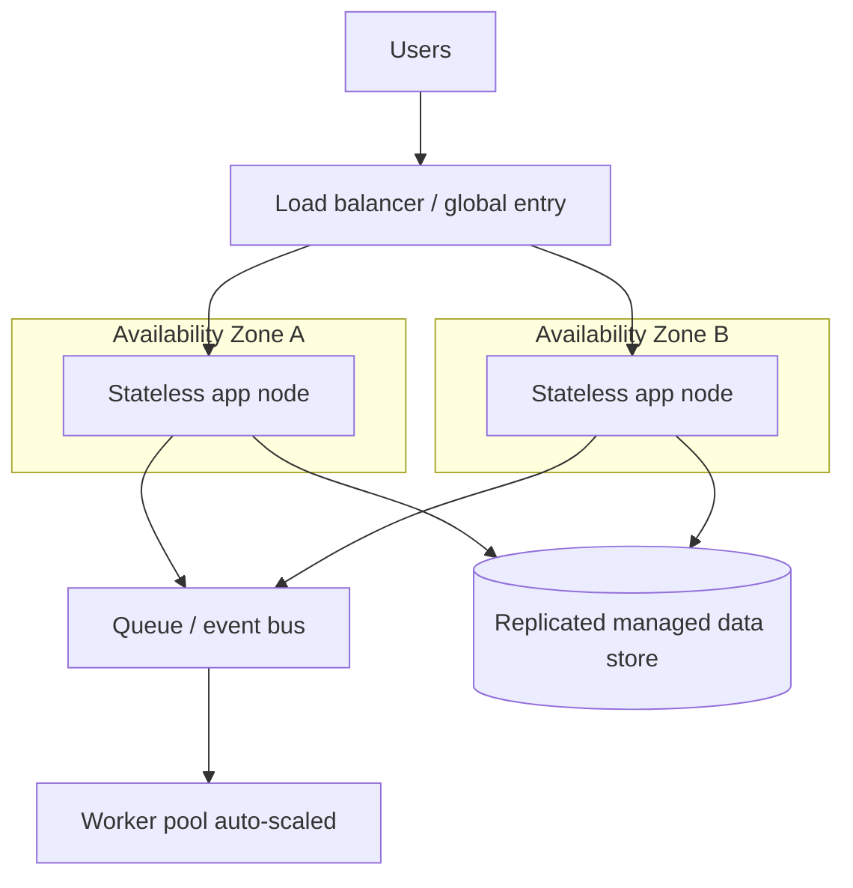

# Cloud Architecture Patterns

Designing *for* the cloud is not the same as running old designs *on* the cloud. The
cloud gives you elastic, API-driven, commodity infrastructure that fails routinely and
is billed by the second. Good cloud architecture leans into those properties: it treats
individual machines as disposable, scales horizontally on demand, and assumes any
component can vanish at any moment. The classic distillation of these ideas is the AWS
[Well-Architected Framework](aws-well-architected-framework.md), whose pillars have close
analogues at GCP (Architecture Framework) and Azure (Well-Architected Framework).

## The pillars

A useful way to organize architectural thinking is a set of orthogonal concerns you
trade off against each other:

| Pillar | Core question | Typical levers |
| --- | --- | --- |
| Operational excellence | Can we run and evolve this safely? | IaC, runbooks, observability, small reversible changes |
| Security | Is access and data protected? | Least-privilege IAM, encryption, network isolation — see [cloud-security-and-iam.md](cloud-security-and-iam.md) |
| Reliability | Does it survive failure and recover? | Multi-AZ, health checks, retries, backups |
| Performance efficiency | Are we using the right resources well? | Right-sizing, caching, managed services, the right compute model |
| Cost optimization | Are we paying only for value delivered? | See [cloud-cost-and-finops.md](cloud-cost-and-finops.md) |
| Sustainability | Are we minimizing energy/carbon footprint? | Higher utilization, efficient regions, demand shaping |

The pillars pull against each other on purpose. More reliability (extra regions, standby
capacity) costs more; more performance (larger instances) may hurt cost and
sustainability. Architecture is the act of choosing where on those curves a given
workload should sit.

## The load-bearing patterns

**Design for failure.** Werner Vogels' maxim — "everything fails all the time" — is the
starting point. Hardware, networks, and whole availability zones fail; the architecture,
not luck, must absorb it. This is the cloud face of
[fault tolerance](../distributed-systems/fault-tolerance-and-failure.md) and system
[resilience](../systems-thinking/resilience-and-robustness.md): assume partial failure as
the normal case and engineer graceful degradation, not perfect uptime.

**Statelessness.** Push session and application state out of compute nodes into shared
stores (DynamoDB/Cloud Firestore, Redis/ElastiCache/Memorystore, S3). A stateless tier
is interchangeable — any node can serve any request — which is what makes auto-scaling
and self-healing possible. Sticky sessions and local disk state are the enemy of
elasticity.

**Decoupling.** Insert queues and event buses (SQS, Amazon SNS/EventBridge, GCP
Pub/Sub, Azure Service Bus) between components so a slow or dead consumer creates
backpressure instead of a cascading failure. Loose coupling lets parts scale, deploy, and
fail independently.

**Elastic auto-scaling.** Match capacity to demand automatically (EC2 Auto Scaling
Groups, GCP Managed Instance Groups, Azure VM Scale Sets, or the serverless models in
[serverless-and-managed-services.md](serverless-and-managed-services.md)). Scaling *out*
(more small nodes) beats scaling *up* (one bigger node) because it improves both
availability and cost granularity.

**Redundancy across failure domains.** Spread replicas across multiple Availability
Zones for high availability, and across regions for disaster recovery. Multi-AZ is cheap
and nearly always warranted; multi-region is expensive and reserved for workloads whose
downtime cost justifies it.

Other recurring patterns: **caching** at every layer (CDN, in-memory, read replicas) to
cut latency and load; **circuit breakers, retries with exponential backoff and jitter,
and timeouts** to stop failures from propagating; **infrastructure as code** (CloudFormation/CDK,
Terraform, Bicep) so environments are reproducible and reviewable; and **immutable
deployments** where you replace nodes rather than patch them in place.

## Anti-patterns

- **Lift-and-shift without redesign** — moving a monolith onto one big VM inherits all
  the old single-point-of-failure problems and adds cloud egress bills.
- **Stateful compute** — sessions or files on local disk that block scaling and lose data
  when a node dies.
- **Ignoring the network cost** — chatty cross-AZ or cross-region traffic and data egress
  quietly dominate the bill.
- **Snowflake servers** — hand-configured machines that can't be reproduced, defeating
  the disposability the cloud is built on.
- **Over-engineering for scale you don't have** — multi-region active-active for an
  internal tool is wasted cost and complexity. Right-size the ambition.

Kavis' *[Architecting the Cloud](kavis-architecting-the-cloud.md)* frames the central
mindset shift: stop protecting individual servers and start engineering the *system* to
be resilient in spite of them. These patterns are how [cloud-native and Kubernetes](cloud-native-and-kubernetes.md)
workloads and disciplined [SRE](../devops-sre/site-reliability-engineering.md) practice
both express that mindset in concrete infrastructure.

## References

Concept note synthesized from the cloud-computing body of knowledge; see the anchor
works [The AWS Well-Architected Framework](aws-well-architected-framework.md) and
[Architecting the Cloud (Kavis)](kavis-architecting-the-cloud.md).
