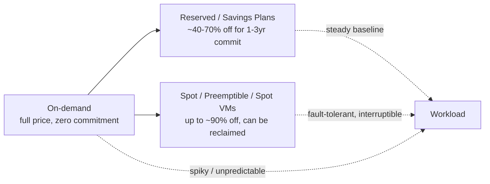

# Cloud Cost and FinOps

The cloud's defining commercial trait is that infrastructure becomes an *operating*
expense billed by consumption rather than a *capital* expense paid up front. You trade a
large, fixed, hard-to-reverse purchase for a small, variable, elastic one. That is
powerful — you pay only for what you use and can turn resources off — but it also removes
the natural brake that a purchase order imposes. Every engineer with deploy access can
now increase the monthly bill, so cost becomes an engineering property, not just a
finance line item. This is the reasoning behind treating cost as its own concern; see
also [cloud-architecture-patterns.md](cloud-architecture-patterns.md) and the broader
[cost-management](../ai-business/cost-management.md) discipline.

## What you actually pay for

Cloud pricing is unbundled into many independent dimensions, and the surprises almost
always come from the dimensions people forget:

| Dimension | Billed on | Example | Gotcha |
| --- | --- | --- | --- |
| Compute | vCPU-seconds / instance-hours | EC2, Compute Engine, Azure VMs | Idle instances bill 24/7 |
| Storage | GB-month + operations | S3, GCS, Azure Blob | Data lingers and accumulates silently |
| Data transfer (egress) | GB leaving the provider/region/AZ | Internet egress, cross-AZ traffic | *Ingress is usually free; egress is not* |
| Requests / operations | Per API call, per invocation | Lambda invocations, S3 GET/PUT | High-frequency small ops add up |
| Managed-service premium | Per hour + throughput/capacity units | RDS, DynamoDB, managed Kafka | You pay for convenience over raw VMs |

**Egress is the classic trap.** Providers let data *in* for free but charge to send it
*out* — to the internet, and often between availability zones and regions. A chatty
multi-AZ design or a data pipeline that shuffles terabytes across regions can run up
transfer charges that dwarf the compute doing the work. This asymmetry is also a
deliberate lock-in mechanism: it is cheap to put data into a cloud and expensive to move
it out.

## Purchase models for compute

For a given workload you choose *how* you buy the same compute, trading commitment and
reliability for price:

- **On-demand** — pay list price, no commitment. Right for spiky or unknown demand.
- **Reserved instances / Savings Plans / Committed Use Discounts** — commit to a level of
  usage for one to three years in exchange for a large discount. Right for a stable
  baseline you are confident you'll run.
- **Spot / preemptible instances** — bid on spare capacity for up to ~90% off, but the
  provider can reclaim it with little warning. Right only for interruption-tolerant work
  (batch, CI, stateless [compute](compute-in-the-cloud.md) behind a queue).

The common pattern is to cover the predictable baseline with commitments, absorb spikes
with on-demand, and run fault-tolerant bulk work on spot.

## Why the bill comes in higher than expected

- **Idle and orphaned resources** — stopped-but-not-terminated instances, unattached
  disks, forgotten dev environments, old snapshots. Nothing reminds you they exist.
- **Egress and cross-AZ chatter** — invisible until the invoice.
- **Over-provisioning** — instances sized for peak load run at peak price all the time.
- **The convenience premium** — managed services trade money for operational simplicity;
  worth it, but real.
- **Sprawl** — self-service means resources proliferate faster than anyone tracks.

The cloud can be cheaper *or* far more expensive than on-prem; which one you get depends
almost entirely on utilization discipline.

## FinOps as a discipline

FinOps is the operating model that makes cost a shared, continuous engineering
responsibility rather than an after-the-fact finance audit. Its loop:

1. **Inform** — allocate spend to teams/products via tagging and cost dashboards so
   people can *see* what they cause.
2. **Optimize** — right-size, delete waste, buy the correct commitment mix, exploit spot.
3. **Operate** — set budgets, alerts, and governance so optimization sticks and drift is
   caught early.

The cultural core is *unit economics*: track cost per meaningful unit (per customer, per
request, per model inference) rather than a raw monthly total, so cost is judged against
value delivered — the same framing used in [cost-management](../ai-business/cost-management.md)
and the wider [ai-business](../ai-business/index.md) view. Which [service model](cloud-service-models.md)
you choose (IaaS vs. PaaS vs. serverless) reshapes the cost curve entirely, so cost
belongs in the architecture conversation from the start.

## References

Concept note synthesized from the cloud-computing body of knowledge; anchor works
[The AWS Well-Architected Framework](aws-well-architected-framework.md) (cost
optimization pillar) and [Architecting the Cloud (Kavis)](kavis-architecting-the-cloud.md).
