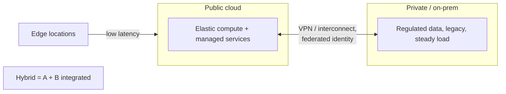

# Cloud Deployment Models

Where a [service model](cloud-service-models.md) asks *how much does the
provider manage*, a **deployment model** asks *who owns the infrastructure and
where does it physically live*. These are orthogonal axes: you can run IaaS in a
private cloud or consume SaaS over the public internet. The main models are
**public**, **private**, **hybrid**, and **multi-cloud**, with **edge** as a
placement variant. This deepens the intro in
[../networking/cloud-computing.md](../networking/cloud-computing.md).

## The models

### Public cloud
Shared, provider-owned infrastructure rented on demand over the internet —
[AWS, GCP, Azure](the-major-cloud-providers.md). You get elasticity,
pay-as-you-go economics, and a global footprint with zero capital outlay. The
tradeoff is that you're a tenant on multi-tenant hardware, subject to the
provider's pricing, regions, and outage timelines. This is the default for
new workloads.

### Private cloud
Cloud-style self-service and elasticity, but on infrastructure dedicated to a
single organization — either on-prem in your own datacenter (e.g. **OpenStack**,
**VMware**) or single-tenant hardware hosted by a provider. Chosen for
regulatory, data-residency, latency, or control reasons. You regain control and
predictability but reabsorb capacity planning, capital cost, and the operational
burden the public cloud removes. Note "private cloud" ≠ "on-prem servers":
the *cloud* part is the API-driven, elastic, self-service operating model.

### Hybrid cloud
A deliberate, integrated mix of public and private (or on-prem), with workloads
placed where they fit best and a network/identity fabric spanning both. Common
patterns: keep regulated data on-prem while bursting compute to public cloud
("cloud bursting"); run steady-state load privately and spiky load publicly;
migrate incrementally rather than all at once. Provider offerings that stretch
the public cloud into your datacenter — **AWS Outposts**, **Azure Arc/Stack**,
**Google Anthos/Distributed Cloud** — exist to make hybrid coherent.

### Multi-cloud
Using more than one public provider at once — for resilience, to avoid lock-in,
to use each provider's best-of-breed service, or for negotiating leverage. The
cost is real: teams must master multiple control planes, and the "portable"
lowest-common-denominator services are often the weakest ones. The pragmatic
middle ground is a **portable substrate** ([Kubernetes](cloud-native-and-kubernetes.md),
open formats) with provider-specific managed services used where the payoff
justifies the coupling.

## On-prem vs. cloud

The underlying decision is **capex vs. opex** and **control vs. leverage**.
On-prem means owning hardware: high upfront capital, fixed capacity, full
control, and a team to run it. Cloud means renting: no capital, elastic
capacity, provider leverage, and a monthly bill that grows with usage and can
surprise you ([cloud-cost-and-finops.md](cloud-cost-and-finops.md)). Cloud wins
for variable/uncertain demand and speed-to-launch; on-prem can win for large,
stable, predictable load where amortized hardware beats years of rent, or where
regulation forbids third-party custody.

## Edge

**Edge** pushes compute and data toward the physical location of users or
devices — CDN points of presence, telco edge, on-device — to cut latency and
backhaul. Examples: **CloudFront / Lambda@Edge**, **Cloudflare Workers**,
**GCP/Azure edge zones**. It's a placement strategy layered onto any deployment
model, and it connects to CDN concepts in
[../networking/hosting-and-deployment.md](../networking/hosting-and-deployment.md).

## Vendor lock-in and portability

Lock-in is the switching cost accumulated by depending on a provider's
proprietary services, APIs, and data formats. It exists on a gradient:

| Layer | Lock-in | Notes |
|-------|---------|-------|
| Raw VMs / containers | Low | Portable across providers |
| Kubernetes | Low–medium | Portable substrate, but managed control planes differ |
| Object storage | Medium | S3 API is a near-standard, but egress fees bite |
| Managed databases | Medium–high | Migration is real work |
| Proprietary serverless / AI / analytics | High | Deepest coupling, biggest productivity gain |

Lock-in is not automatically bad — it's a trade of switching cost for
productivity. The engineering discipline is to **couple deliberately**: accept
deep coupling where a managed service delivers outsized value, and stay portable
where the value is thin. Data-egress fees are the quiet enforcer of lock-in, so
model them early. Provisioning infrastructure through
[../devops-sre/infrastructure-as-code.md](../devops-sre/infrastructure-as-code.md)
keeps the environment reproducible and eases (though never eliminates) a future
move.

## References

Synthesized Concept note. Anchored in the deployment-model taxonomy of
[erl-cloud-computing-concepts.md](erl-cloud-computing-concepts.md) and the
hybrid/portability guidance in
[kavis-architecting-the-cloud.md](kavis-architecting-the-cloud.md).
