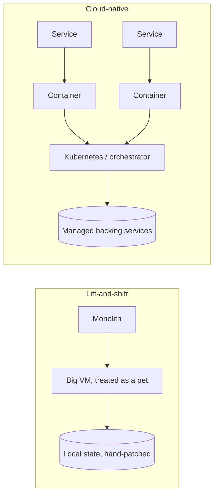

# Cloud-Native and Kubernetes

"Cloud-native" describes software **designed for the cloud from the start**, rather
than software moved *to* the cloud. The distinction matters: you can run a
traditional monolith on a cloud VM and gain almost none of the cloud's real
advantages — elasticity, self-healing, painless deploys — because the application
was never built to exploit them. Cloud-native is the set of architectural choices
that make those advantages available. It is the applied philosophy behind
[Cloud-Native Patterns (Davis)](cloud-native-patterns-davis.md), and it leans on
[compute in the cloud](compute-in-the-cloud.md) and the container tooling in
[Docker](../devops-sre/docker.md) and
[Kubernetes](../devops-sre/kubernetes.md).

## Lift-and-shift vs. cloud-native

**Lift-and-shift** (rehosting) takes an existing app and runs it unchanged on
cloud infrastructure. It's fast and low-risk, but the VM is still a "pet" —
long-lived, hand-configured, painful to replace. **Cloud-native** rebuilds around
disposable, horizontally-scalable units. The tell is how a server is treated:
cloud-native treats servers as **cattle, not pets** — interchangeable and
replaceable — which is only possible once the pillars below are in place.

## The pillars

### Containers

A [container](../linux/containers-and-namespaces.md) packages an application with
its dependencies into one immutable, portable artifact that runs identically
everywhere. Built with [Docker](../devops-sre/docker.md), containers are the unit
of deployment because they start in milliseconds, pack densely onto hosts, and
erase "works on my machine" drift. They are the foundation everything else builds
on.

### Orchestration with Kubernetes

Running a handful of containers by hand is manageable; running thousands across a
fleet is not. **[Kubernetes](../devops-sre/kubernetes.md)** is the de facto
orchestrator: you declare the *desired state* — "run five replicas of this
container, expose it on this port, keep it healthy" — and Kubernetes continuously
reconciles reality toward that declaration, rescheduling failed containers,
scaling replicas, and rolling out new versions. Every major provider offers a
managed control plane: AWS **EKS**, GCP **GKE**, Azure **AKS**. This
**declarative, self-healing** model is the operational core of cloud-native.

### Microservices

Cloud-native systems tend to decompose the monolith into
**microservices** — small, independently deployable services owning one capability
each, communicating over the network. The payoff is independent scaling and
independent release; the cost is genuine distributed-systems complexity — network
failure, partial outages, eventual consistency. That complexity is not free, and
much of the [distributed systems](../distributed-systems/index.md) body of
knowledge exists precisely to manage it. Microservices are an option cloud-native
*enables*, not a mandate.

### The Twelve-Factor App

The [Twelve-Factor App](../distributed-systems/twelve-factor-app.md) is the
methodology that makes an application container- and orchestrator-friendly. Its
most load-bearing rules for cloud-native: keep processes **stateless** (state lives
in backing services), store **config in the environment** (not baked into the
image), treat **backing services as attached resources** (swap a local database
for a managed one by changing a URL), and treat **logs as event streams** the
platform captures. A twelve-factor app is one an orchestrator can start, stop,
replicate, and move without ceremony.

### Immutable infrastructure

Rather than logging into a running server to patch or configure it (**mutable**
infrastructure, which drifts unpredictably), cloud-native builds a new immutable
image, deploys it, and discards the old one. Nothing is changed in place. This
eliminates configuration drift, makes rollbacks trivial (redeploy the previous
image), and is the reason containers and
[infrastructure as code](../devops-sre/infrastructure-as-code.md) fit together so
naturally — the whole environment is a version-controlled artifact.

### GitOps

**GitOps** extends [infrastructure as
code](../devops-sre/infrastructure-as-code.md) to operations: a Git repository is
the single source of truth for the *entire* desired state — application manifests,
infrastructure, and configuration — and an automated agent (Argo CD, Flux)
continuously reconciles the live cluster to match what's committed. Deployments
become pull requests; the audit trail is the Git history; rollback is `git
revert`. It closes the loop, making the declarative model span not just what runs
but how it gets there.

## Why it matters

Cloud-native is what turns "we're on the cloud" into the elasticity, resilience,
and deploy velocity that justify the cloud's cost and complexity. Its pillars
reinforce each other: containers make immutability practical, immutability makes
orchestration reliable, orchestration makes microservices operable, twelve-factor
discipline makes all of it stateless and movable, and GitOps ties the whole thing
to version control. Skipping the discipline — lifting a stateful monolith into a
container and calling it cloud-native — inherits the complexity of the model
without its benefits. This is the through-line of
[Cloud-Native Patterns (Davis)](cloud-native-patterns-davis.md) and the
[Well-Architected Framework](aws-well-architected-framework.md)'s operational and
reliability pillars.

## References

- [Cloud-Native Patterns (Davis)](cloud-native-patterns-davis.md)
- [AWS Well-Architected Framework](aws-well-architected-framework.md)
- [Kubernetes](../devops-sre/kubernetes.md)
- [Docker](../devops-sre/docker.md)
- [The Twelve-Factor App](../distributed-systems/twelve-factor-app.md)
- [Containers and Namespaces](../linux/containers-and-namespaces.md)
