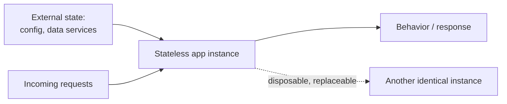

# Cloud Native Patterns

Cornelia Davis's *Cloud Native Patterns* (Manning) is a guide to *designing applications*
for the cloud — as distinct from operating cloud infrastructure. Its thesis is that the
dynamic, distributed, virtualized environment of the cloud is not just a new place to run
the same old software; it is an environment that actively works against assumptions that
traditional applications quietly depend on (stable hosts, durable local state, reliable
networks). Software that thrives there has to be built differently, and the book supplies
the mental model, patterns, and practices that set cloud-native applications apart.

## The core mental model

Davis reframes an application as a **function of state**: the running instance should hold
no important state of its own but instead derive its behavior from state supplied to it
(configuration, requests, backing services). Once state lives outside the process, the
process itself becomes disposable — it can be created, destroyed, replicated, and
relocated freely, which is precisely what a cloud platform needs in order to schedule,
scale, and heal workloads automatically.

## Central patterns and practices

- **Statelessness** — keep instances free of durable local state so any instance can serve
  any request and instances can be added or removed at will. This is what makes horizontal
  elasticity possible.
- **Redundancy and disposability** — assume every component can and will fail; run multiple
  interchangeable instances so the failure of one is a non-event rather than an outage.
- **Resilience patterns** — design for a hostile network: retries with backoff, timeouts,
  and circuit-breaking so that a slow or failing dependency degrades gracefully instead of
  cascading. Downstream failure is treated as the normal case, not the exception.
- **Externalized configuration** — configuration is injected into the app rather than baked
  in, so the same immutable artifact runs unchanged across environments.
- **Application lifecycle and coordination** — apps cooperate with the platform (health
  checks, graceful start/stop, service discovery) rather than assuming a fixed, hand-managed
  deployment.

## Why it anchors cloud-native practice

These patterns are exactly the properties a container orchestrator relies on: statelessness,
disposability, health-checked lifecycle, and externalized config are what let
[cloud-native-and-kubernetes](cloud-native-and-kubernetes.md) reschedule and scale pods
freely. The resilience patterns (retry, timeout, circuit breaker) are the application-level
complement to the infrastructure-level [cloud-architecture-patterns](cloud-architecture-patterns.md).
And because the book insists that operational concerns be designed into the application
rather than bolted on afterward, it aligns closely with the discipline in
[../devops-sre/index.md](../devops-sre/index.md).

## References

- [Cloud Native Patterns — Cornelia Davis (Manning)](https://www.manning.com/books/cloud-native-patterns)
