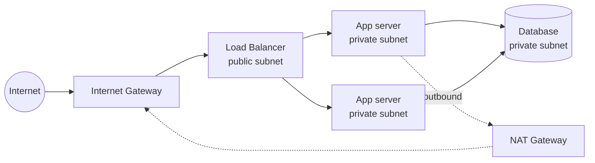

# Cloud Networking — VPCs, Security Groups, and the Edge

Cloud networking is the discipline of building a private, controllable network
*inside* someone else's shared physical infrastructure. The provider owns the
cables, routers, and datacenters; you get software-defined constructs — virtual
networks, subnets, firewalls, routing tables — that behave like the physical
network you'd otherwise cable together, but are created and destroyed with an API
call. It is where the general
[networking](../networking/index.md) fundamentals — [IP addressing and
routing](../networking/index.md), [DNS](../networking/dns.md),
[TLS](../networking/tls-ssl-and-certificates.md) — get re-expressed as cloud
primitives, and where a system's [security posture](cloud-security-and-iam.md) is
largely decided.

## The VPC: your private slice

The foundational construct is the **Virtual Private Cloud** (AWS **VPC**, GCP
**VPC**, Azure **Virtual Network / VNet**). A VPC is an isolated virtual network
you define with a private IP range (a CIDR block like `10.0.0.0/16`). Nothing in
your VPC is reachable from another tenant's VPC or the public internet unless you
deliberately open a path — isolation is the default.

Inside the VPC you carve **subnets**, each a slice of the CIDR range pinned to one
availability zone. The defining split is:

- **Public subnet** — has a route to an **internet gateway**, so resources in it
  can have public IPs and talk to the internet directly. Load balancers and
  bastion hosts live here.
- **Private subnet** — has *no* direct internet route. Application servers and
  databases live here, reaching the internet only *outbound* through a **NAT
  gateway** (which lets them fetch updates without being reachable from outside).

This public/private tiering is the workhorse pattern: expose a thin public edge,
keep everything of value in private subnets. It is the network expression of
defense in depth.

## Firewalls: security groups and NACLs

Two firewall layers control traffic:

- **Security groups** are **stateful** firewalls attached to individual resources
  (a VM, a load balancer). You write allow rules ("permit TCP 443 from anywhere,
  permit TCP 5432 from the app tier"); return traffic for an allowed connection is
  automatically permitted. There are no deny rules — anything not explicitly
  allowed is denied. A powerful idiom is referencing *another security group* as
  the source, so "the database accepts connections from the app tier" is expressed
  by identity rather than by IP range.
- **Network ACLs** are **stateless** rules applied at the subnet boundary, with
  both allow and deny, evaluated in order. They are a coarser, secondary layer.

Security groups are where most access control actually lives, and getting them
right is inseparable from [cloud security and IAM](cloud-security-and-iam.md).

## Load balancers

A **load balancer** is the managed front door that spreads traffic across a pool
of backends, health-checks them, and removes the unhealthy ones — the mechanism
behind horizontal scaling and zero-downtime deploys. Providers offer them at
different layers of the [OSI model](../networking/index.md):

- **Layer 7 (application)** — HTTP-aware, can route by path or host, terminate
  [TLS](../networking/tls-ssl-and-certificates.md), and do sticky sessions. AWS
  **ALB**, GCP **HTTPS LB**, Azure **Application Gateway**.
- **Layer 4 (network)** — raw TCP/UDP, extremely high throughput, preserves client
  IP. AWS **NLB**, GCP **Network LB**, Azure **Load Balancer**.

Terminating TLS at the load balancer centralizes certificate management and
offloads crypto from the backends — see [TLS/SSL and
certificates](../networking/tls-ssl-and-certificates.md).

## DNS and the edge

[DNS](../networking/dns.md) in the cloud (AWS **Route 53**, GCP **Cloud DNS**,
Azure **DNS**) does more than name resolution: it becomes a **traffic-routing
tool**. Latency-based, geolocation, and weighted routing policies steer each user
to the nearest or healthiest endpoint, and DNS-level health checks drive failover
between regions.

A **CDN** (content delivery network — AWS **CloudFront**, GCP **Cloud CDN**,
Azure **Front Door**, Cloudflare) pushes cached content to **edge locations**
physically close to users, cutting latency and shielding the origin from load. The
CDN is the outermost tier of the network and often the first place TLS terminates
and WAF/DDoS protection is applied.

## The private/public boundary and PrivateLink

The most important design question is repeatedly *what is exposed to the public
internet*. Cloud providers give tools to keep traffic off the internet entirely:

- **VPC endpoints / PrivateLink** let a resource reach a managed service (S3, a
  database, a partner's API) over the provider's private backbone, so the traffic
  never traverses the public internet and no public IP is needed.
- **VPC peering** and **Transit Gateway / VNet peering** privately connect VPCs to
  each other; **Direct Connect / Cloud Interconnect / ExpressRoute** give a private
  physical link back to an on-premises datacenter for a
  [hybrid deployment](cloud-deployment-models.md).

Keeping traffic on private paths reduces both latency and attack surface, and
avoids the internet-egress charges that dominate many cloud bills — a recurring
theme in [cloud cost and FinOps](cloud-cost-and-finops.md).

## Why it matters

The network topology *is* the security boundary and a large share of the
performance and cost profile. A flat network with everything public is the classic
cloud breach vector; a well-segmented VPC with private subnets, tight security
groups, and private service links is the difference between a contained incident
and a headline. This is the "security" and "performance efficiency" pillars of the
[Well-Architected Framework](aws-well-architected-framework.md) made concrete.

## References

- [AWS Well-Architected Framework](aws-well-architected-framework.md)
- [Networking (field index)](../networking/index.md)
- [DNS](../networking/dns.md)
- [TLS/SSL and Certificates](../networking/tls-ssl-and-certificates.md)
