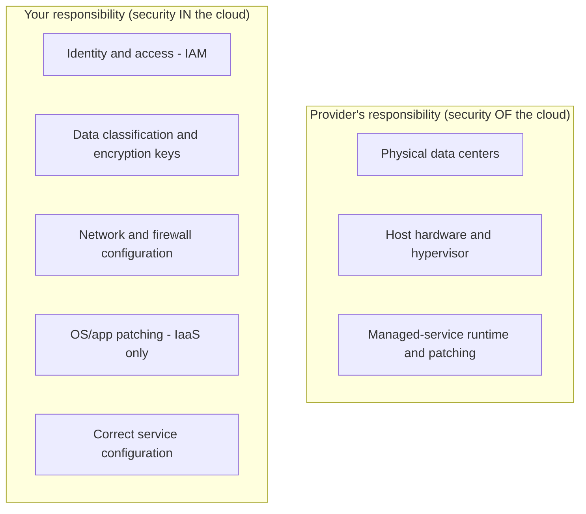

# Cloud Security and IAM

Cloud security starts from a single organizing question: *who is responsible for what?*
The provider secures the infrastructure it operates; you secure everything you put on top
of it. Most real-world cloud breaches are not exotic exploits of the provider — they are
customer misconfigurations on the customer's side of that line. Cloud security is
therefore mostly the disciplined application of familiar
[security](../security/index.md) principles — least privilege, defense in depth,
encryption — expressed through the provider's identity and configuration surfaces.

## The shared-responsibility model

The dividing line moves depending on which [service model](cloud-service-models.md) you
use. The more managed the service, the more the provider covers and the less you do — but
identity, data, and access configuration are *always* yours.

On IaaS you also own guest-OS hardening and patching — the same
[OS-level protection](../operating-systems/os-security-and-protection.md) concerns as any
server. On PaaS and serverless the provider absorbs the OS, but you still own identity,
data, and configuration. Misreading this line — assuming the provider "handles security"
— is the root cause of a large share of incidents.

## Identity and Access Management (IAM)

IAM is the control plane of the cloud and the single most important thing to get right.
Its building blocks are consistent across providers even where the names differ:

- **Principals / identities** — users, groups, and (crucially) *workload* identities:
  IAM roles (AWS), service accounts (GCP), managed identities (Azure).
- **Policies** — declarative rules stating which principal may perform which action on
  which resource, under which conditions.
- **Roles** — bundles of permissions that a principal *assumes* temporarily, yielding
  short-lived credentials instead of long-lived keys.

The governing principle is **least privilege**: grant the minimum permissions needed and
nothing more. In practice this means preferring roles over static access keys, scoping
policies to specific resources and actions rather than wildcards (`Action: "*"` on
`Resource: "*"` is the canonical dangerous grant), and letting compute assume a role
rather than embedding credentials in code. Least privilege is also the load-bearing
control for the [architecture patterns](cloud-architecture-patterns.md) and
[networking](cloud-networking.md) discussed elsewhere — a decoupled, well-segmented system
is only safe if each part can touch only what it must.

## The other pillars of cloud security

**Secrets management.** Credentials, API keys, and certificates belong in a dedicated
store — AWS Secrets Manager / SSM Parameter Store, GCP Secret Manager, Azure Key Vault —
not in source code, container images, or environment files committed to git. Rotate them,
and prefer role-derived short-lived credentials to standing secrets wherever possible.

**Encryption.** Encrypt data **at rest** (server-side encryption on S3/GCS/Blob, encrypted
EBS/persistent disks, TDE on managed databases) and **in transit** (TLS everywhere,
including internal service-to-service traffic). Key management services (KMS, Cloud KMS,
Key Vault) let you control and audit the keys; customer-managed keys give more control at
the cost of more operational burden.

**Network isolation.** Put resources in private subnets inside a virtual network (VPC /
VNet), expose only what must be public, and control traffic with security groups, network
ACLs, and firewall rules — the concrete mechanics live in
[cloud-networking.md](cloud-networking.md). Private endpoints keep traffic to managed
services off the public internet entirely.

## How cloud breaches actually happen

| Pattern | What goes wrong | Prevention |
| --- | --- | --- |
| Public storage buckets | S3/GCS/Blob left world-readable, exposing data | Block public access by default; audit ACLs |
| Over-broad IAM | Wildcard policies, long-lived admin keys, unused permissions | Least privilege, roles, access reviews |
| Leaked credentials | Keys committed to git or baked into images | Secrets manager, key rotation, secret scanning |
| Exposed management ports | SSH/RDP/databases open to `0.0.0.0/0` | Private subnets, bastion/SSM, tight firewall rules |
| Missing encryption | Unencrypted volumes, plaintext internal traffic | Default-on encryption, enforced TLS |

The through-line: the provider gives you strong primitives, but they are safe only when
configured correctly and audited continuously. Treat every default-open setting as a
liability, review access regularly, and assume that misconfiguration — not a novel
exploit — is your most likely path to a breach.

## References

Concept note synthesized from the cloud-computing body of knowledge; anchor works
[The AWS Well-Architected Framework](aws-well-architected-framework.md) (security pillar)
and [Architecting the Cloud (Kavis)](kavis-architecting-the-cloud.md).
