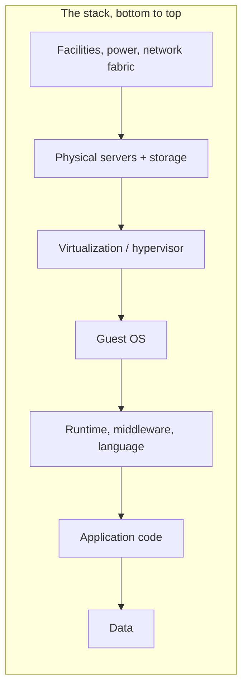

# Cloud Service Models

A **cloud service model** answers one question: *where does the boundary sit
between what you operate and what the provider operates?* The higher up the
stack you buy, the more the provider manages and the less control (and less
undifferentiated toil) you keep. The classic three-layer framing — **IaaS**,
**PaaS**, **SaaS** — is a spectrum of that boundary, with **FaaS/serverless**
sitting between PaaS and SaaS. This note goes deeper than the one-note intro in
[../networking/cloud-computing.md](../networking/cloud-computing.md); read that
first for the economic framing (elasticity, pay-as-you-go, capex→opex).

## The stack and where the line moves

The abstraction stack — from the physical building up to the running
application — is the fixed reference frame. Each model draws the "you vs.
provider" line at a different height.

| Layer | On-prem | IaaS | PaaS | FaaS | SaaS |
|-------|:-------:|:----:|:----:|:----:|:----:|
| Facilities / hardware / hypervisor | You | **Provider** | **Provider** | **Provider** | **Provider** |
| Guest OS | You | You | **Provider** | **Provider** | **Provider** |
| Runtime / middleware | You | You | **Provider** | **Provider** | **Provider** |
| Scaling / capacity | You | You (autoscale config) | **Provider** | **Provider (to zero)** | **Provider** |
| Application code | You | You | You | You (functions only) | **Provider** |
| Data / config | You | You | You | You | You (your tenant) |

The pattern: as you move right, rows flip from "You" to "Provider" from the
bottom up. What never flips is **your data and your access configuration** —
that stays your responsibility in every model, which is the crux of the
[shared-responsibility model](#the-responsibility-shift) below.

## The "pizza as a service" analogy

The durable teaching analogy maps the models to how you get a pizza dinner:

- **On-prem — made at home.** You buy the dough, oven, gas, table. Total
  control, total labor.
- **IaaS — take-and-bake.** The store supplies the raw pizza (kitchen,
  ingredients = the virtualized hardware); you still bring it home, bake it in
  your oven, and set your table (OS, runtime, app).
- **PaaS — delivery.** The pizza is cooked and delivered (facilities, oven,
  cooking = OS + runtime); you supply the table, drinks, and dining room
  (your application and data).
- **SaaS — dining out.** You just show up and eat. The restaurant owns
  everything; you consume the finished experience.

FaaS is the "food court" variant of delivery: you don't even keep the kitchen
warm — the oven fires up only when you order and shuts off the moment you're
done.

## The four models

### IaaS — Infrastructure as a Service
Raw compute, storage, and network primitives above the hypervisor. You pick the
VM size, patch the OS, install the runtime, and wire the network. Maximum
control and portability; maximum operational burden. Examples: **AWS EC2 +
EBS + VPC**, **GCP Compute Engine + Persistent Disk**, **Azure Virtual
Machines + Managed Disks**. See [compute-in-the-cloud.md](compute-in-the-cloud.md)
and [../operating-systems/virtualization-and-containers.md](../operating-systems/virtualization-and-containers.md)
for the virtualization underneath.

### PaaS — Platform as a Service
You deploy code; the provider runs the OS, runtime, scaling, and often the
database and build pipeline. You lose knob-level control but shed most ops.
Examples: **AWS Elastic Beanstalk / App Runner**, **GCP App Engine / Cloud
Run**, **Azure App Service**. This is the managed-platform path in
[../networking/hosting-and-deployment.md](../networking/hosting-and-deployment.md).

### FaaS / serverless — Function as a Service
The provider runs individual functions on demand, scaling to zero when idle and
billing per invocation. There is still a server — you just never provision,
patch, or scale it. Examples: **AWS Lambda**, **GCP Cloud Functions**, **Azure
Functions**. It excels at event-driven and spiky workloads and struggles with
long-running, stateful, or latency-sensitive ones. Deep dive:
[serverless-and-managed-services.md](serverless-and-managed-services.md).

### SaaS — Software as a Service
A finished application delivered over the web. You configure it and put your
data in it; you operate nothing. Examples: Gmail/Google Workspace, Salesforce,
Microsoft 365, Slack.

## The responsibility shift

As you climb the stack, operational *and* security responsibility shift to the
provider — but never entirely. This is the **shared-responsibility model**: the
provider secures the cloud (facilities, hypervisor, managed-service internals);
you secure what you put in it (data, identities, access policy, and — on IaaS —
OS patches and app code). The dividing line rises as you go IaaS → PaaS → FaaS →
SaaS, but the "your data and your IAM policy" row never crosses it.
Misjudging where the line sits is a leading cause of breaches. Full treatment:
[cloud-security-and-iam.md](cloud-security-and-iam.md).

The choice of model interacts with the [deployment model](cloud-deployment-models.md)
(public/private/hybrid) — they are orthogonal axes: you can run IaaS in a
private cloud or consume SaaS over the public internet.

## Choosing a model

The heuristic: **buy the highest layer that still gives you the control you
genuinely need.** Every layer you operate yourself is undifferentiated heavy
lifting unless it's a source of competitive advantage. Reach for IaaS only when
PaaS/serverless can't meet a real constraint (specialized OS, licensing,
latency, cost at scale). This mirrors the "managed services first" bias in the
operational-excellence and cost pillars of
[aws-well-architected-framework.md](aws-well-architected-framework.md).

## References

Synthesized Concept note. Anchored in the service-model taxonomy of
[erl-cloud-computing-concepts.md](erl-cloud-computing-concepts.md) and the
managed-services guidance in [kavis-architecting-the-cloud.md](kavis-architecting-the-cloud.md).
