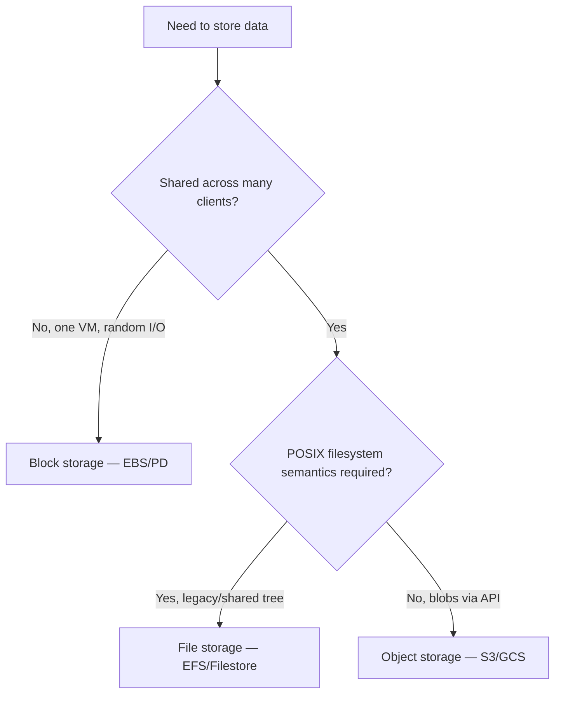

# Cloud Storage — Object, Block, and File

Storage is where the cloud most obviously replaces something a datacenter used to
own outright — the disk array, the SAN, the NAS filer. A cloud provider exposes
these as three distinct services, each with its own access model, consistency
guarantees, and price curve. Choosing the wrong one is a common and expensive
mistake, so the first thing to understand is that **object, block, and file
storage are not interchangeable**: they answer different questions about *how* data
is addressed and *who* mounts it. This note sits under the broader
[cloud service models](cloud-service-models.md) picture and pairs closely with
[compute in the cloud](compute-in-the-cloud.md), since almost every compute
resource needs one or more of these attached.

## The three kinds

| | Addressed by | Mounted by | Shape of data | Canonical service |
|---|---|---|---|---|
| **Object** | a key (flat namespace, in a bucket) | HTTP API (not a filesystem) | whole immutable blobs | S3, GCS, Azure Blob |
| **Block** | block offsets on a virtual disk | one VM at a time (usually) | raw device you format | EBS, Persistent Disk, Managed Disks |
| **File** | POSIX path | many clients over NFS/SMB | shared hierarchical tree | EFS, Filestore, Azure Files |

The mental shortcut: **block is a disk, file is a share, object is a bucket of
blobs behind an API.**

## Object storage and the S3 model

Object storage is the signature cloud primitive, and Amazon **S3** defined its
shape. The model is deliberately minimal:

- A **bucket** is a globally named container. Its name lives in a flat, global
  namespace — a fact that matters for both routing and security.
- An **object** is a blob of bytes plus metadata, addressed by a **key** (a
  string like `logs/2026/07/14/app.json`). The `/` characters are pure
  convention — there are no real directories, just a flat key space that tools
  *present* as folders.
- You read and write over an **HTTP API** (`GET`, `PUT`, `DELETE`), not a
  filesystem call. There is no seek, no partial in-place edit — an object is
  replaced wholesale.

This flat, API-first design is what lets object storage scale to trillions of
objects and effectively unbounded capacity: there is no directory tree to lock,
split, or rebalance, so the service can shard the key space freely. It is the
architectural cousin of the partitioned key-value stores described in
[Designing Data-Intensive Applications](../distributed-systems/designing-data-intensive-applications.md).

### Durability, availability, and consistency

Providers advertise object storage as **11 nines of durability**
(99.999999999%), meaning the odds of losing a given object in a year are
vanishingly small. They achieve this by transparently replicating or
erasure-coding every object across multiple facilities within a region. Note the
distinction the [CAP theorem](../distributed-systems/cap-theorem.md) draws:
**durability** (the data won't be lost) is not the same as **availability** (you
can reach it right now) — a service can promise very high durability while still
having brief availability dips, which is why availability carries a separately
stated, lower SLA.

For years S3 offered only **eventual consistency** for overwrites and listings —
a freshly written object might not appear immediately, a classic distributed-
systems tradeoff. As of 2020 S3 provides **strong read-after-write consistency**
for all operations, so a successful `PUT` is immediately visible on the next
`GET`. This is worth knowing because a great deal of older code and folklore
still assumes eventual consistency; see the treatment of
[consistency models](../distributed-systems/consistency-models.md).

## Block storage

Block storage hands a VM a **raw virtual disk**. The guest OS sees a block device,
formats it with a real filesystem (ext4, XFS, NTFS), and uses it exactly like a
local SSD — random reads and writes, in-place edits, seek. This is what backs a
database's data directory or a boot volume, precisely because those workloads
need low-latency random I/O that object storage cannot give.

The tradeoffs are the disk's tradeoffs made elastic: you pick a **volume type**
(general-purpose SSD, provisioned-IOPS SSD, throughput-optimized HDD) trading
performance for cost, and you can grow or snapshot volumes on demand. A volume is
normally **attached to one instance at a time** — it is not a sharing mechanism.
Examples: AWS **EBS**, GCP **Persistent Disk**, Azure **Managed Disks**.

## File storage

File storage is a **managed network filesystem** — an NFS or SMB share the cloud
operates for you. Unlike a block volume, **many clients can mount it at once** and
see the same POSIX tree, which is exactly what legacy applications and shared
content workloads expect. You trade the raw performance of a local block device
for the convenience of a shared, elastic, hierarchical namespace. Examples: AWS
**EFS** (NFS) and **FSx** (Windows/Lustre), GCP **Filestore**, Azure **Files**.

## Choosing between them

Rules of thumb: a **database or boot disk** wants block; a **lift-and-shift app
expecting a shared drive** wants file; **everything else** — backups, media,
static site assets, data-lake input, logs, ML datasets — wants object, because it
is the cheapest per gigabyte and the most scalable.

## Data lifecycle and archival

Object storage's cost model is a tiered ladder, and managing where data sits on
that ladder is a core [FinOps](cloud-cost-and-finops.md) discipline. Hot tiers
(S3 Standard) cost more per gigabyte but are cheap to read; cold and archive tiers
(S3 Glacier, GCS Coldline/Archive, Azure Archive) cost a fraction to store but
charge — sometimes with a retrieval delay of minutes to hours — to read back.

The lever is a **lifecycle policy**: a rule that automatically transitions objects
to colder tiers as they age (e.g. *Standard → Infrequent Access at 30 days →
Glacier at 90 → delete at 7 years*). This turns retention and compliance
requirements into declarative, cost-optimizing configuration rather than a cron
job, and it is exactly the kind of operational excellence the
[AWS Well-Architected Framework](aws-well-architected-framework.md) urges.
Companion features — **versioning** (keep prior copies of an overwritten key),
**object lock** (WORM immutability for compliance), and **cross-region
replication** — round out the durability and governance story.

## Why it matters

Storage decisions are stickier than compute decisions: data has gravity, egress is
expensive, and migrating terabytes between services or providers is slow and
costly. Picking the right storage class up front — and letting lifecycle policy
manage it over time — is one of the highest-leverage architecture choices in a
cloud system, touching cost, performance, durability, and lock-in all at once.

## References

- [AWS Well-Architected Framework](aws-well-architected-framework.md)
- [Cloud-Native Patterns (Davis)](cloud-native-patterns-davis.md)
- [Designing Data-Intensive Applications](../distributed-systems/designing-data-intensive-applications.md)
