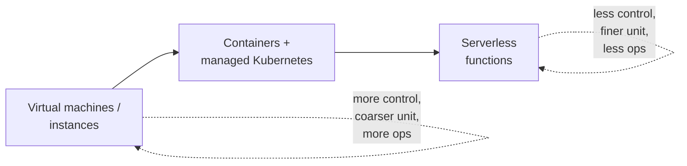

# Compute in the Cloud

**Compute** is the rented CPU/memory that runs your code. Cloud compute is best
understood as a spectrum from "a whole rented machine you operate" to "a
function that runs for 50 milliseconds when an event arrives" — trading control
and granularity for operational burden as you move along it. This note deepens
the compute primitive introduced in
[../networking/cloud-computing.md](../networking/cloud-computing.md).

## The compute spectrum

### Virtual machines / instances
The base unit: a virtualized server ([../operating-systems/virtualization-and-containers.md](../operating-systems/virtualization-and-containers.md))
with a chosen CPU/memory/GPU shape and OS. You own everything above the
hypervisor — this is IaaS ([cloud-service-models.md](cloud-service-models.md)).
Instance *families* target workload profiles (general-purpose, compute-, memory-,
GPU-, storage-optimized). Examples: **AWS EC2**, **GCP Compute Engine**, **Azure
Virtual Machines**. Coarse-grained, maximally flexible, maximally your problem
to operate.

### Containers and managed Kubernetes
Containers package an app with its dependencies and start in milliseconds,
packing many workloads onto fewer VMs. At scale, an orchestrator schedules and
heals them; the managed offerings are **AWS EKS**, **GCP GKE**, **Azure AKS**,
plus lighter container-runners like **AWS ECS/Fargate** and **Cloud Run**. This
is the sweet spot for most modern services. Deep dive:
[cloud-native-and-kubernetes.md](cloud-native-and-kubernetes.md).

### Serverless functions
The finest grain: deploy a function, the platform runs it per event and scales
to zero when idle. You never see the server. Best for event-driven and spiky
work; weak for long-running or stateful jobs. Deep dive:
[serverless-and-managed-services.md](serverless-and-managed-services.md).

## Elasticity and autoscaling

The defining property of cloud compute is **elasticity** — capacity that grows
and shrinks with demand, so you provision for *current* load rather than *peak*.
Autoscaling implements it:

- **Horizontal scaling (scale out/in):** add or remove instances/containers.
  The cloud-preferred axis — it's how you get both elasticity and fault
  tolerance. Requires stateless or externalized-state workloads.
- **Vertical scaling (scale up/down):** resize an instance to bigger/smaller.
  Simpler but bounded by the largest machine and usually needs a restart.
- **Scale to zero:** serverless (and some container runners) drop to no running
  capacity when idle — you pay nothing between requests.

Autoscaling is driven by metrics (CPU, request rate, queue depth) or schedules,
and it's a load-bearing part of the reliability and cost pillars of
[aws-well-architected-framework.md](aws-well-architected-framework.md).
Designing workloads to scale horizontally is a core theme of
[kavis-architecting-the-cloud.md](kavis-architecting-the-cloud.md) and
[cloud-architecture-patterns.md](cloud-architecture-patterns.md).

## How compute is rented: pricing models

The same instance can cost wildly different amounts depending on how you buy it.
The three axes for VMs:

| Model | What you commit | Discount | Interruption risk | Fits |
|-------|-----------------|----------|-------------------|------|
| **On-demand** | Nothing | None (baseline) | None | Spiky, unpredictable, short-lived |
| **Reserved / committed** | 1–3 yr term (or spend) | ~30–70% | None | Steady, always-on baseline |
| **Spot / preemptible** | Nothing; bid on spare capacity | ~70–90% | Can be reclaimed with minutes' notice | Fault-tolerant, batch, stateless |

- **On-demand** — pay per second/hour, no commitment. The flexible default.
- **Reserved / Savings Plans / Committed Use** (AWS Reserved Instances & Savings
  Plans, GCP Committed Use Discounts, Azure Reservations) — commit to a term or
  spend level for a steep discount on baseline capacity.
- **Spot / Preemptible / Spot VMs** — rent the provider's idle capacity at a
  deep discount, accepting that it can be reclaimed on short notice. Ideal for
  interruptible, horizontally-scaled work (batch, CI, stateless web fleets,
  ML training with checkpointing).

The standard cost pattern: cover the steady baseline with reserved/committed
pricing, absorb spikes with on-demand, and run interruptible bulk work on spot.
Serverless sidesteps all of this with per-invocation billing. Modeling and
governing this mix is the subject of [cloud-cost-and-finops.md](cloud-cost-and-finops.md).

## Choosing a compute model

The heuristic mirrors [service-model selection](cloud-service-models.md): pick
the finest-grained, most-managed compute that fits the workload's shape.
Event-driven and spiky → serverless. Standard long-running services → managed
containers. Special constraints (specific OS, licensing, GPUs, sustained
high utilization, latency-sensitive) → VMs, often with reserved or spot pricing
to control cost.

## References

Synthesized Concept note. Anchored in the elasticity and compute treatment of
[erl-cloud-computing-concepts.md](erl-cloud-computing-concepts.md),
the scaling patterns in [kavis-architecting-the-cloud.md](kavis-architecting-the-cloud.md),
and the reliability/cost pillars of
[aws-well-architected-framework.md](aws-well-architected-framework.md).
