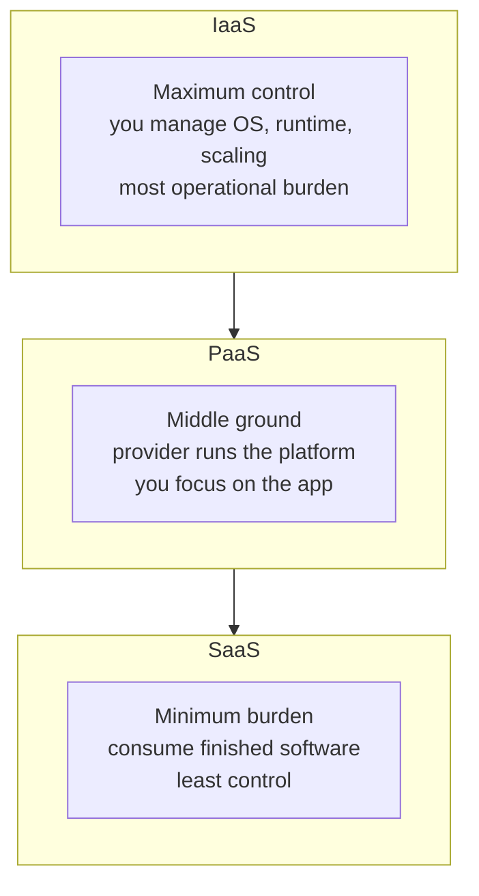

# Architecting the Cloud

Michael J. Kavis's *Architecting the Cloud: Design Decisions for Cloud Computing Service
Models (SaaS, PaaS, and IaaS)* (Wiley, 2014) is a practitioner's decision guide for teams
moving to the cloud. Its distinguishing move is to organize the whole subject around the
**choice of service model** — the single decision Kavis argues most shapes everything that
follows. Rather than surveying technology for its own sake, the book walks through the
architectural, operational, security, and business consequences of picking Infrastructure,
Platform, or Software as a Service for a given workload.

## The central decision

Each service model is a different division of responsibility between the provider and the
consumer, and each buys a different trade-off between control and convenience. Kavis frames
the choice explicitly so teams stop treating it as an afterthought:

More control (IaaS) means more responsibility for patching, scaling, availability, and
security; more convenience (SaaS) means ceding those levers to the provider. The right
answer is workload-dependent, and the book's chapters are essentially a checklist of the
dimensions along which that trade-off plays out. This is the applied companion to the
taxonomy in [cloud-service-models](cloud-service-models.md).

## What the book covers

- **Choosing a service model** — matching IaaS/PaaS/SaaS to the workload's needs for
  control, speed, and operational capacity.
- **Cross-cutting design decisions** — scalability and elasticity, high availability and
  disaster recovery, security and compliance, monitoring, and data considerations, each
  examined in terms of how the chosen service model changes the architect's options. These
  concerns map onto [cloud-architecture-patterns](cloud-architecture-patterns.md).
- **Auditing and governance** — how responsibility for security and compliance shifts with
  the service model, a theme that connects to
  [cloud-security-and-iam](cloud-security-and-iam.md).
- **Organizational and financial impact** — the operational and cost changes cloud adoption
  forces, so architecture decisions are made with their business consequences in view.

## Why it anchors cloud architecture

Kavis's contribution is to insist that cloud architecture *starts* with the service-model
decision and that every downstream concern — availability, security, cost, operations —
must be reasoned about relative to that choice. It is the design-decision layer that sits
between the vendor-neutral taxonomy of [cloud-service-models](cloud-service-models.md) and
the concrete building blocks of [cloud-architecture-patterns](cloud-architecture-patterns.md).

## References

- [Architecting the Cloud — Michael J. Kavis (Wiley)](https://www.wiley.com/en-us/Architecting+the+Cloud%3A+Design+Decisions+for+Cloud+Computing+Service+Models+%28SaaS%2C+PaaS%2C+and+IaaS%29-p-9781118617618)
