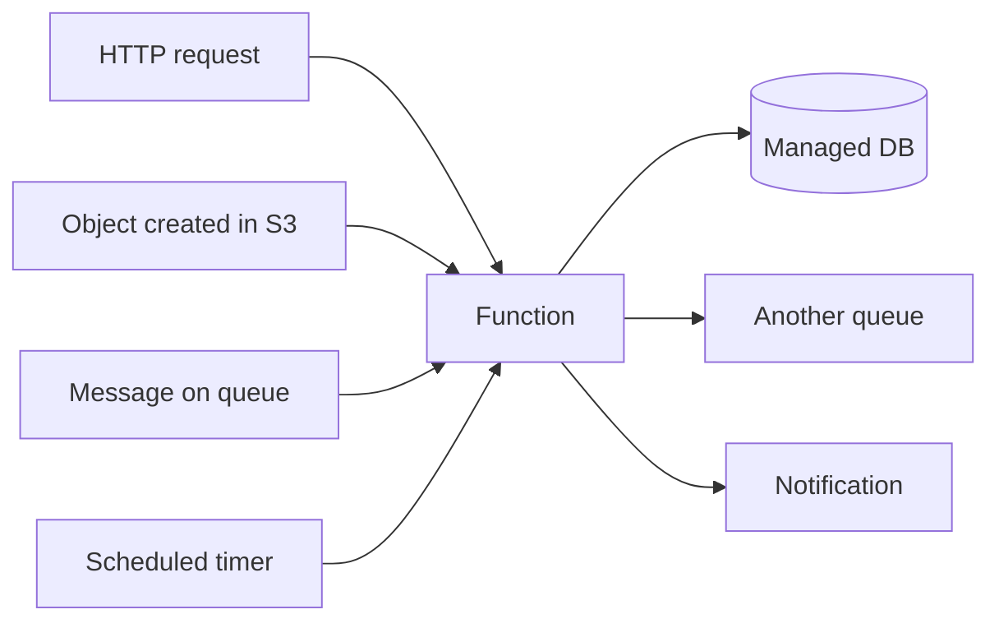

# Serverless and Managed Services

"Serverless" is a misnomer — there are still servers — but it names a real shift:
the provider runs, patches, scales, and heals the infrastructure, and you supply
only code or configuration. It sits at the far end of the
[cloud service models](cloud-service-models.md) spectrum, past IaaS and PaaS,
where you cede the most control in exchange for the least operational burden. It
is the natural counterpart to [compute in the cloud](compute-in-the-cloud.md):
where that note covers VMs and containers you still manage, this one covers the
resources you *don't*.

## Two overlapping ideas

The word covers two related things that are worth separating:

1. **Functions-as-a-Service (FaaS)** — you deploy a single function; the platform
   runs it in response to events, scales it from zero to thousands of concurrent
   invocations, and bills per invocation and per millisecond of execution. AWS
   **Lambda**, GCP **Cloud Functions** / **Cloud Run**, Azure **Functions**.
2. **Managed services** — a whole capability (a database, a queue, an auth system)
   run entirely by the provider. You use an API; you never touch a VM, patch an OS,
   or plan capacity. DynamoDB, S3, SQS, and Cognito are all "serverless" in this
   sense even though no function is involved.

The unifying property is **no server to manage and, ideally, scale-to-zero
economics** — you pay for use, not for idle capacity.

## FaaS and the event-driven model

FaaS is fundamentally **event-driven**: a function is a reaction to a trigger. The
trigger might be an HTTP request through an API gateway, a new object landing in
[object storage](cloud-storage.md), a message on a
[queue or stream](../distributed-systems/messaging-and-event-streaming.md), a
database change, or a scheduled timer. This makes FaaS a natural glue for
composing managed services into pipelines without standing up any long-running
process.

### Scale-to-zero and cold starts

The economic magic is **scale-to-zero**: when no events arrive, no instances run
and you pay nothing. When traffic spikes, the platform spins up instances
automatically. The cost of that elasticity is the **cold start** — the latency
penalty when the platform must initialize a fresh execution environment (load the
runtime, your code, and dependencies) before handling a request. Cold starts range
from tens of milliseconds to several seconds depending on runtime, package size,
and whether the function must attach to a VPC. Mitigations — provisioned
concurrency, lean packages, lighter runtimes — reduce but rarely eliminate the
effect, and they erode the pure pay-per-use economics.

## Trading control for operational burden

The central tradeoff, seen across both FaaS and managed services:

| You give up | You get |
|---|---|
| Control over runtime, OS, versions | No patching, no capacity planning |
| Predictable flat cost of always-on servers | Pay only for actual use |
| Freedom in language/library/long processes | Automatic scaling and high availability |
| Portability (provider-specific APIs) | Speed to build; less code to own |

This is the same bargain the [Well-Architected
Framework](aws-well-architected-framework.md) frames as operational excellence:
managed services shrink the surface you're responsible for. The
[cloud-native](cloud-native-and-kubernetes.md) philosophy embraces this — prefer a
managed queue over a self-hosted broker unless you have a strong reason not to.

## When serverless fits — and when it doesn't

**Good fits:**

- Spiky, unpredictable, or low-average traffic — you're not paying for idle.
- Event processing and glue — resize an image on upload, fan out a webhook.
- Rapid prototypes and internal tools where speed beats control.
- Bursty parallel work that scales out and back to zero.

**Poor fits:**

- **Steady high-volume load** — at constant heavy traffic, always-on containers or
  VMs are usually cheaper than per-invocation billing; the crossover point is a
  real [FinOps](cloud-cost-and-finops.md) calculation, not a given.
- **Latency-critical paths** where cold starts are unacceptable.
- **Long-running or stateful work** — FaaS enforces execution time limits and is
  stateless by design; state must live in an external managed store.
- **Specialized runtimes** — heavy ML inference or GPU work fits managed serving
  platforms (see [serving LLMs with vLLM and
  SkyPilot](../ai-platform/serving-llms-vllm-skypilot.md)) better than generic
  FaaS.
- **Deep portability requirements** — leaning on provider-specific event sources
  and APIs is the sharpest edge of vendor lock-in.

## Why it matters

Serverless and managed services are the fastest way to ship, and they push a
system's [reliability](aws-well-architected-framework.md) and scaling concerns onto
the provider — a good default for most teams most of the time. But the pricing
model inverts at scale, the statelessness forces an event-driven architecture, and
the convenience comes wrapped in lock-in. The engineering judgment is knowing where
on the [service-model spectrum](cloud-service-models.md) each workload belongs,
rather than treating serverless as either a silver bullet or a trap.

## References

- [AWS Well-Architected Framework](aws-well-architected-framework.md)
- [Cloud-Native Patterns (Davis)](cloud-native-patterns-davis.md)
- [Messaging and Event Streaming](../distributed-systems/messaging-and-event-streaming.md)
