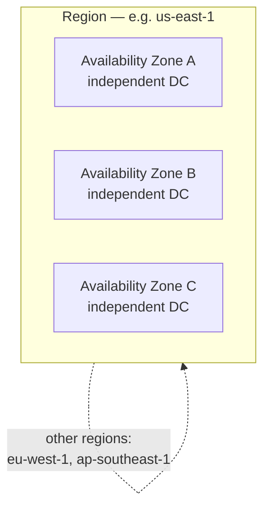

# The Major Cloud Providers

The public-cloud market is dominated by three **hyperscalers** — **Amazon Web
Services (AWS)**, **Microsoft Azure**, and **Google Cloud Platform (GCP)** —
with a long tail of second-tier and specialty clouds. The core primitives rhyme
across all of them (compute, storage, networking, managed databases), so the
skill is transferable; what differs is breadth, defaults, pricing, naming, and
design philosophy. This deepens the provider overview in
[../networking/cloud-computing.md](../networking/cloud-computing.md).

## The landscape

| Provider | Position | Roots / philosophy | Typical strength |
|----------|----------|--------------------|------------------|
| **AWS** | Market leader, largest by revenue and breadth | First mover (2006); "give builders primitives," widest service catalog | Depth and breadth of services; the default reference |
| **Azure** | Strong #2 | Microsoft enterprise + Windows/AD heritage; hybrid-first | Enterprise integration, identity (Entra/AD), hybrid (Arc/Stack) |
| **GCP** | #3, engineering-led | Google's internal infra (Borg → Kubernetes, Spanner, BigQuery) | Data/analytics, ML, Kubernetes, networking |

Beyond the big three:
- **Second tier:** Oracle Cloud (OCI), IBM Cloud, Alibaba Cloud (dominant in
  China), Tencent Cloud.
- **Developer-focused clouds:** DigitalOcean, Fly.io, Render, Vercel,
  Cloudflare — thinner catalogs, sharper developer experience, simpler pricing.

Market share sits roughly AWS > Azure > GCP, with Azure closing the gap on the
strength of enterprise bundling and AI. Exact numbers move, so treat them as
"AWS leads, Azure strong second, GCP third, the rest small" rather than fixed
figures.

## Design philosophies differ

The three big providers reflect their origins, and it shows in defaults:

- **AWS** hands you primitives and expects you to assemble them. Maximum
  flexibility, steeper assembly. Service names are idiosyncratic (EC2, S3, IAM,
  Lambda).
- **Azure** optimizes for existing Microsoft/enterprise shops — identity, hybrid,
  and Windows workloads are first-class, and it leans into integrated
  experiences.
- **GCP** exposes refined versions of Google's internal systems and tends to
  offer opinionated, high-abstraction managed services (Cloud Run, BigQuery,
  GKE) with strong networking.

Choosing among them weighs existing relationships (an Azure/Microsoft shop, a
Google Workspace org), the specific managed services you need, pricing for your
shape of workload, and team familiarity — set against
[vendor lock-in](cloud-deployment-models.md).

## Regions and availability zones

Every hyperscaler organizes capacity geographically, and the two-level model is
near-universal:

- A **region** is a geographic area you choose for **latency** to users,
  **data-residency** law, **service availability** (not every service is in
  every region), and **cost** (prices vary by region).
- An **availability zone (AZ)** is one or more isolated datacenters within a
  region with independent power, cooling, and networking. Spreading a workload
  across multiple AZs is the standard way to survive a single-datacenter
  failure; spreading across regions survives a regional one. This is the
  reliability pillar of [aws-well-architected-framework.md](aws-well-architected-framework.md)
  in practice — see [cloud-architecture-patterns.md](cloud-architecture-patterns.md).

Naming differs (AWS *Regions/AZs*, GCP *regions/zones*, Azure *regions* +
*availability zones*), and Google adds a global network backbone as a
distinguishing feature — but the mental model transfers.

## Reasoning about the service sprawl

Each provider offers 200+ services, which is overwhelming until you realize they
cluster into a small set of categories. Map any unfamiliar service onto these
buckets and it stops being noise:

| Category | AWS | GCP | Azure |
|----------|-----|-----|-------|
| Compute (VMs) | EC2 | Compute Engine | Virtual Machines |
| Containers / k8s | ECS, EKS, Fargate | GKE, Cloud Run | AKS, Container Apps |
| Serverless functions | Lambda | Cloud Functions | Azure Functions |
| Object storage | S3 | Cloud Storage | Blob Storage |
| Relational DB | RDS, Aurora | Cloud SQL, Spanner | Azure SQL, Cosmos DB |
| Networking | VPC | VPC | VNet |
| Identity | IAM | IAM | Entra ID + RBAC |

Deeper by category: [compute-in-the-cloud.md](compute-in-the-cloud.md),
[cloud-storage.md](cloud-storage.md), [cloud-networking.md](cloud-networking.md),
[serverless-and-managed-services.md](serverless-and-managed-services.md), and
[cloud-security-and-iam.md](cloud-security-and-iam.md). The pragmatic approach:
learn the primitives on one provider deeply, then translate — the concepts
port even when the names don't.

## References

Synthesized Concept note. Anchored in the provider-landscape and regional-model
material of [erl-cloud-computing-concepts.md](erl-cloud-computing-concepts.md),
the provider-selection guidance in
[kavis-architecting-the-cloud.md](kavis-architecting-the-cloud.md), and the
region/AZ reliability model of
[aws-well-architected-framework.md](aws-well-architected-framework.md).
