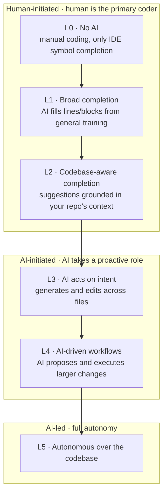

# The Code AI Maturity Model (Levels of Code AI)

Ado Kukic (Director of DevRel at Sourcegraph, makers of Cody) lays out
Sourcegraph's internal framework for **"levels of code AI"** — software that
builds software. The framing is deliberately modeled on the SAE levels of
vehicle autonomy: at each level the human hands off a little more, and the
machine takes on a little more. Context: 92% of developers now use AI coding
tools, up from ~1% a year prior, and Sourcegraph's CEO Quinn Slack predicts 99%
of code will be AI-written within five years.

## The six levels, in three categories

The levels split into three bands by **who initiates the work**: human-initiated,
AI-initiated, and AI-led.

- **Level 0 — No assistance.** The developer writes, tests, and debugs
  everything by hand; the only help is IDE symbol-name completion. The car is
  fully driven by the human.
- **Level 1 — Broad completion.** AI generates single lines or whole blocks from
  developer intent (e.g. write a function signature, get the body). It draws on
  training over millions of lines of open source — context is broad and general,
  not repo-specific. Analogy: cruise control / lane centering.
- **Level 2 — Codebase-aware completion.** The assistant has *specific* context
  about the repo it's working in, so completions reflect the libraries and
  conventions actually in use (e.g. knowing you use a particular HTTP client in a
  Node.js codebase). This is where Sourcegraph's Cody, with whole-codebase
  knowledge, positions itself.
- **Levels 3–5 (AI-initiated → AI-led).** AI moves from reacting to *initiating*:
  proposing and executing multi-file changes, then driving whole workflows, and
  finally operating with full autonomy over the codebase.

## Why the framing matters

The value of the model is as a shared vocabulary for where a team actually sits,
and as a ladder for what "next" looks like — echoing the same
assisted-to-autonomous progression seen in the [AI Codebase Maturity
Model](ai-codebase-maturity-model.md), [agentic maturity
models](agentic-maturity-models.md), and the [autonomy ladder](autonomy-ladder.md).
The recurring insight across all of them: moving up a level is gated less by the
model and more by the surrounding context and feedback loops.

## Related

- [Agentic maturity models](agentic-maturity-models.md)
- [Autonomy ladder](autonomy-ladder.md)
- [From coder to orchestrator](from-coder-to-orchestrator.md)

## References
- [The Code AI Maturity Model and What It Means For You: Ado Kukic — AI Engineer](https://www.youtube.com/watch?v=jpKCIVlS9wM)
