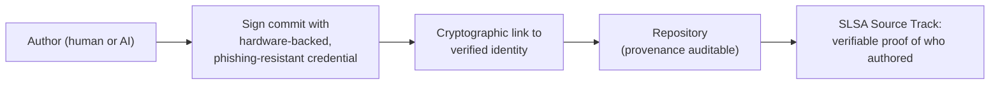

# Why Code Provenance Is Non-Negotiable in the Age of AI

Beyond Identity's argument: when you can no longer trust the *origin* of code, you
must be able to trust the *identity of the committer*. **Code provenance** — the
verifiable, auditable history of who wrote code, when, and how it changed — is the
answer. It's not about stopping AI; it's about **making AI accountable.** This is
the cryptographic/identity counterpart to the manual attribution practice in
[attributing LLM-derived code](attributing-llm-derived-code.md), and the general
principle in [AI code provenance](ai-code-provenance.md).

## The scale that broke manual review

AI coding assistants generate volume no human can vet line by line: reportedly
**41% of all code is AI-generated or AI-assisted**, **82% of developers** use AI
tools weekly, with ~25% of Google's and ~30% of Microsoft's code AI-written. The new
risk isn't only post-hoc vulnerabilities — it's **the commit itself**: the moment
unverified, potentially malicious code enters the repository. Software supply-chain
attacks are projected to cost organizations **$60B in 2025**; a major one
(SolarWinds-scale) can cost up to **11% of annual revenue**. (The
[litellm PyPI attack](litellm-pypi-supply-chain-attack.md) is a live example of code
entering an environment unverified.)

## Why Git and SSH are insufficient

The tools were built for human developers and **prove possession of a credential,
not the identity of the committer**:

- **Git's author field is spoofable.**
- **SSH keys prove possession, not identity** — a stolen key is indistinguishable
  from a legitimate developer.
- **No link to corporate identity** — no native connection between a commit and an
  IdP like Okta or Azure AD.

## The fix: shift the perimeter to identity

Every commit — human *or* AI — must be **cryptographically signed and tied to a
verified identity** with a hardware-backed, phishing-resistant credential. This is
the principle behind **SLSA** (Supply-chain Levels for Software Artifacts), a de
facto requirement for selling software to the U.S. government under **Executive
Order 14028**; SLSA's **Source Track** specifically requires verifiable proof of who
authored a change — which traditional Git/SSH tooling cannot provide. The perimeter
moves from the network to the individual identity, letting teams keep AI's speed
without sacrificing security.

## Related

- [AI code provenance](ai-code-provenance.md) — the general provenance principle.
- [Attributing LLM-derived code](attributing-llm-derived-code.md) — the manual, commit-level version of the same accountability.
- [litellm PyPI supply-chain attack](litellm-pypi-supply-chain-attack.md) — unverified code entering an environment.
- [Agent identity & access](agent-identity-access.md) — identity for the agents doing the committing.

## References
- [Why Is Code Provenance Non-Negotiable in the Age of AI? — Beyond Identity](https://www.beyondidentity.com/resource/why-is-code-provenance-non-negotiable-in-the-age-of-ai)
