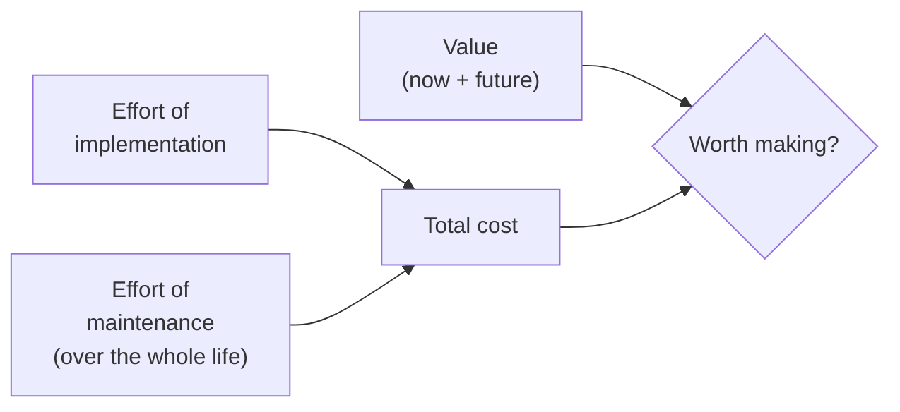

# Code Simplicity: The Fundamentals of Software

Max Kanat-Alexander (O'Reilly, first edition 2012). A short book that argues software
design should be treated as a **science** — a set of stateable laws and rules, not a
matter of opinion or personal style. Kanat-Alexander wrote it out of years of work on
the Bugzilla project, and it is deliberately language-agnostic: the claims are meant to
hold for any language, any project, indefinitely.

## The purpose of software

Everything in the book descends from one root fact: **the purpose of software is to help
people.** Not to be elegant, not to be clever, not to demonstrate technique — to help
people. Any design decision is judged against that goal. When you lose sight of it, you
start optimizing for things that don't matter, and the code gets worse for the people it
was supposed to serve.

A good programmer is defined by *understanding* — a bad programmer is simply one who
doesn't understand what they're doing. The core craft is **reducing complexity to
simplicity** so that other programmers (and future-you) can keep working on the system
without needing godlike comprehension of the whole thing at once.

## The Equation of Software Design

The central tool is a way to decide whether any given change is worth making. The
**value of a change** must be weighed against its **cost**, and cost has two parts:

$$\text{Desirability} = \frac{\text{Value now} + \text{Future value}}{\text{Effort of implementation} + \text{Effort of maintenance}}$$

In words: **the worth of a change is its value divided by the effort to implement it plus
the effort to maintain it.** The maintenance term is the one people forget. A change that
is cheap to write but expensive to keep alive for years can easily be a net loss. This
equation is why simplicity pays: simpler code lowers the *maintenance* denominator over
the whole life of the program, which is usually where most of the cost lives.

## The laws of change

Two related laws about how programs live over time:

- **The Law of Change:** *the longer your program exists, the more probable it is that
  any given piece of it will need to change.* Code is not written once and left alone;
  over a long enough life, nearly everything gets touched. So the design question is never
  "is this correct now" but "how easily can this be changed later."
- Because change is inevitable, the practical goal of design becomes **making the code
  easy to change** — a system's real quality is measured by how cheaply it accommodates
  the changes it will inevitably face.

## Defects and design

- **The Law of Defect Probability:** the chance you introduce a defect is proportional to
  the size of the change you make, measured in how much it alters the *behavior* of the
  system — not merely lines touched. Bigger behavioral changes carry more risk.
- Two supporting rules: **"If it ain't broken, don't fix it"** (don't rewrite working
  code just because you'd have written it differently — every change risks a defect), and
  **Don't Repeat Yourself** (duplication multiplies the places a future change must land,
  raising both maintenance cost and defect probability).

## Simplicity over complexity

Simplicity is the guiding principle, but the book is precise about it:

- **Simplicity is relative** — relative to the reader. Code is simple when it's simple
  *for the people who have to work on it.* More code, or a more advanced technology, can
  actually *increase* simplicity if it makes the system easier to understand and change.
- Simplicity shows up as **consistency, readability, good naming, and comments that
  explain a large block of code** — all in service of the next programmer understanding
  it fast.
- **Complexity compounds.** Every unnecessary piece of complexity makes the *next* piece
  of complexity easier to justify, and systems decay by accumulation. Guarding against
  complexity is a continuous discipline, not a one-time cleanup.
- **Simplicity requires design** — it doesn't happen by accident. You have to plan for it.

## The three flaws (the common ways design goes wrong)

Kanat-Alexander names the recurring mistakes that violate the equation:

1. **Writing code that isn't needed.** Building for imagined future requirements. If it
   isn't required now, the effort is pure cost — you pay implementation *and* maintenance
   for value that may never arrive.
2. **Not making the code easy to change.** Since change is a law, code that resists change
   fights the one certainty about its own future. This is the most expensive flaw over a
   program's life.
3. **Being too generic.** Over-abstraction and speculative flexibility. Solving problems
   you don't have adds complexity and maintenance burden today to serve a "someday" that
   often never comes. Handle the cases you actually have.

These map directly onto the discipline of writing the *minimum code that solves the
problem* — see [Learning the Craft](learning-the-craft.md) for the deliberate-practice
side of building that judgment.

## Incremental development and design

The book favors building in **small, verifiable steps** rather than big up-front designs
or big rewrites. Design incrementally: make the smallest change that moves you forward,
keep the system working at every step, and let the design evolve with real requirements
instead of guessed ones. Small steps keep defect probability low (small behavioral
change per step) and keep the maintenance term of the equation under control.

This is the same instinct behind disciplined refactoring — improving a design in small,
behavior-preserving moves — the subject of Martin Fowler's *Refactoring: Improving the
Design of Existing Code* — see [Refactoring](refactoring-improving-the-design-of-existing-code.md).

## References

- [Code Simplicity: The Fundamentals of Software — O'Reilly](https://www.oreilly.com/library/view/code-simplicity/9781449314750/)
