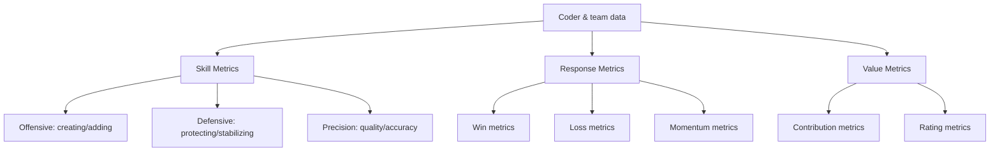

# Codermetrics

Jonathan Alexander's *Codermetrics: Analytics for Improving Software Teams*
(O'Reilly, 2011) borrows the mindset of baseball sabermetrics — Bill James and
the Michael Lewis *Moneyball* tradition — and asks whether the same statistical
thinking can help software managers understand their teams. The premise is that
coders and teams generate far more measurable signal than we usually capture, and
that a richer, more deliberate set of measures can make people more self-aware,
teams more cohesive, and hiring and reviews fairer.

The book is explicit that this is a *departure* from how metrics have historically
been used against developers. It is not another lines-of-code or bug-count
scorecard. It is a way of thinking about contribution, skill, and how a team fits
together.

## The core stance: measure to understand, not to rank or punish

The book's first principle is a warning against its own tools. Metrics are meant to
**shed light** — to reveal patterns, surface hidden contributors, and inform
conversation — not to grade people or manufacture a ranking to punish the bottom of.
"Metrics are not grades." The goal is insight into team dynamics, not a leaderboard.

Alexander stresses several habits that keep the practice honest:

- **Connect activities to goals.** A number only matters if it ties back to what the
  team is actually trying to achieve; measure outcomes, not just busyness.
- **Examine assumptions.** He devotes examples to (partially) debunking received
  wisdom like the "magic triangle" of scope/time/quality — data can contradict what
  everyone "knows."
- **Look for patterns, anomalies, and outliers**, peaks and valleys, ripple effects,
  and repeatable success — the interesting story is usually in the shape of the data
  over time, not a single value.
- **Understand the limits.** Some of what makes a coder valuable resists
  quantification; the conclusion of the book returns to how to handle the qualities
  that are hard to measure.
- **Fairness and consistency** in how data is gathered matter as much as the data
  itself, especially for the skeptic on the team who assumes metrics are a weapon.

This caution against misuse is the throughline. Used badly, these same numbers
become exactly the punitive, gameable scorecards the book is trying to replace.
The stance echoes the modern critique that single-dimension productivity metrics
mislead — see [The 8 Software Engineering Metrics AI Broke](software-engineering-metrics-ai-broke.md)
and the multi-dimensional DORA/SPACE view in
[Developer Productivity with Nicole Forsgren](developer-productivity-with-nicole-forsgren.md).

## The data and the questions it answers

Before defining metrics, the book asks what questions metrics can actually help with:

- How well do coders handle their **core responsibilities**?
- How much do they contribute **beyond** those responsibilities?
- How well do they **interact with others**?
- Is the **team as a whole** succeeding or failing?

The raw material comes from data on coder skills and contributions and from data on
how the software fares in the world — adoption, issues, and competition. A recurring
theme borrowed from sports is the role of **"spotters and stat sheets"**: someone has
to deliberately observe and record, because much of the useful signal is not captured
automatically.

## The three metric families

The heart of the book (Part II) is a reference catalog of derived metrics, grouped
into three families.

- **Skill Metrics** measure what a coder does and how well. They split into
  **Offensive** metrics (creating and adding — new features, forward progress),
  **Defensive** metrics (protecting and stabilizing — fixing, hardening, preventing
  regressions), and **Precision** metrics (accuracy and quality of the work). These
  roll up into skill scorecards, and the book observes how the profile differs for
  architects, senior coders, and junior coders.

- **Response Metrics** measure how the outside world reacts to the software:
  **Win** metrics (positive user response), **Loss** metrics (negative response,
  issues), and **Momentum** metrics (the trend/velocity of that response). These are
  discussed against different project types — consumer software, enterprise software,
  developer/IT tools, and cloud services — because a "win" looks different in each.

- **Value Metrics** highlight the overall value a coder brings to the team, via
  **Contribution** metrics and **Rating** metrics that combine signals into a
  higher-level view. The book maps these against team stages — early, growth, and
  mature — since value means different things at each.

The sports vocabulary is deliberate: it reframes measurement around *roles and
contribution* rather than raw output, which is the whole point.

## Building a metrics program

Part III is the practitioner's playbook — how to actually adopt this without it
blowing up. The rollout is incremental and consent-based:

1. **Find a sponsor** and **create a focus group** — don't impose it top-down.
2. **Choose a few trial metrics**, run a trial, and review the findings before going
   wider.
3. **Introduce metrics to the team** openly, and stand up a simple **storage system**.
4. **Expand** the set gradually and **establish a forum for discourse** so the numbers
   drive conversation rather than verdicts. (He cites a "seven percent rule" example —
   modest, realistic expectations for improvement.)

From there, metrics feed the development process: team meetings, **project
post-mortems**, and **mentoring**, plus setting team goals and rewards. The book is
careful about **performance reviews** — choose appropriate metrics, lean on
self-evaluation and peer feedback, use peer comparison cautiously, and orient toward
**goals for improvement** rather than judgment. Maturing the practice can mean a
"codermetrics council," dedicated analysis projects, or even hiring a "stats
person."

## Building teams with metrics

The final applied chapter uses metrics for team *composition*: set key goals,
identify constraints, find comparable team profiles, and build a target profile. It
then borrows sports roles wholesale — **playmakers and scorers, defensive stoppers,
utility players, role players, backups, motivators, veterans and rookies** — as a
language for the mix of people a team needs. Personnel practices follow the analogy
too: recruit for "comps," build a "farm system," make "trades," and coach the skills
you lack. The closing caution: there is **no such thing as a perfect team**.

## Why it still matters

The specific 2011 metrics are dated, but the framing endures: measure a *broad* set
of contributions (including teamwork and defense, not just feature output), use the
numbers to inform conversation and self-awareness, and never let them become grades.
That is the same lesson the AI-era productivity debate keeps rediscovering — see the
related notes above and [Software Development Metrics](software-development-metrics.md).

## References

- [Codermetrics: Analytics for Improving Software Teams — O'Reilly](https://www.oreilly.com/library/view/codermetrics/9781449313142/)
