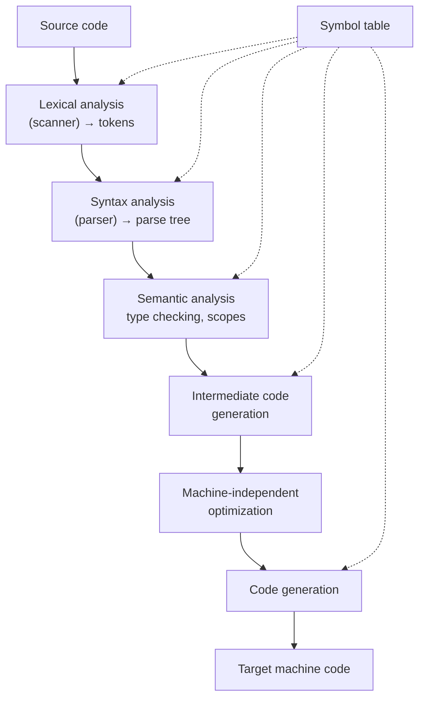

# Compilers: Principles, Techniques, and Tools (the Dragon Book)

By Alfred V. Aho, Monica S. Lam, Ravi Sethi, and Jeffrey D. Ullman (Pearson;
2nd ed. 2006). Universally known as **the Dragon Book** for the knight-and-dragon
cover, this is *the* canonical compilers text. It treats a compiler as a sequence
of well-defined transformations from source text to target machine code, and it
grounds each phase in the formal-language theory that makes the transformation
provably correct — which is why it sits astride both
[compilers-and-interpreters.md](compilers-and-interpreters.md) and
[theory-of-computation.md](theory-of-computation.md).

## The phases of a compiler

The book's structure *is* the compiler pipeline. It splits into a **front end** that
understands the source language and a **back end** that produces target code,
connected by an intermediate representation:

## Front end: from text to meaning

- **Lexical analysis.** The scanner groups characters into tokens. Its theory is
  exactly the **regular languages** and **finite automata** of
  [theory-of-computation.md](theory-of-computation.md): a lexer is a DFA, and tools
  like Lex/Flex compile regular expressions into one. This is where automata theory
  earns its keep in practice.
- **Syntax analysis (parsing).** The parser checks that the token stream conforms to
  the language's **context-free grammar** and builds a parse/syntax tree. The book
  develops top-down (recursive-descent, **LL**) and bottom-up (**LR**, LALR)
  parsing in depth — again, directly the context-free-language machinery (pushdown
  automata) from Sipser. Yacc/Bison generate LALR parsers from a grammar.
- **Semantic analysis.** Beyond grammar: type checking, scope resolution, and
  building the **symbol table**, using **syntax-directed translation** (attaching
  semantic rules to grammar productions) as the organizing technique.

## Middle and back end: from meaning to machine

- **Intermediate code generation.** Translate the checked program into a
  machine-independent IR (e.g. three-address code), decoupling the source language
  from the target machine so *m* languages and *n* targets need *m + n* pieces, not
  *m × n*.
- **Optimization.** Machine-independent improvements driven by **data-flow analysis**
  (reaching definitions, live variables, available expressions) and control-flow
  graphs — constant folding, common-subexpression elimination, dead-code removal,
  loop optimizations. The 2nd edition (Lam's contribution) substantially expanded
  advanced optimization, including for parallelism.
- **Code generation.** Instruction selection, **register allocation** (often via
  graph coloring), and instruction scheduling — the phase that must know the target
  ISA and its pipeline, connecting the book to
  [patterson-hennessy-computer-organization.md](patterson-hennessy-computer-organization.md).

## Interpreters and the deeper lesson

Though titled *Compilers*, the techniques generalize: an interpreter runs the front
end and then evaluates the IR directly instead of emitting machine code, and
just-in-time compilers blur the line entirely. The recurring lesson — one shared with
[sicp.md](sicp.md)'s metacircular evaluator — is that "compile" and "interpret" are
two implementation strategies for the same task of *giving meaning to a program*,
and the boundary between language, translator, and program is one the engineer draws.

## Why it belongs in this wiki

The Dragon Book is where formal-language theory becomes an engineering discipline. It
turns the automata and grammars of [theory-of-computation.md](theory-of-computation.md)
into working scanners and parsers, and it is the standard reference for anyone
building a compiler, interpreter, linter, or any tool that must understand code as
structure rather than text.

## References

- [Compilers: Principles, Techniques, and Tools (2nd ed.) — Aho, Lam, Sethi & Ullman](https://www.pearson.com/en-us/subject-catalog/p/compilers-principles-techniques-and-tools/P200000003472)
