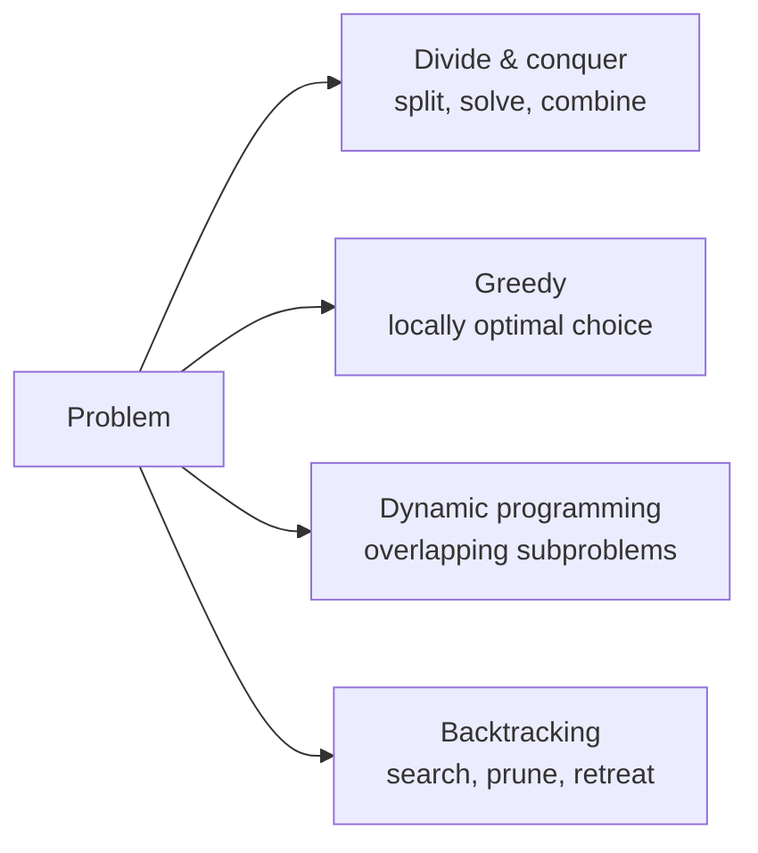

# Algorithms

An **algorithm** is a finite, unambiguous procedure that transforms an input into a
desired output. The discipline of algorithms is not a catalog of tricks but a small set of
reusable *design paradigms*, paired with the tools to prove an algorithm **correct** and to
analyze its **cost**. Whether a problem is even solvable is the domain of
[theory of computation](theory-of-computation.md); *how well* a solution scales is
[computational complexity](computational-complexity.md). Algorithms sit between them: given
a solvable problem, find a procedure that is both correct and efficient.

## Correctness and analysis

An algorithm is worthless if it is fast but wrong. Two standard tools establish
correctness:

- **Loop invariants** — a property true before the loop, preserved by each iteration, and
  strong enough at termination to imply the result. This is [mathematical
  induction](../math/discrete-mathematics.md) applied to iteration.
- **Recurrence relations** — for recursive algorithms, express the running time as a
  recurrence like $T(n) = 2T(n/2) + \Theta(n)$ and solve it (e.g. via the *master
  theorem*, which yields $\Theta(n\log n)$ here).

Cost is then reported in the asymptotic notation of
[computational complexity](computational-complexity.md): best, worst, and average case.

## The design paradigms

- **Divide and conquer** — split the input into independent subproblems, solve
  recursively, and combine. Merge sort, quicksort, and binary search follow this shape; the
  recurrence captures the cost. Works when subproblems *don't overlap*.
- **Greedy** — build a solution by repeatedly making the choice that looks best *right
  now*, never reconsidering. Fast and simple, but only correct when the problem has the
  *greedy-choice property* and *optimal substructure* — proven, not assumed. Dijkstra's
  shortest paths, Huffman coding, and minimum spanning trees (Kruskal, Prim) are greedy.
- **Dynamic programming (DP)** — for problems with *overlapping subproblems* and *optimal
  substructure*, solve each subproblem once and store the result (memoization or a bottom-up
  table), trading memory for time. Longest common subsequence, edit distance, and knapsack
  are classic DP. DP is essentially greedy's honest cousin: it *tries all relevant choices*
  instead of committing to one.
- **Backtracking** — systematically explore a tree of partial solutions, abandoning
  ("pruning") a branch as soon as it cannot lead to a valid answer. It powers constraint
  problems like $N$-queens, Sudoku, and satisfiability search. For NP-hard problems this is
  often the best available exact method, with worst-case exponential cost.

## Sorting and searching

Sorting is the canonical teaching ground because it exposes the trade-offs cleanly.
Comparison-based sorts (merge sort, quicksort, heapsort) are bounded below by
$\Omega(n\log n)$ — a lower bound *proven*, not merely observed — while non-comparison sorts
(counting, radix) beat it by exploiting structure in the keys. Searching a sorted array is
$O(\log n)$ by binary search; searching an unsorted one is $\Theta(n)$. The right
[data structure](data-structures.md) often decides the right algorithm: a hash table turns
search into $O(1)$ expected time, a balanced tree keeps it $O(\log n)$ *and* ordered.

## Graph algorithms

Graphs model networks, dependencies, and relationships, so their algorithms recur
everywhere. The staples:

- **Traversal** — breadth-first search (BFS) and depth-first search (DFS) visit every
  reachable vertex; DFS yields topological sort and cycle detection.
- **Shortest paths** — Dijkstra (non-negative weights), Bellman–Ford (handles negatives),
  Floyd–Warshall (all pairs, a DP).
- **Minimum spanning trees** — Kruskal and Prim, both greedy.
- **Flow and matching** — max-flow/min-cut (Ford–Fulkerson) and bipartite matching.

The underlying vocabulary — vertices, edges, connectivity, cycles — comes from
[graph theory](../math/graph-theory.md), and graph representations are themselves
[data structures](data-structures.md). Many graph optimizations that lack a
polynomial algorithm (e.g. TSP, graph coloring) are NP-hard, handing them to
[integer and combinatorial optimization](../linear-optimization/integer-and-combinatorial-optimization.md).

## Why it matters

Algorithmic thinking is the transferable core of computer science: recognizing which
paradigm fits a problem, and proving the result is correct and efficient, matters more than
memorizing any single algorithm. It underlies databases, networks, graphics, and the
training and inference loops of [machine learning](../ai/machine-learning.md). A better
algorithm routinely beats faster hardware, because it changes the *growth rate*, not the
constant.

## References

- [Introduction to Algorithms (CLRS)](introduction-to-algorithms.md) — the definitive reference on design, correctness proofs, and analysis.
- [Structure and Interpretation of Computer Programs (SICP)](sicp.md) — algorithms as processes, recursion, and orders of growth.
- [Introduction to the Theory of Computation (Sipser)](sipser-theory-of-computation.md) — the computability and complexity boundaries around what algorithms can achieve.
