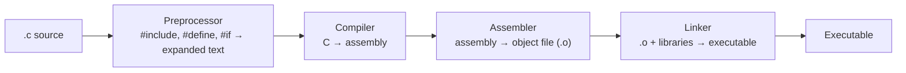

# The C Programming Language

C is a small, imperative systems language designed in the early 1970s by Dennis Ritchie
at Bell Labs, alongside — and in order to write — the UNIX operating system. Its
importance is out of all proportion to its size: C is the language nearly every other
language eventually *bottoms out in*. When Python, Ruby, or JavaScript needs to touch a
file, a socket, or the clock, the call travels down through a C runtime, through the C
standard library, into a system call. C is the systems *lingua franca* and the common
tongue in which higher-level runtimes speak to the operating system. This concept note
is anchored by [kernighan-ritchie-c-programming-language.md](kernighan-ritchie-c-programming-language.md).

## Design philosophy: small, close to the machine, trust the programmer

C's design can be read off three commitments:

- **Small.** The language proper is tiny — a handful of types, operators, and control
  structures, with almost everything else (I/O, strings, memory) pushed into a library
  rather than built into the syntax. This is the same "small core, powerful library"
  ethic as [../linux/unix-philosophy.md](../linux/unix-philosophy.md).
- **Close to the machine.** C's constructs map almost transparently onto hardware:
  variables are memory cells, pointers are addresses, arrays are contiguous bytes, and
  arithmetic mirrors the CPU's own. C is often called "portable assembly" — it abstracts
  over instruction sets without hiding the machine. This sits it right at
  [../electrical-engineering/hardware-software-boundary.md](../electrical-engineering/hardware-software-boundary.md).
- **Trust the programmer.** C omits guardrails other languages insist on — no bounds
  checking, no automatic memory management, no runtime type policing. The compiler
  assumes you know what you are doing. This is the source of both C's speed and its
  notorious bug classes. As an imperative, weakly-typed language it is the canonical
  example in [programming-languages-and-paradigms.md](programming-languages-and-paradigms.md).

## The C abstract machine

A C program is not defined against any particular CPU but against a hypothetical **C
abstract machine** described by the standard — a model with objects that have addresses,
lifetimes, and a sequenced order of side effects. The compiler's job is to produce real
machine code that behaves *as if* the abstract machine executed the program (the
"as-if" rule). This indirection is what lets an optimizing compiler reorder, cache, and
eliminate operations aggressively: as long as the observable behavior matches the
abstract machine, any transformation is legal. It also frames what **undefined behavior**
means (below): it is behavior the abstract machine does not define.

## The memory model: stack, heap, and pointers

C exposes memory almost directly, organized into regions with different lifetimes:

- **Stack** — automatic storage for local variables and call frames, allocated and freed
  by the call/return discipline. Fast, but bounded and scope-lived.
- **Heap** — dynamic storage the programmer requests explicitly with `malloc` and
  returns with `free`. Manual and unbounded (until exhaustion); the site of leaks,
  double-frees, and use-after-free bugs.
- **Static/global** — storage that lives for the whole program run.

A **pointer** is a first-class value holding a memory address; pointer arithmetic,
pointer-to-pointer, and pointers to functions all fall out of this. **Manual memory
management** — the programmer, not a garbage collector, decides when each allocation dies
— is C's defining and most dangerous feature. The [operating system](operating-systems.md)
supplies the virtual address space this model carves up; see
[../operating-systems/memory-management-and-virtual-memory.md](../operating-systems/memory-management-and-virtual-memory.md).

## The translation pipeline

Turning C source into a running program is a fixed sequence of stages, each a separate
tool in the classic UNIX toolchain:

- The **preprocessor** is a text substitution pass: it expands `#include`, `#define`
  macros, and conditional `#if` blocks *before* the compiler sees a single token.
- The **compiler** translates the preprocessed source to assembly for a target
  architecture — the phase covered in depth by
  [compilers-and-interpreters.md](compilers-and-interpreters.md).
- The **assembler** turns assembly into a relocatable object file of machine code.
- The **linker** stitches object files together with libraries, resolving symbol
  references, into a final executable. This whole chain — and what happens after the
  executable is handed to the OS — is traced in
  [../operating-systems/from-code-to-kernel.md](../operating-systems/from-code-to-kernel.md).

## The standard library (libc) as a thin layer over the OS

The C standard library — **libc** — provides the facilities the language proper omits:
`printf`/`scanf`, `malloc`/`free`, string functions, math. Crucially, for anything that
requires the operating system — opening a file, reading a socket, allocating pages — libc
is a **thin wrapper over the system-call interface**. A call like `fopen` or `write`
ultimately marshals arguments and executes a trap instruction that enters the kernel.
libc is the last piece of user-space code before the boundary; see
[../operating-systems/the-kernel-and-system-calls.md](../operating-systems/the-kernel-and-system-calls.md)
and, on Linux specifically, [../linux/the-linux-kernel.md](../linux/the-linux-kernel.md).

## Undefined behavior and why it exists

C's specification deliberately leaves some operations **undefined** — dereferencing a
null or dangling pointer, signed integer overflow, reading past an array's end, data
races. Undefined behavior (UB) is not a bug in the standard; it is a *design choice*.
Two motives:

1. **Portability without cost.** Different CPUs handle edge cases differently (overflow,
   alignment, byte order). By declaring these undefined rather than mandating one
   behavior, C lets a compiler emit the fastest correct code for each target instead of
   inserting checks to normalize the machine.
2. **Optimization freedom.** Because the compiler may *assume* UB never occurs, it can
   optimize aggressively (e.g. assume a pointer used in a dereference is non-null). The
   flip side is infamous: when UB *does* occur, the program may do anything at all, and
   the resulting security holes (buffer overruns, especially) are a large share of the
   industry's worst vulnerabilities — see [../security/index.md](../security/index.md).

UB is the price C pays for the "trust the programmer / close to the machine" bargain.

## Symbiosis with UNIX and the role as systems lingua franca

C and UNIX co-evolved: C was created to make the UNIX kernel portable, and UNIX's design
in turn shaped C's minimalism and its file/stream model (see
[../linux/everything-is-a-file.md](../linux/everything-is-a-file.md) and
[../linux/unix-philosophy.md](../linux/unix-philosophy.md)). Two consequences make C
inescapable:

- **The FFI substrate.** The stable *C ABI* (calling convention, struct layout, symbol
  linkage) is the interoperability standard between languages. When Python, Ruby, Rust,
  Go, or the JVM call into a native library, they do it through a **foreign function
  interface that speaks C**. C is the neutral meeting ground precisely because it adds no
  runtime of its own.
- **The syscall layer.** Every operating system's public interface is expressed in C
  headers and reached through libc. To ask the kernel for anything, a program eventually
  makes a C-shaped call — which is why "everything eventually speaks C to the OS," and
  why C is the language kernels, drivers, interpreters, and databases are still written
  in. The full descent is diagrammed in
  [../operating-systems/from-code-to-kernel.md](../operating-systems/from-code-to-kernel.md).

## Why it matters

C is the load-bearing layer of modern computing: the language of the kernel, the runtime
that higher-level languages sit on, and the ABI they interoperate through. Its bargain —
maximum control and speed in exchange for manual memory management and undefined behavior
— explains both its 50-year staying power and the entire safety-focused generation of
languages (Rust above all) built to keep C's performance while removing its footguns.

## References

- Anchored by [The C Programming Language (K&R)](kernighan-ritchie-c-programming-language.md),
  and drawing on the standard body of systems-programming knowledge (the C abstract
  machine, the ISO C standard, the C ABI and syscall interface).
