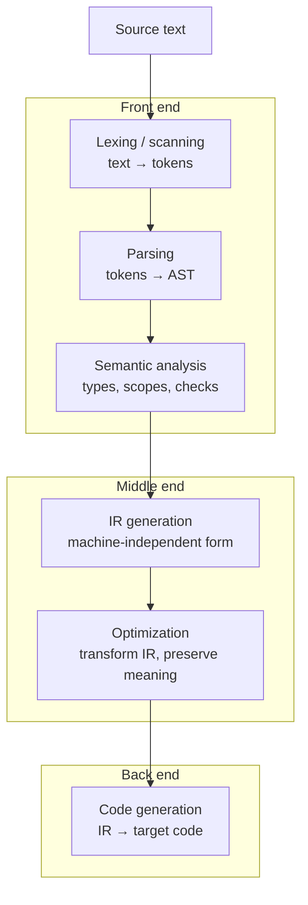

# Compilers and Interpreters

A compiler and an interpreter both answer the same question — *how does source code,
written for people, become behavior on a machine?* — with two different strategies.
A **compiler** translates a whole program from one language into another (usually a
lower-level one) ahead of time, producing an artifact that runs later. An
**interpreter** reads the program and directly executes its meaning, without
producing a separate target artifact. Both are just programs that take programs as
input, and — as [SICP](sicp.md) insists with its metacircular evaluator — the line
between "language," "interpreter," and "compiler" is one you draw, not one that is
given. The canonical reference is the Dragon Book,
[Compilers: Principles, Techniques, and Tools](aho-dragon-book-compilers.md).

## The translation pipeline

A classical compiler is organized as a pipeline of phases, conventionally split into
a **front end** (understand the source, language-specific), a **middle end**
(language- and machine-independent optimization), and a **back end** (emit code for a
target, machine-specific). This structure is what lets one front end target many
machines, and many front ends share one optimizer.

- **Lexing (scanning)** turns the raw character stream into a sequence of *tokens* —
  the words of the language (keywords, identifiers, literals, punctuation), with
  whitespace and comments discarded. Lexers are specified by **regular expressions**
  and implemented as **finite automata** — a direct application of the lowest rung of
  the formal-language hierarchy (see [theory-of-computation.md](theory-of-computation.md)).
- **Parsing** organizes the flat token stream into an **abstract syntax tree (AST)**,
  a structured representation of the program's grammatical form. Parsing is specified
  by a **context-free grammar** and implemented by pushdown-style parsers (recursive
  descent, LL, LR). The grammar/automaton correspondence is exactly the Chomsky
  hierarchy — regular languages for lexing, context-free for parsing.
- **Semantic analysis** checks the things grammar can't express: are names declared
  before use, do types match, is `break` inside a loop? This is where the
  [type system](programming-languages-and-paradigms.md) is enforced and a symbol
  table is built. The AST is often annotated or rewritten into a typed tree.
- **Intermediate representation (IR)** is a lower-level, regular form (three-address
  code, SSA, bytecode) that is easier to analyze and transform than source and not
  yet tied to a specific machine. It is the hinge of the pipeline.
- **Optimization** rewrites the IR to run faster or smaller while *preserving
  meaning* — constant folding, dead-code elimination, inlining, loop transformations,
  register allocation strategy. Correctness here means semantic equivalence, which is
  why formal semantics matters (see
  [programming-languages-and-paradigms.md](programming-languages-and-paradigms.md)).
- **Code generation** emits the target: machine code for a specific
  [architecture](computer-architecture.md), assembly, or bytecode for a virtual
  machine. This phase knows the target's instruction set, registers, and calling
  conventions.

## Compilers vs. interpreters vs. JIT

The three are points on a spectrum of *when* translation happens, not fundamentally
different technologies.

| | Translates when | Produces | Startup | Steady-state speed |
|---|---|---|---|---|
| Compiler (AOT) | before running | machine code / binary | slow build, fast start | fast |
| Interpreter | during running | nothing persistent | instant | slow (re-decodes each time) |
| JIT | during running, lazily | machine code, cached | fast start | fast once warm |

- A pure **interpreter** walks the AST or a bytecode stream and performs each
  operation as it encounters it. It is simple, portable, and gives instant startup
  and easy debugging, at the cost of re-interpreting the same code every time it runs.
- A pure **ahead-of-time compiler** does all translation before execution, so the
  running program is native code with no translation overhead — but you pay a build
  step and lose portability across machines.
- A **just-in-time (JIT)** compiler is the hybrid that dominates modern high-level
  runtimes (the JVM/HotSpot, V8 for JavaScript, .NET, PyPy). It starts by
  interpreting, profiles which code is *hot*, and compiles those paths to native code
  at runtime — even re-optimizing with runtime information a static compiler could
  never have (actual types seen, actual branch frequencies). This is why managed
  languages can approach C-level throughput on hot loops.

Many real toolchains combine everything: source compiles to bytecode ahead of time,
then a VM interprets it and JIT-compiles the hot parts.

## The connection to formal languages

Compilation is the practical home of the theory of formal languages. The two front-end
phases map cleanly onto the two lowest levels of the
[Chomsky hierarchy](theory-of-computation.md):

- **Regular languages** ↔ regular expressions ↔ finite automata ↔ **lexing**.
- **Context-free languages** ↔ context-free grammars ↔ pushdown automata ↔ **parsing**.

Everything a grammar cannot capture (declaration-before-use, type agreement) is
context-sensitive and gets pushed into semantic analysis. This is why compiler
construction is the textbook demonstration that
[theory of computation](theory-of-computation.md) is not abstract for its own sake —
it is the blueprint for building the tools that run every other program.

## Why it matters

Compilers and interpreters are the substrate under all software: they decide how fast
programs run, what errors are caught before shipping versus at runtime, and how a
language's abstractions are realized on real hardware. Understanding the pipeline
demystifies error messages (which phase produced them), performance (what the
optimizer can and can't do), and the design of languages themselves — the highest
form of abstraction in [SICP](sicp.md). For how the emitted code actually executes,
see [computer-architecture.md](computer-architecture.md); for the language design
choices the front end must honor, see
[programming-languages-and-paradigms.md](programming-languages-and-paradigms.md).

## References

- Anchored by [Compilers: Principles, Techniques, and Tools (the Dragon Book)](aho-dragon-book-compilers.md),
  with foundational ties to [SICP](sicp.md) and the formal-language theory in
  [theory-of-computation.md](theory-of-computation.md).
