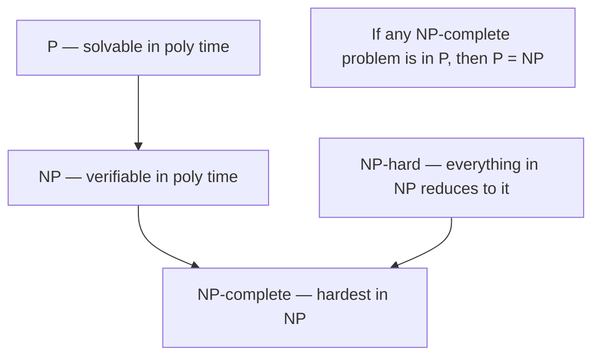

# Computational Complexity

Where [theory of computation](theory-of-computation.md) asks *what can be computed at
all*, complexity theory asks *what can be computed within a reasonable budget of time and
memory*. It measures the **resources** an algorithm consumes as a function of input size,
classifies problems by the resources any algorithm solving them must use, and — most
famously — tries to separate the problems we can solve efficiently from those we probably
cannot.

## Measuring cost asymptotically

We count *elementary operations* (or memory cells) as a function of input size $n$, then
discard constants and lower-order terms and keep the dominant growth rate. This is
**asymptotic analysis**, and it uses three bounds:

- **Big-O** — $f(n) = O(g(n))$: $g$ is an *upper* bound; $f$ grows no faster than $g$.
- **Big-Omega** — $f(n) = \Omega(g(n))$: a *lower* bound.
- **Big-Theta** — $f(n) = \Theta(g(n))$: a *tight* bound, both at once.

So binary search is $\Theta(\log n)$, a linear scan $\Theta(n)$, comparison sorting
$\Theta(n\log n)$, and a naive all-pairs check $\Theta(n^2)$. The point of ignoring
constants is portability: the ranking of growth rates holds across machines and languages,
which is why it is the shared vocabulary of [algorithms](algorithms.md) and
[data structures](data-structures.md). Analyzing these rates rests on the summations,
recurrences, and induction of [discrete mathematics](../math/discrete-mathematics.md).

## Time, space, and the shape of growth

**Time complexity** counts operations; **space complexity** counts memory. They trade off:
memoizing results (a [dynamic programming](algorithms.md) tactic) spends space to save
time. The qualitative cliff is between **polynomial** growth ($n$, $n^2$, $n^3$, …) and
**exponential** growth ($2^n$, $n!$). Polynomial algorithms scale to large inputs;
exponential ones hit a wall almost immediately — at $2^n$, adding a single element doubles
the work.

## The classes P and NP

- **P** — problems *decidable* in polynomial time by a deterministic algorithm. These are
  the ones we call **tractable**: sorting, shortest paths, linear programming, primality.
- **NP** — problems whose *proposed solutions can be verified* in polynomial time (equivalently,
  solved in polynomial time by a *nondeterministic* machine). Given a candidate, you can
  check it fast, even if finding it seems hard. Boolean satisfiability, the traveling
  salesman decision problem, and graph coloring live here.

Every problem in P is in NP (if you can *solve* it fast, you can *verify* fast by ignoring
the certificate). The open question is whether the containment is strict.

## Reductions and NP-completeness

A **polynomial-time reduction** transforms instances of problem $A$ into instances of
problem $B$ so that a fast solver for $B$ yields a fast solver for $A$ — capturing "$A$ is
no harder than $B$." A problem is **NP-hard** if *every* NP problem reduces to it, and
**NP-complete** if it is both NP-hard and itself in NP. NP-complete problems are the
*hardest* problems in NP: solve one in polynomial time and you solve them all.

The **Cook–Levin theorem** established SAT as the first NP-complete problem; Karp then
reduced SAT to 21 others, and thousands are now known. Practically, when a new problem is
shown NP-hard, that is strong evidence to *stop* hunting for an efficient exact algorithm
and instead reach for heuristics, approximation, or the machinery of
[integer and combinatorial optimization](../linear-optimization/integer-and-combinatorial-optimization.md),
whose hardest instances are exactly these NP-hard problems.

## The P vs NP question

Is **P = NP**? That is, does efficient *verification* imply efficient *solving*? It is the
central open problem of theoretical computer science and one of the Clay Millennium Prize
problems. The overwhelming consensus is **P ≠ NP** — that some problems are genuinely hard
to solve despite being easy to check — but no proof exists in either direction. The stakes
are enormous: P = NP would collapse much of modern cryptography (whose security assumes
certain problems are intractable) and make optimal solutions to countless planning and
[machine learning](../ai/machine-learning.md) problems suddenly cheap.

## Why it matters

Complexity theory tells you *in advance* whether to expect an exact efficient algorithm or
to settle for approximation. It grounds cryptography, sizes the ambitions of optimization
and AI, and turns "this is slow" into a precise, provable claim about a problem's inherent
difficulty rather than a comment on one implementation.

## References

- [Introduction to the Theory of Computation (Sipser)](sipser-theory-of-computation.md) — Part Three develops complexity classes, reductions, and NP-completeness.
- [Introduction to Algorithms (CLRS)](introduction-to-algorithms.md) — asymptotic notation and the NP-completeness chapter.
- [Structure and Interpretation of Computer Programs (SICP)](sicp.md) — orders of growth as a way to reason about program cost.
