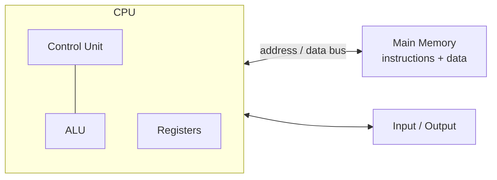
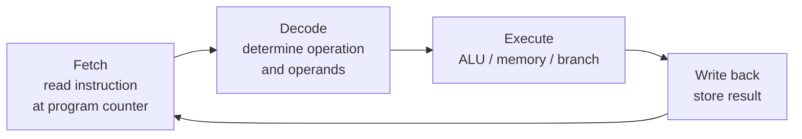

# Computer Architecture

Computer architecture is the study of how a machine is organized to execute
programs: what operations the hardware exposes to software, and how the physical
components are arranged so those operations run fast. It sits at the boundary
between the abstract instructions a compiler emits (see
[compilers-and-interpreters](compilers-and-interpreters.md)) and the transistors
that carry them out. The canonical text is
[Patterson & Hennessy](patterson-hennessy-computer-organization.md).

## The von Neumann model

Almost every general-purpose computer follows the **von Neumann architecture**:
a single memory holds *both* program instructions and data, and a processor
fetches instructions from that memory one after another. This is the
stored-program idea — code is just data the CPU happens to interpret as
commands, which is what makes a computer general-purpose rather than a fixed
appliance.

Its defining weakness is the **von Neumann bottleneck**: instructions and data
share one path to memory, so the processor can be starved waiting for that path.
Much of modern architecture is an effort to hide this bottleneck — which is why
caching and pipelining, below, dominate the design.

## Instruction set architecture (ISA)

The **ISA** is the contract between hardware and software: the set of
instructions the processor understands (arithmetic, load/store, branch), the
registers available, the addressing modes, and the data types. It is the stable
interface that lets one binary run on many chip implementations, and it lets
compiler writers target a machine without knowing its circuit-level details.

Two broad philosophies:

- **CISC** (Complex Instruction Set Computing, e.g. x86) — many rich
  instructions, some doing multi-step work in one opcode. Compact code, complex
  decoding.
- **RISC** (Reduced Instruction Set Computing, e.g. ARM, RISC-V) — a small set
  of simple, fixed-length instructions that each do little but pipeline cleanly.
  Simpler hardware, more instructions per program, but each runs fast.

Modern x86 chips are effectively RISC cores wearing a CISC front end: they
decode complex instructions into simpler internal micro-operations.

## The CPU: fetch–decode–execute

The processor runs a relentless loop, the **instruction cycle**:

A naive CPU does one full cycle before starting the next. Two techniques break
that serialization to gain enormous speed:

- **Pipelining** — like an assembly line, different stages of *different*
  instructions run at once. While instruction *n* executes, *n+1* is decoding
  and *n+2* is being fetched. Ideally one instruction completes every clock
  cycle even though each takes several cycles end to end. The catch is
  **hazards**: a branch or a data dependency can stall the pipeline or force it
  to discard work already in flight.
- **Branch prediction** — because a conditional branch's outcome isn't known
  until it executes, the CPU *guesses* which way it will go and speculatively
  runs down that path. A correct guess costs nothing; a misprediction flushes
  the pipeline. Predictors reach well over 95% accuracy on typical code, which
  is why unpredictable branches are a real performance cost. **Superscalar** and
  **out-of-order** execution push further, issuing multiple instructions per
  cycle and reordering them around stalls while preserving program semantics.

## The memory hierarchy and caching

Fast memory is small and expensive; large memory is slow and cheap. Architecture
resolves this tension with a **hierarchy**, each level a cache for the one below:

| Level | Typical size | Rough latency | Role |
|-------|-------------|---------------|------|
| Registers | ~KB | <1 ns | Operands the CPU works on right now |
| L1 / L2 / L3 cache | KB–tens of MB | 1–40 ns | Recently/nearby used data |
| Main memory (DRAM) | GB | ~100 ns | Working set |
| SSD / disk | TB | µs–ms | Persistent storage |

Caching works because of **locality of reference**: programs tend to reuse the
same data soon (temporal locality) and to touch nearby addresses (spatial
locality). A **cache hit** is fast; a **cache miss** falls through to a slower
level and stalls the CPU for many cycles. This is why data layout matters more
than instruction count in performance-critical code — iterating an array in
order is far faster than chasing pointers, even for the same number of
operations. The [operating system](operating-systems.md) extends this same
hierarchy downward with **virtual memory**, treating RAM as a cache for disk.

## Why hardware shapes performance — and GPUs

Since about 2005 single-core clock speeds have plateaued (power and heat
limits), so performance now comes from **parallelism**: multiple cores, wider
vector units, and specialized processors. This is what makes
[concurrency and parallelism](concurrency-and-parallelism.md) a first-class
concern rather than a niche.

The **GPU** is the sharpest example of architecture dictating performance. Where
a CPU has a few powerful cores optimized for latency (branch prediction, big
caches, fast single-thread execution), a GPU has thousands of simple cores
optimized for throughput on the *same* operation over massive data (SIMT). This
maps almost perfectly onto the dense matrix multiplies at the heart of neural
networks, which is why modern ML training and inference live on GPUs. The
practical consequence — that serving large models is a matter of packing work
onto scarce, expensive accelerators and keeping their memory fed — is exactly
the concern in [serving LLMs with vLLM and
SkyPilot](../ai-platform/serving-llms-vllm-skypilot.md). The same von Neumann
bottleneck reappears here as **memory bandwidth**: keeping thousands of cores
busy means moving data fast enough to feed them.

## Why it matters

Architecture is the floor under all software performance. An algorithm's
asymptotic cost (see [algorithms](algorithms.md) and
[Introduction to Algorithms](introduction-to-algorithms.md)) predicts how work
*scales*, but the constant factors — whether it hits cache, pipelines cleanly,
or parallelizes — are set by how it meets the hardware. Understanding the
machine is what turns a correct program into a fast one.

## References

- [Patterson & Hennessy — Computer Organization and Design](patterson-hennessy-computer-organization.md)
