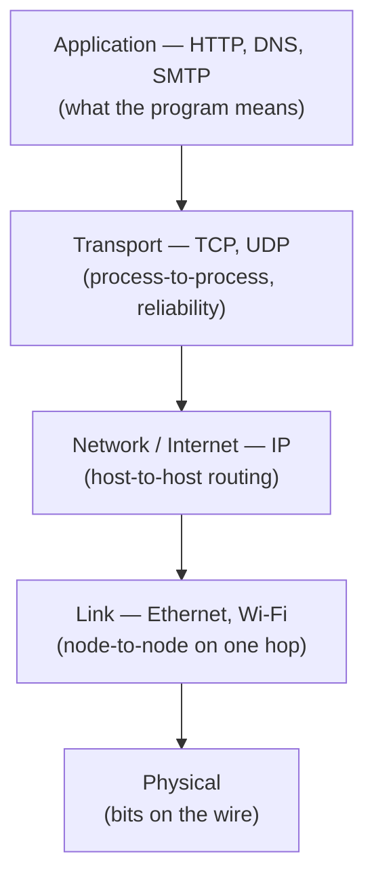

# Computer Networks

A computer network is a set of machines that exchange data over shared links.
The central engineering problem is that the physical medium is *unreliable* —
wires drop signals, packets get lost, reordered, duplicated, and delayed — yet
applications want to move bytes as if over a clean, ordered pipe. The internet
solves this by stacking **layers**, each adding a guarantee, so that reliability
is built up from unreliable parts. The canonical text is
[Kurose & Ross](kurose-ross-computer-networking.md).

## The layered model

Each layer talks to its peer on the other machine using a **protocol**, and
relies only on the service the layer below provides. This separation is why the
web works over Wi-Fi, fiber, and cellular alike — the application layer never
knows or cares. The internet's five-layer model:

A message is wrapped in a header at each layer on the way down
(**encapsulation**) and unwrapped on the way up. The OSI model is the classic
seven-layer version; the five-layer TCP/IP model is what the internet actually
runs.

## Packet switching

Rather than reserving a dedicated circuit for each conversation (as the old
telephone network did), the internet chops data into **packets** and routes each
independently. Links are shared statistically, which is far more efficient for
the bursty traffic real applications generate. The costs are **queuing** (a
packet may wait behind others at a busy router) and the possibility of **loss**
when a queue overflows — the very unreliability the upper layers must mask. This
best-effort, decentralized routing is what lets the network scale to billions of
hosts without any central coordinator, a theme shared with
[distributed systems](../distributed-systems/index.md).

## IP — getting packets to a host

The **Internet Protocol** gives every host an address and defines how routers
forward a packet hop by hop toward its destination. IP is deliberately
**best-effort**: it makes no promise that a packet arrives, arrives once, or
arrives in order. That minimalism (the "thin waist" of the internet) is a
feature — it keeps the network core simple and dumb, pushing intelligence to the
endpoints. IPv4's 32-bit addresses are nearly exhausted, motivating NAT and the
128-bit IPv6.

## TCP vs. UDP — the transport layer

The transport layer turns host-to-host delivery into **process-to-process**
delivery (via port numbers) and is where reliability is optionally added:

| | TCP | UDP |
|---|-----|-----|
| Connection | Connection-oriented (handshake) | Connectionless |
| Reliability | Guaranteed, in-order, no duplicates | Best-effort, may drop/reorder |
| Flow/congestion control | Yes | No |
| Overhead | Higher | Minimal |
| Use cases | Web, email, file transfer | DNS, video/voice, gaming |

**TCP** rebuilds a reliable ordered stream on top of unreliable IP:
acknowledgments confirm receipt, timeouts and retransmission recover losses,
sequence numbers reorder packets, and **congestion control** throttles the
sender when the network is overloaded — a decentralized cooperation that keeps
the whole internet from collapsing. **UDP** skips all of it, trading guarantees
for low latency where an app either doesn't need reliability or implements its
own (e.g. real-time media, where a late packet is worse than a lost one).

## DNS — names to addresses

Humans use names (`example.com`); IP routes to numbers. The **Domain Name
System** is a distributed, hierarchical database that resolves one to the other.
A lookup walks from the **root** servers to **top-level domain** servers (`.com`)
to the domain's **authoritative** server, with heavy caching at every step so
the common case is a single fast query. DNS is itself a large-scale distributed
system and usually rides on UDP for speed.

## HTTP — the web's application protocol

**HTTP** is a request/response protocol: a client sends a request (method like
`GET` or `POST`, a URL, headers) and the server returns a response (status code,
headers, body). It is **stateless** — each request stands alone — which is what
lets servers scale horizontally, with cookies and tokens layered on to carry
session state. HTTP runs over TCP (and, in HTTP/3, over QUIC on UDP), and its
disciplined use of methods, status codes, and resource URLs is the foundation of
[REST API design](../web-frontend/rest-api-design-rulebook.md).

## How the internet moves bytes reliably over an unreliable medium

Putting it together, loading a web page exercises the whole stack: DNS resolves
the name, TCP opens a reliable connection over best-effort IP, HTTP requests the
resource, and each layer's guarantee stacks on the one below so the application
sees a clean byte stream despite lossy, shared, decentralized links underneath.
Reliability is not a property of the wire — it is *constructed*, layer by layer,
from parts that individually promise almost nothing.

## Why it matters

Networks are the substrate of every distributed system, web application, and
cloud service. Understanding that the network is unreliable, has latency, and
can partition explains why distributed software is hard — the same realities
drive the tradeoffs in
[Designing Data-Intensive Applications](../distributed-systems/designing-data-intensive-applications.md)
and the whole field of [distributed systems](../distributed-systems/index.md).

## References

- [Kurose & Ross — Computer Networking: A Top-Down Approach](kurose-ross-computer-networking.md)
