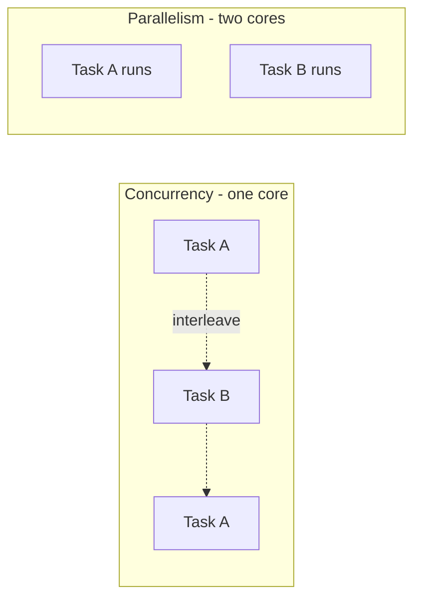
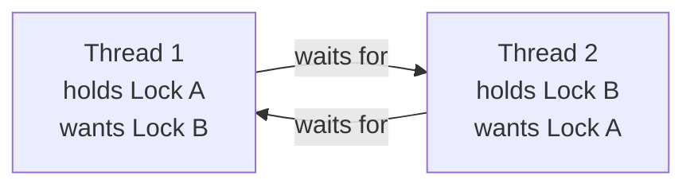

# Concurrency and Parallelism

Concurrency and parallelism are about doing more than one thing at a time — but
they are not the same thing, and conflating them is the source of much confusion.
Both matter because single-core clock speeds stalled years ago (see
[computer architecture](computer-architecture.md)), so squeezing more work out of
a machine now means running work on multiple cores, and keeping a program
responsive means not blocking while it waits.

## Concurrency vs. parallelism

- **Concurrency** is a *structuring* property: a program is decomposed into
  independent tasks that can make progress in overlapping time periods. It's
  about dealing with many things at once. A single-core machine can be
  concurrent by rapidly switching between tasks.
- **Parallelism** is an *execution* property: multiple tasks literally run at the
  same instant, which requires multiple processing units. It's about doing many
  things at once.

Rob Pike's framing: concurrency is a way to structure a program; parallelism is
a way to execute it. A well-structured concurrent program *can* run in parallel,
but concurrency is useful even without it — e.g. a web server juggling thousands
of connections, most of them idle waiting on I/O.



## Threads and processes

The OS provides two units of concurrent execution (see
[operating systems](operating-systems.md)):

- A **process** is an isolated program with its own memory space. Processes
  don't accidentally corrupt each other, but communicating between them requires
  explicit **inter-process communication** (pipes, sockets, shared memory
  segments).
- A **thread** is a lighter unit of execution *within* a process. Threads of the
  same process **share memory**, so communication is as cheap as reading a
  variable — and that sharing is exactly where the danger lives.

## Shared memory vs. message passing

These are the two paradigms for coordinating concurrent tasks:

- **Shared memory** — tasks communicate by reading and writing common variables.
  Fast, but requires careful synchronization to avoid corruption. This is the
  threads model.
- **Message passing** — tasks are isolated and communicate only by sending
  messages (Go channels, the actor model, Erlang processes). No shared state
  means no data races by construction; the tradeoff is copying data and more
  explicit coordination. "Don't communicate by sharing memory; share memory by
  communicating." Message passing is also the natural model for
  [distributed systems](../distributed-systems/index.md), where there is no
  shared memory to begin with — the machines are separated by a network.

## Race conditions and atomicity

A **race condition** is a bug where the result depends on the unpredictable
*timing* of concurrent operations. The classic example is `count++`, which looks
atomic but is really three steps — read, increment, write:

```
Thread A: read count (5)
Thread B: read count (5)
Thread A: write 6
Thread B: write 6    <- one increment lost; count should be 7
```

An operation is **atomic** if it appears to happen instantaneously and
indivisibly — no other thread can observe it half-done. `count++` is not atomic,
which is why the interleaving above loses an update. This is the *same* hazard
the isolation property of ACID transactions defends against in
[databases](databases.md): concurrent access to shared state, protected by
serializing the conflicting operations.

## Locks, mutexes, and semaphores

The classic fix is to enforce **mutual exclusion** over the **critical section**
(the code touching shared state):

- A **mutex** (mutual-exclusion lock) is held by at most one thread at a time.
  Others block until it's released, guaranteeing serial access to the protected
  data.
- A **semaphore** generalizes this to a counter, allowing up to *N* threads
  through — useful for limiting access to a pool of resources.
- **Atomic operations** and lock-free structures use hardware primitives
  (compare-and-swap) to update shared state safely without locks, avoiding the
  overhead of blocking.

Locks solve the race but introduce their own hazards, chiefly overhead
(contention serializes threads, undoing parallelism) and the problems below.

## Deadlock

A **deadlock** is a standstill where a set of threads each hold a resource the
others need and none can proceed. It arises when four conditions hold at once
(Coffman conditions): mutual exclusion, hold-and-wait, no preemption, and a
**circular wait**.



The standard prevention is to break the cycle — e.g. always acquire locks in a
global order, so no circular wait can form. Related failure modes are
**livelock** (threads keep reacting to each other and make no progress) and
**starvation** (a thread is perpetually denied a resource).

## Why concurrent code is hard

Sequential code is deterministic: the same input yields the same execution.
Concurrent code with shared state is **non-deterministic** — the number of
possible interleavings explodes combinatorially, and a bug may surface only under
a rare timing that's nearly impossible to reproduce or test. Correctness
arguments must hold across *every* interleaving, not just the ones you happened
to observe. This is compounded in distributed settings, where partial failure is
added to timing non-determinism — the reason patterns like idempotency and
careful retry logic matter so much, as explored in
[Kelsey Hightower on the retry](../harness-engineering/hightower-the-retry.md).
The practical wisdom is to *minimize* shared mutable state: prefer immutability,
confine state to one owner, or use message passing so races can't arise at all.

## Why it matters

Every modern system is concurrent — multi-core CPUs, servers handling many
clients, GPUs running thousands of threads, distributed clusters. Getting
concurrency right is a defining challenge of systems programming, and getting it
*wrong* produces the most expensive and elusive class of bugs there is. The best
defense is structural: choose designs where the dangerous interleavings simply
cannot happen.

## References

Synthesized from the standard operating-systems and concurrency literature; see
[operating systems](operating-systems.md) and
[Introduction to Algorithms](introduction-to-algorithms.md) for the underlying
models.
