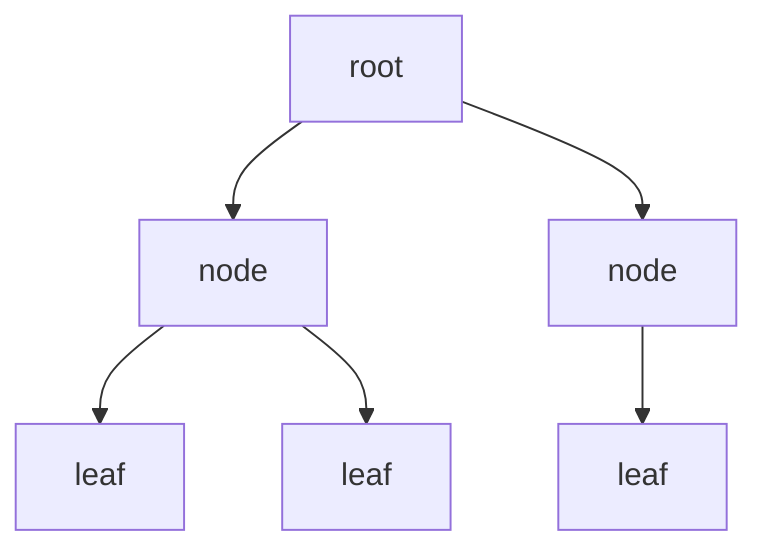

# Data Structures

A **data structure** is a concrete way of organizing data in memory so that the operations
you need — insert, delete, search, order, traverse — run efficiently. There is no single
best structure: each makes some operations cheap by making others expensive, so choosing
one *is* a choice about which [time/space trade-off](computational-complexity.md) you can
afford. The structure you pick largely dictates which [algorithm](algorithms.md) is
available and how fast it runs, which is why the two subjects are always taught together.

## The trade-off lens

Every structure answers the same question differently: *what do you optimize, and what do
you pay for it?* Contiguous storage buys $O(1)$ indexing but costly insertion; linked
storage buys cheap insertion but loses random access; hashing buys $O(1)$ average lookup
but loses order; trees keep order *and* stay logarithmic. Reading the table below as a menu
of trade-offs is more useful than memorizing any row.

| Structure | Access | Search | Insert / Delete | Ordered? |
|-----------|--------|--------|-----------------|----------|
| Array | $O(1)$ | $O(n)$ | $O(n)$ | — |
| Linked list | $O(n)$ | $O(n)$ | $O(1)$ at a known node | — |
| Hash table | — | $O(1)$ avg | $O(1)$ avg | no |
| Balanced BST | — | $O(\log n)$ | $O(\log n)$ | yes |
| Binary heap | peek $O(1)$ | $O(n)$ | $O(\log n)$ | partial |

## Linear structures

- **Arrays** store elements in contiguous memory, giving constant-time indexing by
  position — but inserting or deleting in the middle shifts everything after it, an $O(n)$
  cost. Dynamic arrays (e.g. `vector`, `ArrayList`) amortize growth by doubling capacity.
- **Linked lists** store each element in a node with a pointer to the next. Insertion and
  deletion at a known node are $O(1)$, but reaching the $k$-th element is $O(n)$ — you must
  walk the chain. This is the array/list duality: random access vs. cheap splicing.
- **Stacks** (LIFO) and **queues** (FIFO) are *access disciplines* layered on an array or
  list. Stacks power function-call frames and the backtracking in
  [algorithms](algorithms.md); queues power scheduling and breadth-first traversal.

## Hash tables

A **hash table** maps keys to array slots via a **hash function**, delivering $O(1)$
*average* insert, delete, and lookup — the fastest general-purpose dictionary. The catch is
**collisions** (distinct keys hashing to the same slot), handled by *chaining* (a list per
slot) or *open addressing* (probing for the next free slot). Worst case degrades to $O(n)$
if the hash function is poor or an adversary forces collisions, and the structure imposes
*no order* on keys. Hash tables are the workhorse behind language dictionaries, database
indexes, and caches.

## Trees

Trees impose hierarchy and, when balanced, guarantee logarithmic operations.

- **Binary search tree (BST)** — each node's left subtree holds smaller keys, its right
  subtree larger. Search, insert, and delete are $O(h)$ in the height $h$ — but a naive BST
  can degenerate into a list ($h = n$).
- **Balanced trees** — AVL and red–black trees perform rotations on update to keep
  $h = O(\log n)$, guaranteeing logarithmic operations *and* sorted traversal. B-trees
  generalize this to high branching factor for on-disk [database](databases.md) indexes.
- **Heaps** — a binary heap is a nearly-complete tree with the *heap property* (each parent
  $\le$ its children, for a min-heap). It gives $O(1)$ access to the minimum and $O(\log n)$
  insert/extract, making it the natural **priority queue** behind Dijkstra's algorithm and
  event scheduling.

## Graphs

A **graph** is a set of vertices joined by edges — the most general relational structure,
underlying networks, dependencies, and maps. The two standard representations embody the
core trade-off again: an **adjacency matrix** ($O(V^2)$ space, $O(1)$ edge lookup) suits
dense graphs, while an **adjacency list** ($O(V+E)$ space) suits sparse ones and is
preferred for traversal. These representations feed directly into the
[graph algorithms](algorithms.md) — BFS, DFS, shortest paths, spanning trees — and the
mathematics of connectivity, cycles, and coloring comes from
[graph theory](../math/graph-theory.md).

## Why it matters

Choosing the right data structure is often the single highest-leverage decision in making
software fast: it changes the *asymptotic* cost of the operations that dominate the
workload, not just a constant factor. The same insight scales up — the index structures of
[databases](databases.md), the routing tables of
[computer networks](computer-networks.md), and the feature stores of
[machine learning](../ai/machine-learning.md) are all data-structure choices made at scale.
Master the trade-offs and you can reason about performance *before* writing a line of code.

## References

- [Introduction to Algorithms (CLRS)](introduction-to-algorithms.md) — the definitive treatment of these structures and their operation costs.
- [Structure and Interpretation of Computer Programs (SICP)](sicp.md) — data abstraction and building structures from primitives.
- [Introduction to the Theory of Computation (Sipser)](sipser-theory-of-computation.md) — the abstract memory models (stack, tape) that data structures make concrete.
