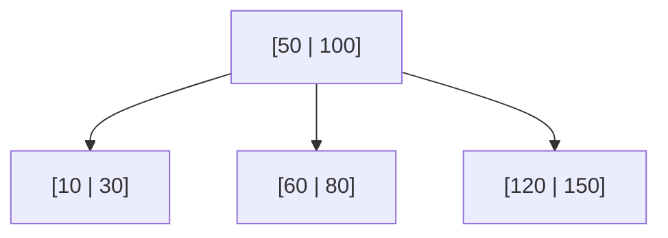

# Databases

A database is a system for storing, querying, and safely updating structured
data over long periods, shared by many users and applications at once. The
enduring achievement of database theory is **declarative** access: you say
*what* data you want, not *how* to fetch it, and the system figures out an
efficient plan — while guaranteeing your data survives crashes and concurrent
writes. The canonical text is
[Silberschatz](silberschatz-database-system-concepts.md).

## The relational model

Introduced by E. F. Codd (1970), the **relational model** represents all data as
**relations** (tables) of **tuples** (rows) with named **attributes** (columns).
Its power is that it is grounded in set theory and relational algebra, so
queries have a rigorous mathematical meaning, and the physical storage is fully
decoupled from the logical view. Keys tie it together: a **primary key**
uniquely identifies each row; a **foreign key** references a primary key in
another table, encoding relationships and enforcing referential integrity.

## SQL

**SQL** (Structured Query Language) is the declarative language for relational
databases. Its core is deceptively small:

```sql
SELECT   name, total
FROM     orders
JOIN     customers ON orders.customer_id = customers.id
WHERE    total > 100
ORDER BY total DESC;
```

You describe the desired result set — filters, joins, grouping, ordering — and
the database's query engine decides how to execute it. `SELECT`/`INSERT`/
`UPDATE`/`DELETE` manipulate data; `CREATE`/`ALTER` define schema; `GRANT`
controls access. The declarative style is what lets the same query keep working
as data grows and as the engine's internals change.

## ACID transactions

A **transaction** is a group of operations treated as a single indivisible unit.
The **ACID** properties are the guarantees that make databases trustworthy:

- **Atomicity** — all operations commit, or none do. A transfer that debits one
  account and credits another never leaves money in limbo.
- **Consistency** — a transaction moves the database from one valid state to
  another, preserving all declared constraints.
- **Isolation** — concurrent transactions don't corrupt each other; the result
  is as if they ran in some serial order. This is deeply tied to
  [concurrency and parallelism](concurrency-and-parallelism.md): the database
  uses locks or multiversion concurrency control (MVCC) to prevent the same race
  conditions that plague any shared-state program.
- **Durability** — once committed, data survives crashes (via a write-ahead log
  flushed to disk before acknowledging the commit).

Isolation is a spectrum, not a switch: weaker **isolation levels** (read
committed, repeatable read, serializable) trade correctness anomalies for
throughput, and choosing the right level is a real engineering decision.

## Indexing and B-trees

Without help, answering `WHERE total > 100` means scanning every row — O(n). An
**index** is an auxiliary data structure that makes lookups fast, at the cost of
extra storage and slower writes (the index must be maintained). The workhorse is
the **B-tree** (specifically the B+ tree): a balanced, high-fanout tree that
keeps data sorted and supports lookups, range scans, and ordered iteration in
O(log n) with very few disk reads.



The high fanout matters because databases are **disk-bound**: each node maps to
a disk block, and a shallow tree means a lookup touches only a handful of blocks
— the same memory-hierarchy logic that governs
[computer architecture](computer-architecture.md). Hash indexes serve exact-match
lookups faster but can't do range queries; B-trees are the sensible default.

## Normalization

**Normalization** is the discipline of structuring tables to eliminate redundant
data, so each fact is stored **once**. If a customer's address is duplicated
across every order, updating it risks leaving inconsistent copies (an **update
anomaly**). The normal forms (1NF through BCNF and beyond) progressively remove
these anomalies by splitting data into more tables joined on keys. The tradeoff:
a highly normalized schema needs more joins to reassemble data, so read-heavy
systems sometimes **denormalize** deliberately for speed — a conscious bet, not
an accident.

## Query planning

Because SQL is declarative, the **query optimizer** must translate a query into
an efficient execution plan. It considers alternatives — which index to use,
join order, join algorithm (nested loop, hash join, merge join) — estimates each
one's cost using **statistics** about the data (row counts, value
distributions), and picks the cheapest. This is why the same query can run in
milliseconds or minutes depending on whether the right index exists and the
statistics are current. Reading the plan (`EXPLAIN`) is how you diagnose slow
queries.

## The difference from distributed data

Classical relational databases assume a **single node** (or a tightly
coordinated cluster) where ACID guarantees are affordable. The concerns in
[Designing Data-Intensive Applications](../distributed-systems/designing-data-intensive-applications.md)
begin where that assumption breaks: once data is **partitioned** and
**replicated** across many machines for scale and fault tolerance, strong
consistency collides with availability and network partitions (the CAP
tradeoff), transactions become expensive or impossible to coordinate, and
systems often settle for **eventual consistency**. The relational model's clean
ACID story is a property of staying small enough to coordinate cheaply;
distributed data is the study of what you give up when you can't. Understanding
the single-node model first is what makes the distributed tradeoffs legible.

## Why it matters

Nearly every application is a thin layer over a database. The relational model
and SQL have outlasted decades of alternatives because declarative querying plus
ACID guarantees is an extraordinarily productive contract: developers get
correctness and flexibility without hand-writing storage and concurrency logic.
Knowing how indexes, transactions, and the optimizer actually work is the
difference between an application that scales and one that falls over.

## References

- [Silberschatz — Database System Concepts](silberschatz-database-system-concepts.md)
