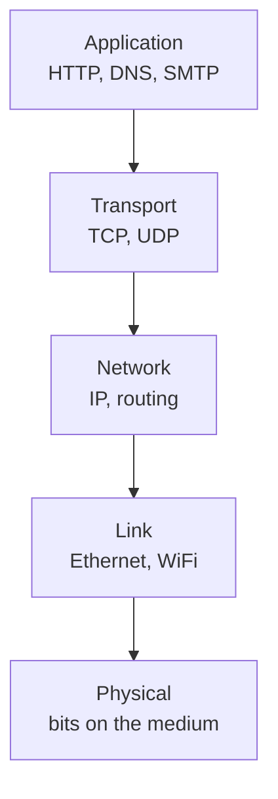

# Computer Networking: A Top-Down Approach

By James F. Kurose and Keith W. Ross (Pearson; 9th ed. 2025). The dominant
introductory networking textbook, adopted at hundreds of universities and
translated into 14 languages. Its defining choice — the one in the subtitle — is
**top-down**: rather than start at the wire and build up, it starts at the
**application layer** with things a reader already uses (the Web, email, streaming)
and descends the protocol stack from there. The motivation is pedagogical: you meet
each layer already knowing what problem it exists to solve for the layer above.

It is the anchor reference for [computer-networks.md](computer-networks.md).

## The layered model

The book's spine is the five-layer Internet stack, taught top to bottom. Each layer
provides a service to the one above and is implemented using the one below —
**encapsulation** means each layer wraps the layer above's data in its own header.

## Application layer

Starts with **network application architectures** (client-server vs. peer-to-peer)
and the socket API, then works through the protocols that define the Internet's user
experience: **HTTP** and the Web, **DNS** (the distributed name-to-address
directory), email, and video streaming/CDNs. Because it opens here, the book makes
the abstract lower layers concrete: you already know what an HTTP request needs
before you learn how TCP delivers it.

## Transport layer

The core intellectual content of the course. How do you build a **reliable**,
ordered byte stream (**TCP**) on top of an unreliable, best-effort packet network?
The book develops reliable data transfer from first principles (acknowledgments,
retransmission, sequence numbers, sliding windows), then adds TCP's **connection
management, flow control**, and — critically — **congestion control**, the
distributed feedback mechanism that keeps the whole Internet from collapsing under
load. **UDP** is the minimal alternative for when the application would rather handle
reliability itself.

## Network layer

Split into **data plane** (forwarding: how a router moves a packet from an input to
an output port; IP addressing, subnetting, and NAT) and **control plane**
(routing: how the forwarding tables get computed). It covers link-state and
distance-vector routing algorithms, intra-domain protocols, and **BGP**, the
inter-domain protocol that stitches the autonomous systems of the Internet together.

## Link and physical layers

The bottom: error detection, multiple-access protocols (how many hosts share one
medium), **Ethernet**, switches, and wireless (WiFi, cellular). This is where bits
finally meet the physical medium.

## Cross-cutting: security and the distributed nature of it all

Later material treats **network security** (cryptography, TLS, firewalls) as a
first-class concern rather than an afterthought. Throughout, the book emphasizes that
the Internet is a vast **distributed system** with no central controller — routing,
congestion control, and DNS are all distributed algorithms reaching global behavior
through local decisions. That framing connects directly to the concerns of
[../distributed-systems/index.md](../distributed-systems/index.md): partial failure,
consistency, and coordination without a single authority.

## Why it belongs in this wiki

This is the canonical map of how machines talk to each other. Every distributed
system, cloud service, and web application in the wiki runs on the protocol stack
this book explains — and the top-down framing makes it the natural on-ramp from
"the app I use" down to "the packets on the wire."

## References

- [Computer Networking: A Top-Down Approach — Kurose & Ross](https://gaia.cs.umass.edu/kurose_ross/index.php)
