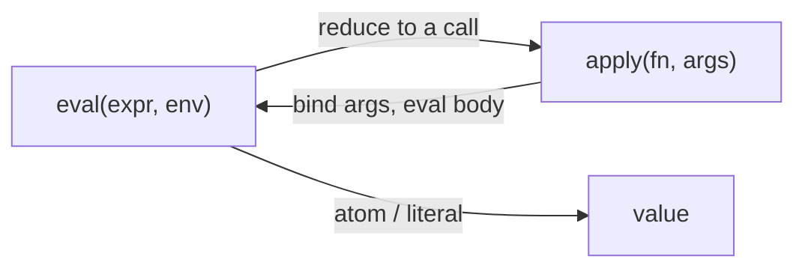

# Lisp

**Lisp** (from "LISt Processor") is the second-oldest high-level programming
language still in use, and — more importantly for study — the language that
turned several deep ideas in [programming-language theory](programming-languages-and-paradigms.md)
into a working system. It was born from John McCarthy's 1960 paper
[Recursive Functions of Symbolic Expressions](mccarthy-recursive-functions.md),
which set out to build a practical notation for computation over symbolic data
and, almost as a side effect, produced a language whose evaluator can be written
in itself. Studying Lisp is less about a syntax and more about a set of ideas
that recur across the whole field.

## S-expressions and homoiconicity

Lisp's surface syntax is the **s-expression** (symbolic expression): either an
atom (a symbol or number) or a parenthesized list of s-expressions. There is no
separate grammar for statements, operators, and blocks — everything, from a
literal list to a function call to a whole program, is the same nested-list
structure.

The consequence is **homoiconicity**: *code is data*. A Lisp program is itself an
ordinary Lisp list, indistinguishable from data the program might manipulate.
`(+ 1 2)` is at once "the sum of 1 and 2" and "a three-element list whose first
element is the symbol `+`." Because a program can construct, inspect, and
transform lists, it can construct, inspect, and transform *programs*. This single
property is the root of macros, of the metacircular evaluator, and of Lisp's long
association with [symbolic AI](../ai/knowledge-representation-and-reasoning.md),
where programs reason about symbolic structures — including other programs.

## The lambda-calculus foundation

Lisp draws its theoretical core from Alonzo Church's **lambda calculus**, the
same formalism explored in
[mathematical proof and logic](../math/mathematical-proof-and-logic.md) and one of
the models that pins down [computability](../logic/computability-and-decidability.md).
The lambda calculus reduces all of computation to three things: variables,
function abstraction (`lambda`), and function application. Lisp adopts this
directly: `lambda` builds an anonymous function, and evaluation is function
application. Everything else — conditionals, recursion, data structures — is
layered on top. Because the lambda calculus is Turing-complete, so is the tiny
core of Lisp, which is why the language can bootstrap so much from so little.

## McCarthy's eval/apply and the metacircular evaluator

McCarthy's decisive move was to define a **universal function** `eval` that takes
a representation of a Lisp expression (as an s-expression) plus an environment,
and returns the expression's value. `eval` and its partner `apply` are mutually
recursive: `eval` reduces an expression to the point of a function call, then
`apply` binds arguments and hands control back to `eval` for the body.

Because Lisp code *is* Lisp data, `eval` can be written **in Lisp itself** — a
short program that is a complete interpreter for the language it is written in.
This is the **metacircular evaluator**, developed in depth in
[SICP](sicp.md). It is the concrete demonstration of the universal-machine idea
from the [theory of computation](theory-of-computation.md): a single program that
can run any program, expressed compactly because the interpreter and the
interpreted language share their representation.

## cons, lists, and the primacy of the pair

The one built-in compound data structure is the **cons cell**: a pair of two
references, conventionally its *car* (first) and *cdr* (rest). Lists are simply
cons cells chained through their cdrs, ending in the empty list `nil`. From this
single pair type Lisp builds trees, association lists, and — since code is
represented the same way — the syntax tree of programs themselves. The trio
`cons` (construct), `car`, and `cdr` (destructure) is enough to express every
data structure the language needs, which is why Lisp is often taught as a study
in building richness from a minimal kernel.

## Macros: code that writes code

A **macro** is a function that runs at compile/expansion time and receives its
arguments as *unevaluated s-expressions* — as code — and returns new code to be
evaluated in its place. Because code and data are the same, a macro is just an
ordinary list transformation. This lets a programmer extend the language itself:
new control structures, embedded sub-languages, and domain-specific notations
become library code rather than compiler changes. This is Lisp's distinctive form
of abstraction and the sharpest expression of homoiconicity in practice.

## First-class functions and closures

Functions in Lisp are **first-class values**: they can be passed as arguments,
returned from other functions, and stored in data structures. A function created
inside another can capture the variables in scope where it was defined; the pair
of the function plus that captured environment is a **closure**. Closures give
Lisp much of its expressive power — they underpin higher-order functions,
callbacks, and the way state can be encapsulated without objects — and they are a
core reason Lisp is treated as the archetypal functional language.

## Dynamic vs lexical scope

Early Lisps used **dynamic scope**: a free variable in a function resolved to the
most recent binding on the call stack at *run time*. This is easy to implement
but makes programs hard to reason about, because a function's meaning depends on
who called it. **Lexical scope**, in which a free variable resolves to the
binding in the surrounding *program text* where the function was written, is what
makes true closures possible. Scheme's adoption of lexical scope (and its careful
treatment in SICP) was a turning point; most modern Lisps and most modern
languages generally now use lexical scope as the default, keeping dynamic scope
as an occasional, explicit tool.

## Garbage collection

Because Lisp builds unbounded structures of cons cells at run time, it needed
automatic reclamation of unreachable memory. **Garbage collection was invented
for Lisp** (McCarthy, around 1959): the runtime, not the programmer, tracks which
cells are still reachable and frees the rest. This freed Lisp programmers from
manual memory management decades before mainstream languages adopted the idea,
and it remains one of Lisp's most widely inherited contributions.

## The REPL

Lisp popularized the **REPL** — Read-Eval-Print Loop — the interactive cycle that
*reads* an s-expression, *evaluates* it with `eval`, *prints* the result, and
loops. Note that the REPL is essentially `eval` exposed to a human: the same
universal function that defines the language also drives its interactive
tooling. Interactive, incremental development — define a function, test it, redefine
it, all in a live image — originated here and shaped how dynamic languages are
used today.

## The family

Lisp is a family of dialects sharing the s-expression core:

- **Scheme** — a small, clean, lexically scoped dialect prized for teaching and
  for language research; it is the vehicle of [SICP](sicp.md).
- **Common Lisp** — a large, standardized, industrial dialect unifying earlier
  Lisps, with a rich object system and macro facilities.
- **Clojure** — a modern Lisp on the JVM emphasizing immutable data and
  concurrency.
- **Emacs Lisp** — the extension language of the Emacs editor, a living example
  of a program made programmable in its own Lisp.

## Why Lisp matters academically

Lisp sits at the intersection of two threads in this wiki. It is the concrete
realization of ideas from the [theory of computation](theory-of-computation.md)
and [computability](../logic/computability-and-decidability.md) — the universal
function made runnable — and it is the historical home of
[symbolic AI](../ai/knowledge-representation-and-reasoning.md), where the ability
to treat symbolic expressions (including programs) as data made it the natural
language for GOFAI systems. Many features now standard across languages —
garbage collection, first-class functions, closures, the REPL, dynamic typing,
tree-structured program representation — either originated in or were popularized
by Lisp.

## References

- Studied within HAL from primary works: [Recursive Functions of Symbolic
  Expressions (McCarthy 1960)](mccarthy-recursive-functions.md) and
  [SICP](sicp.md).
