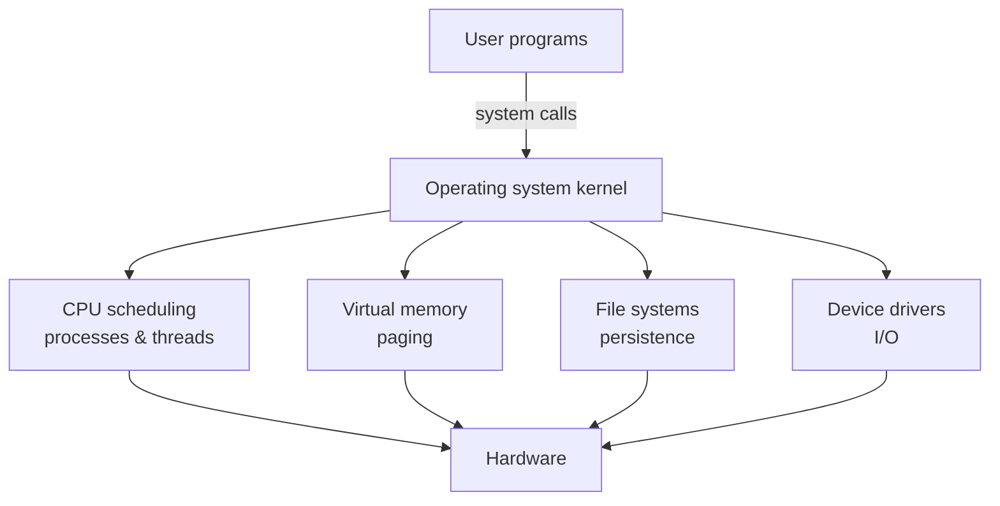

# Operating Systems

An operating system (OS) is the program that stands between the raw hardware and every
other program. It has two jobs that are really the same job seen from two sides. As a
**resource manager**, it multiplexes a finite machine — one (or a few) CPUs, a fixed
pool of RAM, disks, network cards — across many programs that all behave as if they
had the machine to themselves. As an **abstraction layer**, it turns awkward physical
reality (a specific disk controller, a fixed number of memory cells) into clean,
uniform, portable illusions: a process, a file, an address space, a socket. Almost
everything an OS does is one of these virtualizations. The canonical text organizes
the whole field around exactly three of them — the CPU, memory, and persistence — and
is worth reading in full:
[Operating Systems: Three Easy Pieces (OSTEP)](ostep-operating-systems.md).

## Processes and threads

A **process** is the OS's abstraction of a running program: a private virtual address
space plus the bookkeeping (open files, registers, a program counter) needed to run
it. The OS gives each process the illusion of its own CPU by rapidly switching among
them — a **context switch** saves one process's state and restores another's, fast
enough that dozens of programs appear to run at once on a single core.

A **thread** is a unit of execution *within* a process. Threads in one process share
the same address space (the same heap, the same globals) but each has its own stack
and registers. Sharing memory makes threads cheap to communicate but is exactly the
setup that produces race conditions and deadlocks — the subject of
[concurrency-and-parallelism.md](concurrency-and-parallelism.md), which the OS both
enables (by scheduling threads) and must protect against (with locks, semaphores, and
atomic primitives it exposes).

## CPU scheduling

Because runnable threads usually outnumber cores, the OS **scheduler** decides who
runs next and for how long. The tension is between competing goals: **throughput**
(work per unit time), **latency / response time** (how quickly an interactive task
reacts), and **fairness** (no task starves). Classic policies illustrate the
trade-offs — first-come-first-served is simple but lets one long job delay everyone;
round-robin time-slices for responsiveness; priority and multi-level feedback queues
approximate "run short/interactive jobs first" without knowing the future. Preemption
— the OS forcibly reclaiming the CPU on a timer interrupt — is what keeps one runaway
program from freezing the machine.

## Virtual memory, paging, and the memory hierarchy

**Virtual memory** gives each process a private, contiguous-looking address space that
the OS transparently maps onto physical RAM (and disk). The mapping is done in
fixed-size **pages**: the OS and the hardware MMU translate virtual page numbers to
physical frames through page tables, and a **page fault** occurs when a referenced
page isn't resident — the OS fetches it, possibly evicting another (LRU-style
replacement). This buys three things at once: **isolation** (a process literally
cannot name another's memory), **the illusion of more memory than exists** (backed by
disk), and **relocation** (programs need not know where in RAM they'll live).

Virtual memory only performs because of the **memory hierarchy** — a tower of
storage trading speed for capacity, exploited by the principle of *locality* (programs
reuse recent data and nearby addresses):

| Level | Typical latency | Managed by |
|---|---|---|
| CPU registers | < 1 ns | compiler / hardware |
| L1 / L2 / L3 cache | ~1–20 ns | hardware |
| Main memory (RAM) | ~100 ns | OS (paging) |
| SSD / disk | ~10 µs – 10 ms | OS (file system, swap) |

The hardware side of this — caches, the MMU, TLB — belongs to
[computer-architecture.md](computer-architecture.md); the OS orchestrates the layers
it can see.

## File systems and persistence

Where memory is volatile, the **file system** is the OS's abstraction for durable
storage. It turns a flat array of disk blocks into named files organized in a
directory tree, tracks which blocks belong to which file (via structures like inodes),
manages free space, and enforces access permissions. Because a crash can strike
mid-update, real file systems add **crash consistency** mechanisms — journaling or
copy-on-write — so the on-disk state is always recoverable. The same "name an
abstraction, hide the device" pattern extends via a uniform interface (in Unix,
*everything is a file* — devices, pipes, and sockets all present the same
`read`/`write` API).

## System calls, isolation, and protection

User programs cannot touch hardware directly; that would destroy isolation. Instead
the CPU runs in two privilege levels — unprivileged **user mode** and privileged
**kernel mode** — and a program requests OS services through a **system call**, a
controlled trap that switches into the kernel, does the privileged work, and returns.
`open`, `read`, `fork`, `mmap` are the kernel's public API. This boundary is the
foundation of **protection**: the kernel mediates every access to memory, files, and
devices, so a buggy or malicious process cannot corrupt others or the OS itself.

That protection boundary is precisely what makes it safe to run untrusted code, and it
generalizes upward into containers, VMs, and other sandboxes — the mechanism explored
in [../ai-platform/execution-sandboxing.md](../ai-platform/execution-sandboxing.md),
where running arbitrary AI-generated code safely depends on exactly these OS isolation
primitives.

## Why it matters

Nearly every performance characteristic, security guarantee, and failure mode of
software traces back to the OS: why a program is slow (page faults, context switches,
cache misses), why it is safe (address-space isolation, the user/kernel boundary), and
why it is portable (the system-call interface abstracts the hardware). Understanding
the OS is understanding the contract every program you write is actually running
under. It connects downward to [computer-architecture.md](computer-architecture.md),
sideways to [concurrency-and-parallelism.md](concurrency-and-parallelism.md), and
upward into the sandboxing and platform layers built on top of it.

## References

- Anchored by [Operating Systems: Three Easy Pieces (OSTEP)](ostep-operating-systems.md),
  drawing on the standard OS curriculum (processes, scheduling, virtual memory, file
  systems, protection).
