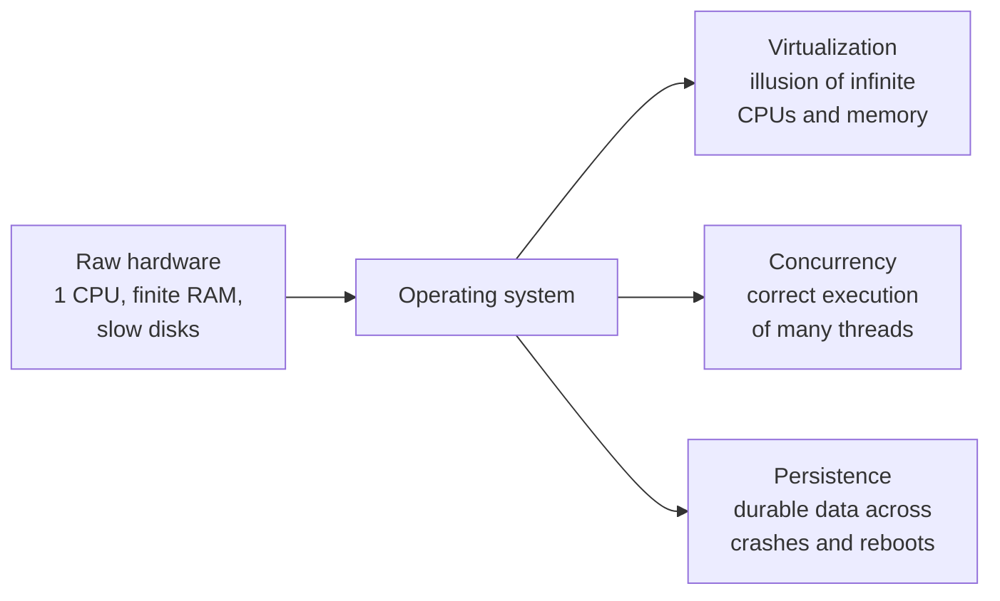

# Operating Systems: Three Easy Pieces (OSTEP)

By Remzi H. Arpaci-Dusseau and Andrea C. Arpaci-Dusseau (University of
Wisconsin-Madison). A free, online undergraduate operating-systems textbook whose
organizing insight is in the title: an OS is really only doing **three easy
pieces** — virtualization, concurrency, and persistence. Rather than march through
a laundry list of subsystems, the book keeps returning to one question — *how does
the OS create a convenient, safe illusion on top of raw, limited, dangerous
hardware?* — and answers it three times.

## Piece 1 — Virtualization

The OS turns scarce physical resources into a private, well-behaved abstraction for
each process.

- **The process** is the running-program abstraction. The OS multiplexes one (or a
  few) CPUs across many processes by **limited direct execution**: run user code
  natively for speed, but interpose at the boundaries (system calls, timer
  interrupts) to retain control. This is the crux of the OS's relationship to
  [computer-architecture.md](computer-architecture.md) — user/kernel modes, traps,
  and interrupts are hardware features the OS exploits to stay in charge.
- **CPU scheduling** — from FIFO and round-robin up to the **multi-level feedback
  queue** and proportional-share (lottery, stride) schedulers — is the policy layer
  deciding *who runs next*, trading off turnaround time against responsiveness.
- **Virtual memory** gives each process its own private address space. The book
  develops address translation from base-and-bounds through segmentation to
  **paging**, the **TLB** as the translation cache, multi-level page tables, and
  **swapping** with page-replacement policies (LRU and its approximations). Memory
  management is the other deep dependency on
  [computer-architecture.md](computer-architecture.md) — the MMU and TLB are hardware
  that only make sense in tandem with OS policy.

## Piece 2 — Concurrency

Once a process can have multiple **threads** sharing an address space, correctness
gets hard. This part is the applied counterpart to
[concurrency-and-parallelism.md](concurrency-and-parallelism.md):

- **The problem** — race conditions arise on shared state; a **critical section**
  must execute atomically.
- **Locks** — built from hardware atomics (test-and-set, compare-and-swap), with
  attention to spinning vs. sleeping and fairness.
- **Condition variables and semaphores** — the primitives for threads to *wait for*
  events, worked through classic patterns (producer/consumer, reader/writer).
- **Concurrency bugs and deadlock** — the four conditions for deadlock and how to
  prevent, avoid, or detect it.

The book is unusually honest that concurrent code is a minefield, and it teaches the
discipline of reasoning about *all possible interleavings* rather than the one you
happened to observe.

## Piece 3 — Persistence

Data must survive crashes and outlive any single process.

- **I/O devices and drivers** — how the OS talks to hardware via interrupts and DMA.
- **Disks, RAID, and SSDs** — the physical substrate and its performance model
  (seek/rotation for disks; erase-before-write and wear for flash).
- **File systems** — from a simple inode-based FS up to real designs, plus the
  central problem of **crash consistency**: because a crash can strike mid-update,
  file systems use **journaling** (write-ahead logging) or copy-on-write to move
  atomically from one consistent on-disk state to the next. This write-ahead-log
  idea is the same durability mechanism relational databases use for transactions —
  see [silberschatz-database-system-concepts.md](silberschatz-database-system-concepts.md).

## Why it belongs in this wiki

OSTEP is the canonical modern OS text, and it is *free* — the whole book is online.
It sits directly between hardware and applications: it consumes the mechanisms of
[computer-architecture.md](computer-architecture.md) (modes, interrupts, the MMU) and
provides the abstractions — processes, threads, virtual memory, files — that every
program above it takes for granted.

## References

- [Operating Systems: Three Easy Pieces — Remzi and Andrea Arpaci-Dusseau](https://ostep.org/)
