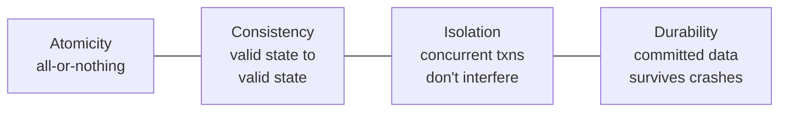

# Database System Concepts

By Abraham Silberschatz, Henry F. Korth, and S. Sudarshan (McGraw-Hill; 7th ed.
2019). The long-standing standard textbook for a first course in databases,
often called "the Sailboat Book" for its cover. Its ambition is breadth *and*
depth: it starts from what a database and a DBMS are, develops the theory of the
relational model rigorously, and follows the data all the way down to how bytes
sit on disk and how a query executor turns SQL into physical operations.

It is the anchor reference for [databases.md](databases.md).

## The relational model and query languages

The conceptual foundation is E. F. Codd's **relational model**: data as sets of
tuples in relations (tables), manipulated by **relational algebra** — a small set of
operations (selection, projection, join, union, etc.) that compose into any query.
This algebra is the formal semantics beneath **SQL**, which the book teaches
thoroughly: from basic queries through joins, aggregation, subqueries, views, and
integrity constraints. The separation between *what* you ask for (declarative SQL)
and *how* it is computed (the algebra and, later, physical operators) is the central
abstraction of the whole field.

## Database design

How do you decide what tables to have? The book covers **entity-relationship (E-R)
modeling** for capturing a domain, then the theory of **functional dependencies and
normalization** (BCNF, 3NF) — the principled way to eliminate redundancy and the
update anomalies it causes. This is the design discipline that keeps a schema honest
as it grows.

## Storage, indexing, and query processing

The middle of the book descends from logical to physical:

- **Storage and file structures** — how records and pages live on disk, and the
  disk performance model that shapes every decision (the same device model as in
  [operating-systems.md](operating-systems.md)'s persistence chapters).
- **Indexing** — **B+-trees** as the workhorse index and hashing as the alternative;
  indexes are the single biggest lever on query performance.
- **Query processing and optimization** — how the engine turns a declarative SQL
  statement into a physical **query plan**: choosing join algorithms (nested-loop,
  hash, merge), ordering operations, and using a cost model to pick among equivalent
  plans. This is the payoff of the algebra: because queries are declarative, the
  optimizer is *free* to rewrite them.

## Transactions: the ACID guarantees

The intellectual crown of the book. A **transaction** is a unit of work that must be
**Atomic, Consistent, Isolated, and Durable** even under concurrency and crashes:

- **Concurrency control** — serializability as the correctness criterion, achieved
  by two-phase locking, timestamp ordering, or multiversion (MVCC) schemes. The
  isolation problem here is the database face of the race conditions in
  [concurrency-and-parallelism.md](concurrency-and-parallelism.md).
- **Recovery** — **write-ahead logging (WAL)** to guarantee atomicity and durability
  across crashes, the same log-then-apply discipline the file-system chapters of
  [operating-systems.md](operating-systems.md) use for crash consistency.

## Beyond the single node

Later material reaches into distributed and parallel databases, replication, and the
consistency/availability tensions that arise when a database spans machines — the
bridge to [../distributed-systems/designing-data-intensive-applications.md](../distributed-systems/designing-data-intensive-applications.md),
which takes those same concerns (storage engines, replication, consistency models)
and reframes them around building large-scale systems rather than a single DBMS.

## Why it belongs in this wiki

This is the canonical, from-first-principles account of how data is stored, queried,
and kept correct. It supplies the relational-model theory, the SQL, and the
transaction guarantees that every data-intensive application in the wiki depends on —
and it makes explicit *why* those guarantees are hard to keep.

## References

- [Database System Concepts (7th ed.) — Silberschatz, Korth & Sudarshan](https://www.db-book.com/)
