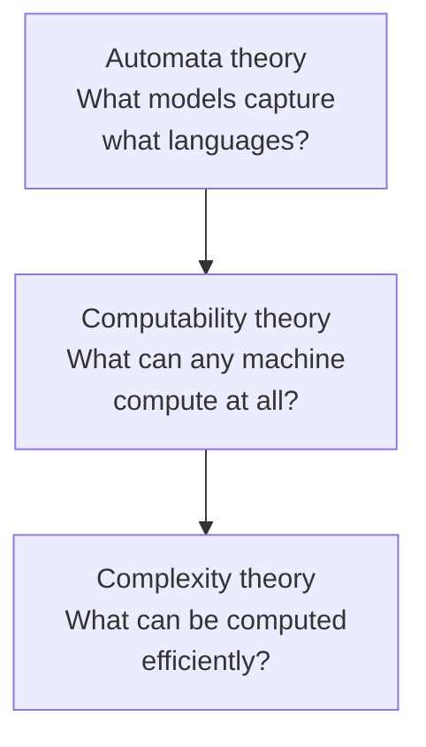

# Introduction to the Theory of Computation

By Michael Sipser (Cengage Learning; 3rd ed. 2012). The standard upper-division
and introductory-graduate text for **the theory of computation** — the branch of
computer science that asks not *how to compute a thing* but *what can be computed
at all, and at what cost*. Sipser's distinction is pedagogical clarity: he builds
the whole edifice from a handful of precise definitions and proofs, and he is
explicit about proof *technique* (he opens with a chapter on how to read and write
proofs) so the mathematics never becomes a black box.

The book is organized as three ascending questions, which map cleanly onto the
three pillars of [theory-of-computation.md](theory-of-computation.md):

## Part I — Automata and languages

The book starts with the weakest machines and works up, pairing each machine model
with the class of languages it recognizes:

- **Finite automata (DFA/NFA)** recognize exactly the **regular languages**.
  Sipser proves DFAs and NFAs are equivalent in power (the subset construction),
  gives regular expressions as an alternative characterization, and proves the
  **pumping lemma** — the standard tool for showing a language is *not* regular.
- **Pushdown automata** add a stack and recognize the **context-free languages**,
  the ones generated by **context-free grammars**. This is the theory under
  programming-language syntax, which is why it anchors the parsing chapters of the
  [aho-dragon-book-compilers.md](aho-dragon-book-compilers.md).

The recurring theme is the **Chomsky-style hierarchy**: more memory (none → a stack →
an unbounded tape) buys strictly more expressive power.

## Part II — Computability theory

The centerpiece is the **Turing machine** as the definitive model of "mechanical
computation," and the **Church-Turing thesis** — the claim that every intuitively
computable function is Turing-computable. From there Sipser proves the negative
results that define the field:

- **Decidability vs. recognizability.** A language is *decidable* if a Turing
  machine always halts with the right answer; *recognizable* if it halts and
  accepts on yes-instances but may loop forever on no-instances.
- **The halting problem is undecidable.** No algorithm can decide, for an arbitrary
  program and input, whether it halts. Proved by diagonalization.
- **Reducibility.** Undecidability spreads by reduction: if solving problem *A*
  would let you solve the halting problem, *A* is undecidable too. This machinery is
  the computer-science face of the logic in
  [../logic/computability-and-decidability.md](../logic/computability-and-decidability.md), and it
  connects to Gödel-style limits on formal systems.

## Part III — Complexity theory

Once we know *what* is computable, we ask what is computable *cheaply*. Sipser
develops the resource-bounded complexity classes that
[computational-complexity.md](computational-complexity.md) is built on:

- **Time complexity** — the classes **P** (polynomial time) and **NP**
  (nondeterministic polynomial time, equivalently: solutions checkable in
  polynomial time).
- **NP-completeness** — the Cook-Levin theorem (SAT is NP-complete) and polynomial
  reductions, the toolkit for proving a problem is among the hardest in NP. This is
  the practical payoff: recognizing that a problem is NP-complete tells you to stop
  hunting for an efficient exact algorithm and reach for approximation or heuristics.
- **Space complexity** — PSPACE, Savitch's theorem, and the interplay of time and
  space.

The unresolved **P vs. NP** question sits at the center: whether every problem whose
solutions can be *checked* quickly can also be *solved* quickly.

## Why it belongs in this wiki

Sipser is the bridge from pure logic to practical computer science. It supplies the
formal spine under nearly everything else here: the automata that underlie
[compilers](aho-dragon-book-compilers.md), the complexity classes that decide which
algorithms are worth writing, and the undecidability results that mark the outer
boundary of what any program — or any AI — can ever do.

## References

- [Introduction to the Theory of Computation — Michael Sipser](https://math.mit.edu/~sipser/book.html)
