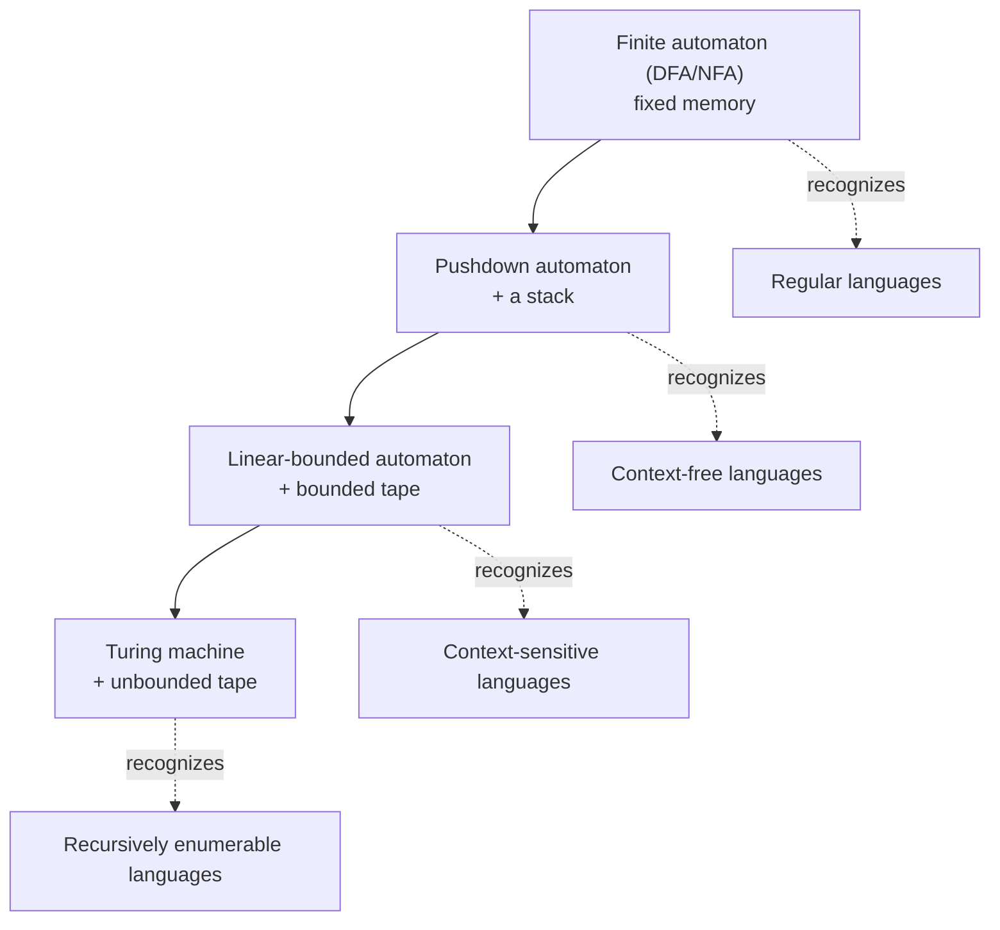

# Theory of Computation

The theory of computation asks two foundational questions: **what can be computed at
all**, and — more finely — **what can be computed efficiently**. This note treats the
first (*computability*); the second (*complexity*) is
[computational complexity](computational-complexity.md). The strategy is to study
idealized abstract machines — *models of computation* — and the classes of languages
(sets of strings) each can recognize. As the machines gain power, the languages they can
decide grow richer, producing a strict hierarchy.

## Languages and machines

Fix a finite **alphabet** $\Sigma$ (say $\{0,1\}$). A **string** is a finite sequence of
symbols; a **language** is any set of strings. Every computational problem can be recast
as a language-membership question: "does this input belong to the language of yes-instances?"
A model of computation *recognizes* a language if it accepts exactly the strings in it.
This reduction of *computing* to *deciding set membership* is what makes the theory
tractable, and it rests on the discrete structures of
[discrete mathematics](../math/discrete-mathematics.md).

## The ladder of machines

### Finite automata and regular languages

A **deterministic finite automaton (DFA)** has a finite set of states, a start state,
accepting states, and a transition function that reads one input symbol at a time. It has
*no memory beyond its current state*. A **nondeterministic finite automaton (NFA)** may
have several possible next states; a classic result is that NFAs and DFAs recognize
exactly the same languages (the subset construction converts one to the other). The
languages they recognize are the **regular languages**, equivalently those describable by
**regular expressions** or generated by regular grammars. Regexes in text editors and
`grep` are this theory in daily use. The **pumping lemma** proves some languages are *not*
regular: $\{0^n1^n\}$ needs to *count*, and finite memory cannot.

### Pushdown automata and context-free grammars

Add a **stack** and you get a **pushdown automaton (PDA)**, which recognizes the
**context-free languages (CFLs)** — those generated by **context-free grammars (CFGs)**,
where each rule rewrites a single nonterminal. CFGs capture nested, balanced structure
(matched parentheses, arithmetic expressions, programming-language syntax), which is why
they are the backbone of parsers in [compilers and interpreters](compilers-and-interpreters.md).
The stack gives exactly enough memory to match $\{0^n1^n\}$, but not $\{0^n1^n2^n\}$.

### Turing machines and the Church–Turing thesis

A **Turing machine (TM)** adds an unbounded, read-write tape with a movable head. It is
the most powerful standard model: everything intuitively "computable" — lambda calculus,
general recursive functions, and every real programming language — computes exactly the
same class of functions. That empirical convergence is the **Church–Turing thesis**: *the
Turing-computable functions are precisely the effectively calculable ones.* It is a claim
about the nature of computation, not a theorem. Languages a TM can recognize are
**recursively enumerable**; those it can *decide* (halting on every input with yes/no) are
the **decidable** (recursive) languages.

### The Chomsky hierarchy

Noam Chomsky's classification ties grammar restrictions to machine power:

| Type | Grammar | Machine | Language class |
|------|---------|---------|----------------|
| 3 | Regular | Finite automaton | Regular |
| 2 | Context-free | Pushdown automaton | Context-free |
| 1 | Context-sensitive | Linear-bounded automaton | Context-sensitive |
| 0 | Unrestricted | Turing machine | Recursively enumerable |

Each level strictly contains the ones below it.

## Decidability and the halting problem

Not every well-posed question can be answered by *any* algorithm. The canonical example is
the **halting problem**: given a program and an input, decide whether the program
eventually halts. Turing proved this is **undecidable** via a diagonalization/self-reference
argument — assume a decider `H` exists, build a program that halts iff `H` says it loops,
feed it to itself, and derive a contradiction. From this one result, undecidability spreads
by **reduction**: if solving problem $B$ would let you solve the halting problem, then $B$
is undecidable too (Rice's theorem generalizes this to *any* non-trivial semantic property
of programs). This is the computability face of the impossibility results studied in
[computability and decidability](../logic/computability-and-decidability.md). Decidable
problems are the raw material that [algorithms](algorithms.md) and
[computational complexity](computational-complexity.md) then sort by cost.

## Why it matters

The theory draws the outer boundary of software: no cleverness, faster hardware, or
[AI](../ai/machine-learning.md) system escapes undecidability. Practically, the same
machine models are engineering tools — finite automata drive lexical scanners and protocol
state machines, CFGs specify language syntax, and the notion of reduction underpins how we
prove problems hard. Knowing *why* a general "will this code terminate?" checker cannot
exist reframes what static analysis and verification can honestly promise.

## References

- [Introduction to the Theory of Computation (Sipser)](sipser-theory-of-computation.md) — the standard undergraduate text; automata, computability, and complexity.
- [Structure and Interpretation of Computer Programs (SICP)](sicp.md) — the universal-machine and metacircular-evaluator view of computation.
- [Introduction to Algorithms (CLRS)](introduction-to-algorithms.md) — the transition from "computable" to "computable efficiently."
