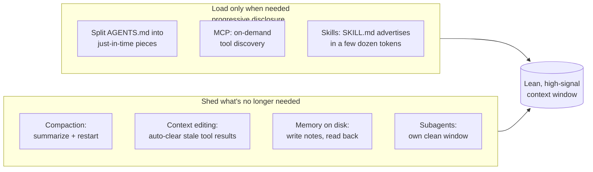

# Context Engineering

Managing **what enters and stays in** an agent's context window is now as
important as the prompt. More tokens do not mean better results — as the window
fills, models suffer **context rot**. The skill: find the smallest set of
**high-signal** tokens that fully specifies the task. *Minimal doesn't mean
short — it means high-signal.*

## The successor to prompt engineering

Prompt engineering asks *"what words do I write?"*. Context engineering asks the
broader question: *"what configuration of the **entire** context — system
prompt, tools, examples, history, retrieved data — is most likely to produce
the behavior I want?"* For a single chat the distinction barely matters; for an
agent over many turns it decides whether the run succeeds. Karpathy: *"the
delicate art and science of filling the context window with just the right
information for the next step."*

Two halves:

- **Upstream** — find and clean the right context *before* it enters the window:
  retrieval, selection, pruning.
- **In-window** — manage what's already there: ordering, compaction, isolation.

## Why it matters: context rot + economics

As a window fills, a model's ability to recall and reason over any given token
**degrades** — attention is a finite budget, like human working memory
(Anthropic). It's also an **economics** argument:

- The codebase is part of the budget: SonarSource's 660-trial study — agents on
  cleaner, more navigable code used **7–8% fewer tokens** and **34% fewer file
  revisitations** at the same success rate. (Ties back to
  [before/after AI bottlenecks](before-and-after-ai-bottlenecks.md).)
- With a typical **25:1 input-to-output** token ratio in agentic sessions,
  per-run cost is driven almost entirely by how much context accumulates.

## Keeping the window small

Dexter Horthy (coined "context engineering" in *12-factor agents*) frames the
craft as **"frequent intentional compaction"** — deliberately structuring what
you feed the agent at each step rather than letting the window fill. His team
drove Claude Code through 300k-line codebases at review-passing quality this
way.

**Load only when needed (progressive disclosure):**
- Split one giant prompt or `AGENTS.md` (see
  [four-files workflow](four-files-ai-workflow.md)) into pieces loaded
  just-in-time — the agent holds lightweight references (paths, queries) and
  pulls data at runtime.
- **MCP** first earned a bad name for spending the window on every tool's
  definition; the fix is **on-demand tool discovery** — search and load
  definitions as needed once the tool set is large.
- **Skills** are the cleanest version: each `SKILL.md` advertises itself in a
  few dozen tokens of frontmatter, full instructions loaded only when a task
  calls for it.
- **Open gap:** tools, skills, and MCP can all be loaded on demand — none has a
  clean way to *unload* once pulled in.

**Shed what is no longer needed:**
- **Compaction** summarizes a near-full window and restarts from the summary.
- **Context editing** — the lighter touch — auto-clears stale tool calls and
  results (~84% fewer tokens in one 100-turn eval).
- **Memory on disk** — the agent writes notes/plans/research to files, reads
  them back when relevant, keeping the live window lean.
- **Subagents** get their own clean window.

## Related

- [CRESS context-quality checklist](cress-context-checklist.md) — Current /
  Refutable / Empirical / Small / Specific: a scorecard for high-signal tokens.
- [Delete 90% of your prompt](delete-90-percent-of-your-prompt.md) — modern
  models make boilerplate unnecessary; same minimal-but-high-signal ethos.
- [Self-improving harness loop](self-improving-harness-loop.md) — where the
  loaded context comes from and how it's refined.
- [Memory engineering](memory-engineering.md) — the durable counterpart:
  context manages the live window, memory manages what outlives it.

## References
- [Context Engineering — Tessl Patterns](https://tessl.io/patterns/agentic-development-workflow/context-engineering/)
