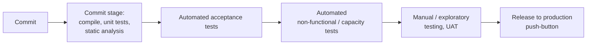

# Continuous Delivery

Jez Humble and David Farley's 2010 book (foreword by Martin Fowler) that named and
systematized **continuous delivery**: the practice of keeping software in a **releasable
state at all times**, so that shipping to production is a business decision rather than a
technical event. Its central mechanism is the **deployment pipeline** — an automated,
staged path from commit to production.

## The core principle: every commit is a release candidate

The book's north star is that **every change committed to version control should be
treated as a potential release**. To make that credible you need automation that can
prove, quickly and repeatably, that a given build is fit to deploy. The reward is that
releasing stops being a painful, error-prone, all-hands event and becomes a routine,
low-drama push — done on demand.

Underlying disciplines the book insists on:

- **Everything in version control** — code, configuration, scripts, environment
  definitions, database schema. The pipeline should be able to recreate any environment.
- **Automate almost everything** — build, test, deployment, and environment provisioning.
  Manual steps are where errors and irreproducibility hide.
- **Build the binary once** — the same artifact promotes through every stage; you never
  rebuild per environment.
- **Done means released** — a feature isn't done when the code is written, but when it is
  delivering value in production.
- **Bring the pain forward** — if something is hard (integration, deployment), do it more
  often and earlier, until it stops being hard.

## The deployment pipeline

The pipeline is the book's signature artifact: a sequence of automated stages that a
change passes through, each providing more confidence than the last and each able to fail
the build fast. A canonical shape:

Early stages are fast and cheap and run on every commit; later stages are slower and run
on artifacts that already passed. The same versioned binary flows through unchanged;
environment-specific behavior comes from externalized **configuration management**, not
rebuilds.

## Supporting practices

- **Continuous integration** as the foundation — the commit stage is CI done rigorously.
- **Test automation strategy** across the layers (unit, acceptance, non-functional).
- **Configuration and environment management** — treat infrastructure and environments
  as versioned, reproducible artifacts (a precursor to infrastructure-as-code).
- **Data and database migration** handled as part of the pipeline.
- **Deployment/release strategies** — blue-green, canary, and decoupling *deploy* from
  *release* (feature toggles) so you can ship code dark and flip it on independently.

## Relation to other notes

- CD is the delivery half of the DevOps movement — see [Effective DevOps](effective-devops.md);
  the two share the "fast feedback, shared responsibility, automate the painful" ethos.
- The pipeline's fast test stages depend on a healthy test suite: see
  [Unit Testing: Principles, Practices, and Patterns](unit-testing-khorikov.md) and
  [Test-Driven Development by Example](test-driven-development-by-example.md).
- "Every commit releasable" and "small safe steps" is the delivery-scale version of the
  same instinct in [Extreme Programming Explained](extreme-programming-explained.md) and
  [Tidy First?](tidy-first.md).

## References

- [Continuous Delivery — O'Reilly](https://www.oreilly.com/library/view/continuous-delivery-reliable/9780321670250/)
