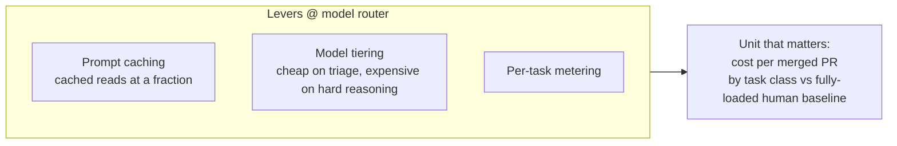

# Cost Management

**FinOps for agents** — making agentic spend **visible, attributable, and
controllable.** Jazz Tong: *"A loop runs the meter whether or not the output
ships."*

Agentic workloads are expensive in a **specific** way:

- An agent uses ~**4×** the tokens of a chat turn; a multi-agent system ~**15×**.
- A ~**25:1 input-to-output ratio** means per-run cost is driven by **how much
  context accumulates**, not by what the agent writes. (Same tokenomics as
  [context engineering](context-engineering.md).)

## Levers live at the router; the discipline is its own

The levers mostly live at the [model router](model-router.md) — prompt caching,
model tiering, per-task metering — but **cost management is its own concern.**
The number worth reporting: **cost per merged pull request**, by task class
against the fully loaded human baseline.

## Why it matters: autonomy as an economic decision

Without metering, agent spend is **invisible until the bill arrives**, and you
can't tell which task classes pay for themselves. With it, **autonomy becomes an
economic decision:**

- Classes where the loop **beats** human cost → **earn more autonomy.**
- Classes where it **loses** → get **narrowed or moved down a model tier.**

As fleets grow, cost management keeps *"let it run"* from quietly becoming the
**largest line in the budget.**

## Related

- [Model Router](model-router.md) — where the cost levers (caching, tiering,
  metering) physically live.
- [Calculating ROI](calculating-roi.md) — token cost is one input to the net-ROI
  number.
- [Agent Runtime](agent-runtime.md) — fan-out caps bound cost as much as safety.

## References
- [Cost Management — Tessl Patterns](https://tessl.io/patterns/scaling-the-org/cost-management/)
