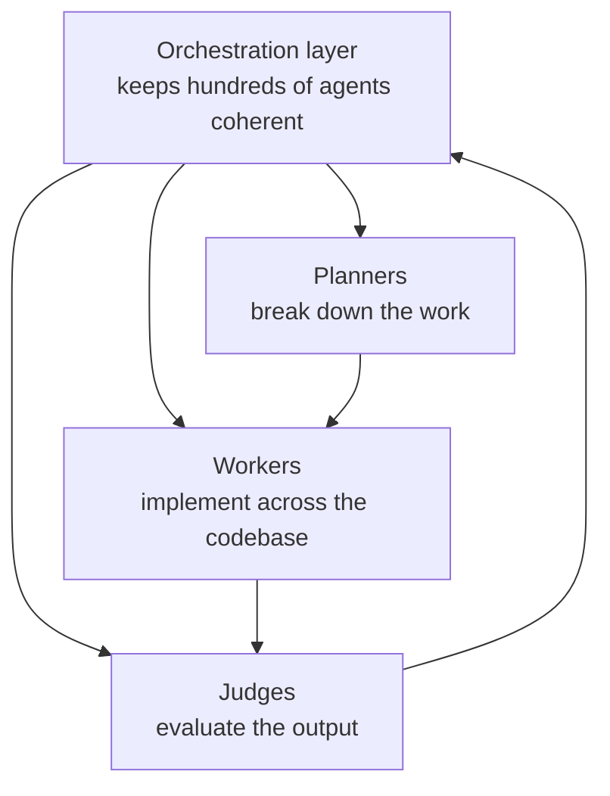

# Cursor's Agent Swarm Built a Browser for a Week With No Humans

Fortune's report (Jan 2026) on the Cursor experiment that's become HAL's standing
**existence proof** for autonomous, long-running agent work — cited in
[loop engineering](loop-engineering.md) and
[the software-factory essay](loop-engineering-software-factory.md).

## What happened

Cursor set a swarm of AI agents, powered by **OpenAI's GPT-5.2**, to build and
run a **web browser from scratch** — running roughly a **week unattended**,
across **millions of lines of code**, with no human intervention. The question
they were testing — can a swarm stay coherent long enough to ship something this
big? — came back mostly *yes*.

## The "orchestra"

The experiment orchestrated **hundreds of agents** into something like a software
team — **planners, workers, and judges** coordinating across the codebase. This
is Anthropic's [orchestrator-workers](building-effective-agents.md) pattern plus
an independent evaluator role, scaled far past a single agent. The enabling
pieces: models are now smart enough to **stay coherent much longer**, and a
custom **orchestration layer keeps the swarm from descending into chaos**.

## Why it matters

- **Task length as an intelligence signal.** OpenAI's Bill Chen: a system doing a
  long task "autonomously and coherently is a very good indicator of how
  intelligent and how general a system is" — the same lens as
  [METR's time horizon](measuring-ai-long-tasks.md). Expect even longer-horizon
  tests next.
- **Revisit your assumptions often.** Cursor's Jonas Nelle: engineers should
  re-check every few months what models can do. He wouldn't ditch Chrome for it
  yet — but it was "better than anything models previously would have been able
  to do."
- **From assisting to owning projects.** Both companies frame this as a near
  future where AI takes on **entire projects**, not just tasks — first in
  software, then beyond. That's the dispatch end of
  [from coder to orchestrator](from-coder-to-orchestrator.md), the automation
  target of [loop engineering](loop-engineering.md), and a live glimpse of the
  [dark factory](dark-factory.md). The platform that runs such swarms is an
  [agent runtime](agent-runtime.md).

## References
- [Cursor's OpenAI-powered agents built and ran a browser for a week with no humans. Why that matters — Fortune](https://fortune.com/2026/01/23/cursor-built-web-browser-with-swarm-ai-agents-powered-openai)
