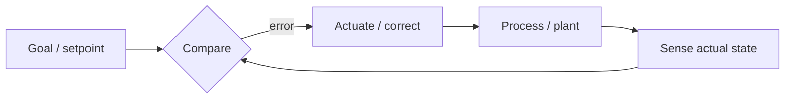

# Cybernetics (Wiener)

Norbert Wiener's 1948 book (second edition 1961) founded **cybernetics** — the science of *control and communication in the animal and the machine*, which is exactly what its subtitle promises. Wiener's thesis is that steering a system, whether a nervous system, a servo, or an economy, is fundamentally the same problem regardless of the medium: it is the management of **feedback** and **information** to hold behavior on course against disturbance. It is the naming work and the founding statement for the tradition that HAL's harness thinking draws on; W. Ross Ashby's [An Introduction to Cybernetics](introduction-to-cybernetics.md) is the textbook that follows and sharpens it.

## Feedback is the central idea

Wiener's core mechanism is the **negative-feedback loop**: a system senses the gap between its actual state and its goal, and acts to shrink that gap. This closed loop — measure, compare to a setpoint, correct, measure again — is what lets a governor hold an engine's speed, a hand reach for a glass, or a thermostat hold a room's temperature. Wiener drew the analogy explicitly between biological regulation (homeostasis, purposeful movement) and engineered control (servomechanisms, anti-aircraft fire control, the problem that seeded the whole field during WWII).

Too much feedback, or feedback delayed, produces **oscillation and instability** — Wiener treats the pathology as seriously as the mechanism, which is why cybernetics is as much about *when control fails* as about how it works.

## Information, entropy, and noise

Wiener frames control as inseparable from **information**: to correct you must first measure, and measurement is the acquisition of information about the system's state. He connects this to statistical mechanics — information as negative entropy, a measure of order pulled against the world's tendency toward disorder — and to the problem of **filtering signal from noise**, the prediction-and-smoothing theory he developed in parallel with Shannon's information theory. A regulator is, in this light, an information processor operating under noise.

## Why it matters here

Cybernetics is the intellectual origin of treating an AI-assisted development process as a **regulated system**. An agent harness is a negative-feedback loop in Wiener's exact sense: it senses the state of the codebase (tests, type checks, [Code Health](code-simplicity.md), reviews), compares against the desired state, and drives corrective change — the "cybernetic governor" framing that runs through the [harness-engineering](agent-harness-engineering.md) notes. Wiener supplies the *why feedback works*; Ashby's [Law of Requisite Variety](introduction-to-cybernetics.md) supplies the *hard limit on how well* it can work. Wiener's warning about instability from excessive or delayed feedback is also the reason a harness must be tuned, not merely present — a loop that overcorrects is worse than none.

## References

- [Cybernetics: or Control and Communication in the Animal and the Machine — Norbert Wiener (MIT Press, 2nd ed.)](https://mitpress.mit.edu/9780262730099/cybernetics/)
