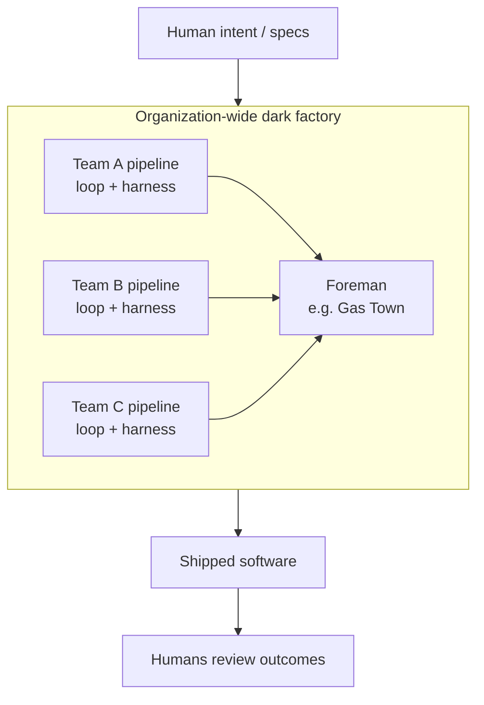

# Dark Factory

**The end state of [loop engineering](loop-engineering.md): software production
that runs with the lights off.** Autonomous agents build, test, and ship around
the clock; humans define **intent** and review **outcomes**, not code. Named
after manufacturing's *lights-out* factories — FANUC's plant where robots build
robots in the dark. Dan Shapiro puts it as the top rung of a five-level autonomy
ladder: *"At level 5, it's not really a car any more… It's a black box that
turns specs into software."*

Real for a handful of tiny elite teams; **contested as a general model.**

## The clearest example: StrongDM

Charter is blunt: *"code must not be written by humans"* and *"code must not be
reviewed by humans."* CTO Justin McCarthy's provocative gauge: *"If you haven't
spent at least $1,000 on tokens today per human engineer, your software factory
has room for improvement."*

With no line-by-line review, **trust is engineered in elsewhere**: agents prove
each change against a **"Digital Twin Universe"** of services (Okta, Slack,
etc.), backed by layered verification, red-team agents, and full traceability of
every action to a human-defined intent.

## Why it matters: effort relocates

The defining shift isn't the *absence* of humans but the **relocation** of their
effort — away from writing and reviewing code, toward two scarce skills:

1. **[Harness engineering](harness-engineering.md)** — architecting the factory.
2. **"Intent thinking"** — stating precisely enough what *correct* looks like
   that a [spec](spec-driven-development.md) can carry it.

## It scales by composition

The natural shape is a **factory of pipelines**: each team runs its own pipeline
(a [loop](loop-engineering.md) + a [harness](harness-engineering.md) on its
project), and those compose into one org-wide factory. Orchestration frameworks
like Steve Yegge's **Gas Town** — a "coding agent factory" coordinating many
agents under a single foreman — reach for exactly this. That makes the dark
factory as much an **org-scaling** question as an individual practice.

## The most contested pattern — two fronts

- **Does it generalize?** Credible examples are *tiny* teams — StrongDM's
  factory was described by just **three engineers**. Spotify is factory-adjacent
  (engineers reportedly not writing code since Dec 2025, ~650 agent PRs/month;
  consultancies claim 3–5× gains), but most other claims are **experiments**,
  not steady state.
- **Can it be trusted?** With no human in the code path, safety rides entirely
  on engineered verification. Simon Willison warns of the **lethal trifecta**
  compounding into an "AI Challenger disaster" — *"built by agents, tested by
  agents, trusted by whom?"*

## Related

- [Loop Engineering](loop-engineering.md) — the dark factory is its end state.
- [The Autonomy Ladder](autonomy-ladder.md) — the rungs leading up to it.
- [The AI Factory Stack](ai-factory-stack.md) — the components inside such a
  factory.
- [Five Engineering Archetypes](five-engineering-archetypes.md) — how roles
  shift when humans stop writing code.

## References
- [Dark Factory — Tessl Patterns](https://tessl.io/patterns/agentic-development-workflow/dark-factory/)
