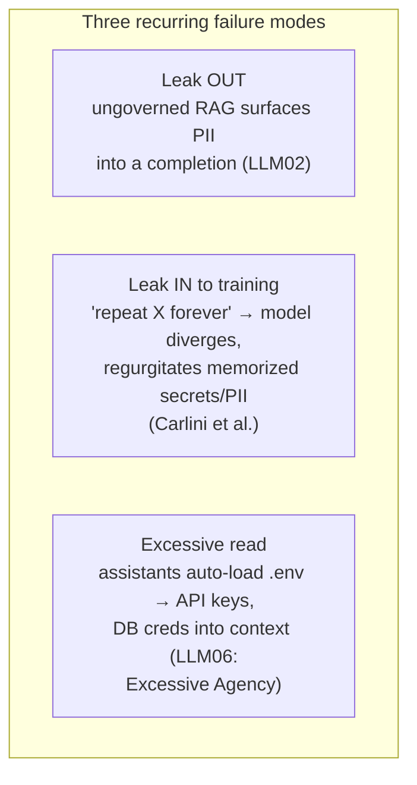

# Data Governance

The **organization-level** discipline of controlling **what data agents can see,
send, and learn from**: which repositories, secrets, and customer data reach
which models and tools, where prompts and outputs are retained, and what may
leave the boundary. It's the **policy layer above** the platform's technical
controls — the policy that the [guardrails proxy](guardrails-proxy.md) and
[agent identity](agent-identity-access.md) layers *enforce*.

The exposure is **rarely dramatic — it hides in ordinary, useful work.**
Whitenack (Prediction Guard): a RAG system pulls a support ticket into a prompt
to ground an answer, the ticket carries an employee's email + address, and *"all
of a sudden you've just doxed your employee."* The leak comes from the system
**working as designed**, not from an attacker. OWASP codifies this as **LLM02:
Sensitive Information Disclosure.**

## Three failure modes

Agents are **data-movement machines** — every prompt may ship context to a
third-party model, every tool call may reach sensitive systems.

- **Leak *out*** — ungoverned retrieval surfaces PII into a completion (the
  RAG-doxing case, **LLM02**).
- **Leak *in* to training** — prompting a production model to "repeat the word X
  forever" made it diverge and regurgitate memorized training data (verbatim
  secrets, PII) — so **what an org allows to be trained on is itself a governance
  decision.**
- **Excessive read** — coding assistants observed auto-loading local `.env`
  files, pulling API keys and DB credentials into context without an explicit
  prompt. OWASP: **LLM06: Excessive Agency** — more autonomy/reach = more a
  single bad instruction can move.

Governance decides, **before any of this runs**, which data classes are in
bounds for which model and tool.

## The honest tension: governance fights usability

Every safeguard bolted around the model adds **latency and friction** — a PII
filter, a factual-consistency check, a prompt-injection classifier each cost
time, traded off against the model call itself. **Lock data down too hard and
people route around it** with personal accounts and shadow tools; **leave it
open and you ship secrets to a vendor's logs.** The balance is the discipline.

## Related

- [Guardrails Proxy](guardrails-proxy.md) / [Agent Identity & Access](agent-identity-access.md)
  — the technical layers that *enforce* this policy.
- [AI Code Security](ai-code-security.md) — the `.env` / secret-exposure overlap.
- [Six Layers for AI Governance](six-layers-ai-governance.md) /
  [AI Governance by Design](ai-governance-by-design.md) — the broader governance
  frame; this is its data slice.

## References
- [Data Governance — Tessl Patterns](https://tessl.io/patterns/scaling-the-org/data-governance/)
