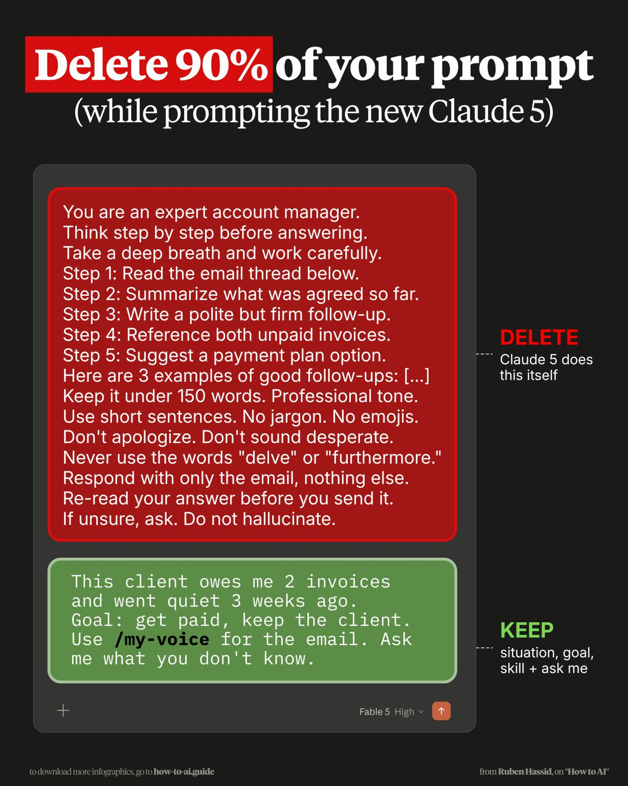

# Delete 90% of Your Prompt (with Claude 5)

An argument (Ruben Hassid, "How to AI") that newer models (Claude 5 / Fable 5) make most
prompt boilerplate unnecessary — delete the scaffolding, keep the substance.

**Delete** (Claude 5 does this itself): role priming ("You are an expert account
manager"), "think step by step", "take a deep breath", explicit step-by-step
decomposition, few-shot examples, tone/length rules ("under 150 words", "no jargon", "no
emojis"), banned-word lists ("never use 'delve' or 'furthermore'"), "re-read your answer",
"don't hallucinate."

**Keep:** the **situation**, the **goal**, the **skill** to use, and **ask me what you
don't know**. Example that survives:

> This client owes me 2 invoices and went quiet 3 weeks ago. Goal: get paid, keep the
> client. Use `/my-voice` for the email. Ask me what you don't know.

The shift: capabilities that used to be prompted (reasoning, formatting, style) are now
built in, so the prompt should carry only context the model *can't* infer.

## Cross-links

The model-side complement to voice/skills files in
[How to Build Your Claude "Clone"](build-your-claude-clone.md) and
[Four Files to Save You Two Hours a Day](four-files-ai-workflow.md) (`/my-voice`, Skills);
contrast with the heavier [XML Prompt Scaffold](xml-prompt-scaffold.md), which still
fences rules explicitly for higher-stakes coding work.

## References

- 
