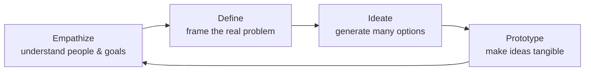

# Design It! From Programmer to Software Architect

Michael Keeling's *Design It!* (Pragmatic Bookshelf, 2017) reframes software architecture
as a hands-on, team-owned activity rather than a title held by one person. Its central
claim: every developer already makes design decisions, so every developer can grow into an
architect. The book fuses classic architecture rigor with the human side of design
thinking, treating the building of software as an intensely social act.

## Architecture as significant design decisions

Architecture is not diagrams or a document — it is the set of design decisions that are
hard to change and expensive to get wrong. These are the choices about structure,
patterns, and technology that shape everything built on top of them. The architect's job
is to make the *significant* decisions deliberately (and defer the rest to the people
writing code), so the team spends its limited "decide early" budget only where the cost of
being wrong is high. This is the same instinct behind stable boundaries in
[clean architecture](clean-architecture.md): protect the decisions that ripple.

## Risk-driven design: how much to design up front

Rather than choosing dogmatically between big-up-front-design and no-design-at-all, Keeling
asks a sharper question — *how much design does this project's risk justify right now?*
You design to reduce the failures you most fear, and you stop when the remaining risk is
acceptable. A design that merely *satisfices* (good enough to meet the real constraints)
beats a perfect design delivered too late. Practically:

- List the risks — the things that could make the system fail to meet its goals.
- Design to burn down the biggest risks first.
- Stop designing when the leftover risk is tolerable, and let the code decide the rest.

## Quality attributes and architecturally significant requirements (ASRs)

Functional requirements say *what* the system does; **quality attributes** say *how well* —
performance, availability, security, modifiability, usability, and so on. Architecture is
driven far more by quality attributes than by features, because it's the qualities that
force structural trade-offs. The subset of requirements, constraints, and quality
attributes that genuinely shape the architecture are the **architecturally significant
requirements (ASRs)**. Keeling makes qualities testable by pinning each to a concrete
**response measure** (a scenario with a stimulus and a measurable expected response), and
collects them in an **ASR workbook**. Constraints (fixed technology, deadlines, mandated
standards) are treated as pre-made decisions that shrink the option space.

## The design mindset (design thinking)

Keeling imports the four principles of design thinking — be **human-centered**, keep
**exploration open**, treat design as an **iterative** process, and make ideas
**tangible**. From this flow four mindsets the architect moves between:

- **Empathize** — talk to stakeholders, build a stakeholder map, surface the business
  goals the architecture must serve.
- **Define** — narrow the problem and the ASRs so you know what you're actually solving.
- **Ideate** — diverge to see many options before you converge on a decision.
- **Prototype** — turn ideas into something concrete (a model, a spike, a diagram) that
  can be tested and reacted to.

## Architecture activities and the think–do–check loop

The work itself runs as a continuous loop — **Think, Do, Check** — not a phase gate. You
*think* about what design problem to attack, *do* a focused design activity to make
progress, then *check* whether it moved you closer to a good-enough design, and repeat.
The book's Part III is a large toolbox of concrete activities slotted into three buckets:

- **Understand the problem** — empathy maps, GQM workshops, stakeholder interviews,
  quality-attribute webs, mini quality-attribute workshops.
- **Explore solutions** — CRC cards, event storming, divide-and-conquer, whiteboard jams,
  round-robin design, architecture flipbooks.
- **Make the design tangible** — architecture decision records, architecture haiku,
  context diagrams, prototypes, modular decomposition diagrams.

## Patterns as a starting foundation

Architecture patterns give a proven starting structure: Layers, Ports-and-Adapters,
Pipe-and-Filter, Service-Oriented, Publish-Subscribe, Shared-Data, Multi-Tier — and the
anti-pattern Big Ball of Mud. Patterns are a foundation to adapt, not a finish line. Event
storming and CRC-card exercises overlap heavily with [domain-driven design](domain-driven-design.md),
which the book leans on for discovering elements and responsibilities.

## Modeling with views

Because a whole architecture won't fit in one picture, you model it through multiple
**views**, each answering the concerns of a particular audience — a module/decomposition
view for developers, a runtime/component-and-connector view for behavior, an
allocation/deployment view for operations. Keeling separates the underlying **meta-model**
(the concepts and relationships you reason about) from the **diagrams** that project it,
and pushes toward embedding models directly in the code so they don't drift. Good diagrams
follow simple discipline: a legend, consistent notation, and one clear message each.

## Design studio and architecture decision records

The **architecture design studio** is a facilitated, collaborative working session — the
team designs *together* at the whiteboard rather than receiving a design from an architect.
Planning it means picking the right activities, inviting the right participants, and
actively managing the group (including remote teams). This is how architectural skill
spreads across a team: create safe practice, delegate design authority, and let more people
own significant decisions.

Decisions are captured in **Architecture Decision Records (ADRs)** — short, durable notes
that record the decision, its context, and its rationale (including the *paths not taken*).
An ADR answers "why is it this way?" long after the whiteboard is erased, and pairs with
lighter artifacts like the one-page **architecture haiku** for describing the system to
others. Growing this kind of judgment across a team is exactly the deliberate-practice
theme of [learning the craft](learning-the-craft.md).

## References

- [Design It! From Programmer to Software Architect — Pragmatic Bookshelf](https://pragprog.com/titles/mkdsa/design-it/)
