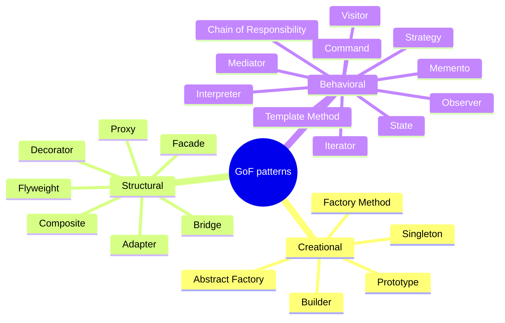

# Design Patterns: Elements of Reusable Object-Oriented Software

The 1994 book by Erich Gamma, Richard Helm, Ralph Johnson, and John Vlissides — the
"Gang of Four" (GoF) — cataloged 23 recurring solutions to object-oriented design
problems and gave the industry a shared vocabulary. Its lasting contribution is less the
individual patterns than the *idea* of a pattern: a named, reusable solution to a
problem that recurs in a context, described so designers can recognize and discuss it.

## The two organizing principles

Underneath every pattern the book argues for two design maxims:

- **Program to an interface, not an implementation.** Depend on abstract types, not
  concrete classes, so implementations can vary behind a stable contract. This is
  [Parnas information hiding](parnas-decomposing-systems-into-modules.md) applied at the
  class level.
- **Favor object composition over class inheritance.** Composition assembles behavior
  from parts at runtime and avoids the rigid, deep hierarchies that inheritance
  encourages. Inheritance is "white-box" reuse (it exposes internals); composition is
  "black-box" reuse.

## The catalog, by purpose

The 23 patterns fall into three families:

- **Creational** — how objects get made, decoupling clients from concrete construction
  (Factory Method, Abstract Factory, Builder, Prototype, Singleton).
- **Structural** — how objects and classes compose into larger structures (Adapter,
  Bridge, Composite, Decorator, Facade, Flyweight, Proxy).
- **Behavioral** — how objects distribute responsibility and communicate (Strategy,
  Observer, Command, State, Template Method, Iterator, Visitor, Mediator, Memento,
  Chain of Responsibility, Interpreter).

Each pattern is documented in a fixed template — Intent, Motivation, Applicability,
Structure, Participants, Consequences — so the *tradeoffs* are explicit, not just the
mechanics.

## How to read it today

The patterns are a vocabulary and a set of tradeoffs, not a checklist to apply
everywhere. The common failure mode is pattern *overuse* — reaching for Abstract Factory
or Visitor where a plain function or a bit of composition would do, which adds the
indirection without the change it was meant to absorb. Use a pattern when the change it
localizes is one you actually expect; otherwise it is speculative abstraction.

## Related notes

- [Parnas — Decomposing Systems into Modules](parnas-decomposing-systems-into-modules.md)
  — "program to an interface" is information hiding at the class boundary.
- [Refactoring: Improving the Design of Existing Code](refactoring-improving-the-design-of-existing-code.md)
  — Fowler's refactorings often move code *toward* these patterns in small steps.
- [Clean Code](clean-code.md) and [Clean Architecture](clean-architecture.md) — build on
  the same abstraction and dependency-direction ideas.
- [Patterns of Enterprise Application Architecture](patterns-of-enterprise-application-architecture.md)
  — Fowler's later catalog, same "named solution" format at the application scale.
- [A Philosophy of Software Design](a-philosophy-of-software-design.md) — cautions
  against the indirection these patterns can introduce when misapplied.

## References

- [Design Patterns: Elements of Reusable Object-Oriented Software](https://www.oreilly.com/library/view/design-patterns-elements/0201633612/)
