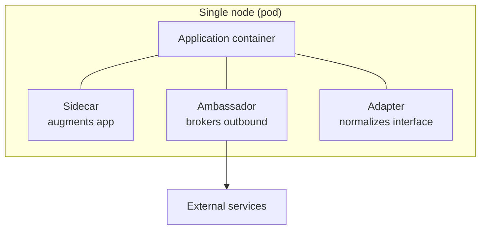

# Designing Distributed Systems

Brendan Burns's 2018 book (associated with Joe Beda and Kelsey Hightower's Kubernetes work) does for distributed systems what the Gang of Four did for object-oriented code: it names a **catalog of reusable patterns**, made practical by the rise of containers as the reusable unit of composition. The argument is that most distributed systems are built from scratch and end up unique for no good reason; a shared vocabulary of patterns and shared containerized components make reliable systems dramatically faster to build. It is kept here as the pattern language underneath [Kubernetes: Up and Running](kubernetes-up-and-running.md), and its patterns map directly onto how agents and their harnesses are wired together.

## Single-node patterns (containers on one machine)

These compose several containers colocated on one node, each doing one job:

- **Sidecar** — a helper container attached to the main application container to extend it without modifying it: adding HTTPS to a legacy service, log shipping, config sync. The application stays ignorant; the sidecar handles the cross-cutting concern.
- **Ambassador** — a proxy container that brokers the application's connection to the outside world: sharding a request across database replicas, service discovery, rate limiting. The app talks to `localhost`; the ambassador owns the messy routing.
- **Adapter** — a container that normalizes the application's heterogeneous output to a uniform external interface (e.g. exposing metrics in a standard format regardless of the app's native format).

## Multi-node and batch patterns

- **Replicated / sharded services** — loosely coupled multi-node patterns for scaling and availability, including scatter/gather.
- **Scatter-gather** — fan a single request out to many workers in parallel, then combine their partial results into one response (the search-index query shape). Trades computation width for latency.
- **Work queue** — a batch pattern: a queue of independent work items drained by a pool of interchangeable workers, giving elastic throughput and natural retry semantics.
- **Event-driven and coordinated workflows** — larger batch-processing compositions built from the above.

## Why it matters here

These patterns are the connective tissue of agent architecture. A tool-use proxy or a policy-enforcing wrapper around an agent is a **sidecar/ambassador**; multi-agent fan-out-then-synthesize is **scatter-gather**; a backlog of tasks drained by a pool of agents is a **work queue**. Naming them gives HAL precise language for wiring agents together, and it connects to the messaging and resilience patterns cataloged in [Enterprise Integration Patterns](enterprise-integration-patterns.md) and the [System Design Master Tree](system-design-master-tree.md). Same authorship and lineage as [Kubernetes: Up and Running](kubernetes-up-and-running.md) — the reconciler runs the controllers, these patterns shape what the controllers manage.

## References

- [Designing Distributed Systems — Brendan Burns (O'Reilly, 2018)](https://www.oreilly.com/library/view/designing-distributed-systems/9781491983638/)
