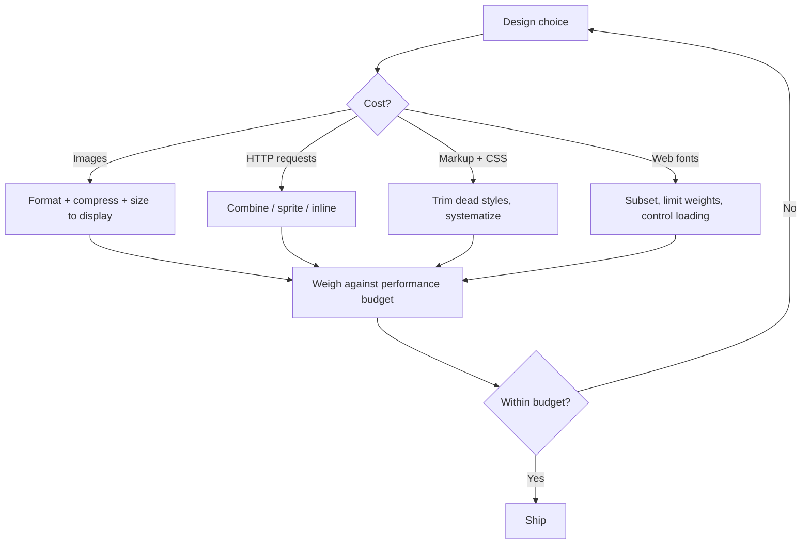

# Designing for Performance

Lara Callender Hogan's *Designing for Performance: Weighing Aesthetics and Speed*
(O'Reilly, First Edition, 2014) argues that page speed is a **design concern**, not
something to bolt on at the end of engineering. Every aesthetic decision — an image, a
web font, a decorative flourish — carries a cost in bytes and load time, and that cost
is paid by the user. The designer who ignores it is designing only half the experience.

## Performance is a design decision, not an afterthought

The book's central reframe: "great performance is good design." Content, layout,
imagery, and interactivity all engage an audience, and each also inflates page weight
and load time. Because designers choose those elements, designers own part of the
performance outcome. Treating speed as an engineering cleanup step means the expensive
choices are already locked in by the time anyone measures them. Hogan's remedy is to
put page speed *into the design process*, early, while mockups and code are still
fluid enough to change cheaply.

This is a usability argument as much as a technical one — slow pages frustrate and lose
users, which connects directly to the friction-reduction thinking in
[Don't Make Me Think](dont-make-me-think.md): a page the user has to wait for is a page
that makes them think about the wait.

## The aesthetics-vs-speed tradeoff

The core tension is that the things that make a page beautiful are usually the things
that make it slow. Rather than treating this as a zero-sum fight, Hogan frames it as a
series of *informed tradeoffs*: test and benchmark which design choices actually matter
to users, then spend your byte budget on those and trim the rest. The goal is not the
fastest possible page or the prettiest possible page, but the best experience per byte.

## What actually costs bytes, and how to trim it

Hogan walks through the concrete levers a designer controls:

- **Images.** Usually the single largest contributor to page weight. Choose the right
  format for the content, compress aggressively, strip metadata, and serve images sized
  for how they're actually displayed. Consider CSS, sprites, icon fonts, or SVG in place
  of raster images where possible.
- **HTTP requests.** Every asset is a round trip, and round trips dominate load time
  especially on high-latency mobile/cellular networks. Fewer requests beats smaller
  files up to a point — combine, sprite, and inline where it helps.
- **Markup and CSS.** Clean, lean HTML and CSS render faster and weigh less. Remove
  dead styles, avoid over-nesting, and prefer reusable, systematic styling over one-off
  declarations — the same discipline a utility-first system encodes in
  [Modern CSS with Tailwind](modern-css-with-tailwind.md).
- **Web fonts.** Custom fonts are a common hidden tax: extra requests, large files, and
  render-blocking behavior that can hide or reflow text. Subset them, limit weights and
  styles, and decide deliberately whether the typographic gain is worth the delay.

## The performance budget

The organizing idea that ties the tactics together is the **performance budget**: an
agreed-upon ceiling — total page weight, number of requests, or a target load time —
that every new design decision must fit inside. A budget turns "is this image worth it?"
from a vague debate into an accounting question: adding this asset means cutting that one.
It makes the aesthetics-vs-speed tradeoff explicit and shared rather than left to
whoever happens to notice the page got slow.

Setting budgets per breakpoint supports a **mobile-first** approach, where the tightest
constraints (small screens, slow networks) shape the baseline and richer experiences are
layered on only where the budget allows.

## Measuring and communicating performance

You can't manage what you don't measure. Hogan covers the tooling for benchmarking real
page behavior — how browsers retrieve and render content, and how to test which choices
matter — but stresses that the numbers are only useful if they're *communicated*. Making
performance visible (dashboards, before/after comparisons, framing speed in terms of user
and business impact) is what moves it from one engineer's private concern to a shared
goal. This measurement-and-communication emphasis pairs with the broader treatment of
web speed in [Rethinking Performance](rethinking-performance.md).

## Building a culture where speed is a feature

The book's final ambition is organizational: performance sticks only when the whole
company treats speed as a feature rather than a nice-to-have. That means building
awareness across design, engineering, and product; wiring performance goals into the
process (budgets, reviews, monitoring); and celebrating speed wins the way you'd
celebrate any other user-facing improvement. Individual optimizations decay; a culture
that values performance keeps the pages fast over time.

## References

- [Designing for Performance — O'Reilly](https://www.oreilly.com/library/view/designing-for-performance/9781491902899/)
