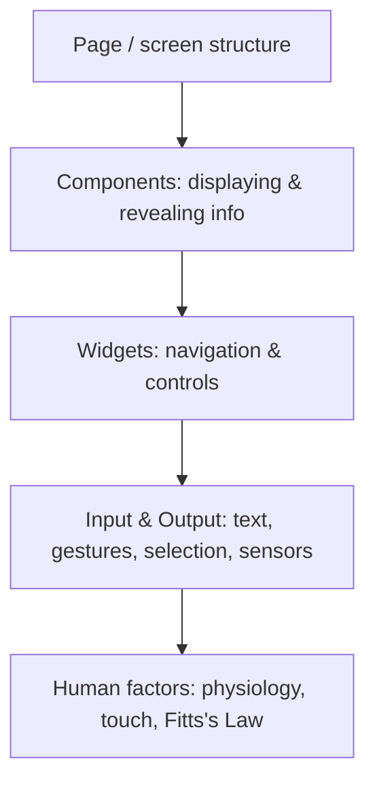

# Designing Mobile Interfaces

A pattern library for mobile user interfaces by Steven Hoober and Eric Berkman
(O'Reilly, 2011). Its premise is that mobile interaction design has recurring,
well-tested solutions, and that a designer should reach for a documented **pattern**
rather than reinventing an interaction each time. Each pattern is a reusable solution
to a recurring problem, described with the context in which it works, its variations,
and the tradeoffs and pitfalls that come with it — the same "problem / solution /
context" spirit as classic architectural pattern languages, applied to small screens.

The book's stance is deliberately **device-agnostic**. It resists tying advice to a
single OS or to pixel-perfect layouts, arguing that phones and feature phones share far
more interaction concepts than their surface differences suggest. A pattern that is
correct is correct whether it ships as a native app or a mobile website, and most of the
~70+ patterns are meant to be universal, with notes on how to adapt them when hardware
or form factor forces a variation. This is why the interaction patterns have aged well
even though the book predates the mature iOS Human Interface Guidelines and Google's
Material Design: it documents *why* an interaction works (grounded in wayfinding,
Norman's interaction model, Fitts's Law, and human physiology) rather than a specific
platform's chrome.

## How the patterns are organized

The catalog is grouped from the whole screen down to individual inputs:

- **Page** — composition of a whole screen: how the screen is framed and wrapped, and
  where persistent furniture goes. Patterns cover scrolling, the annunciator/status row,
  notifications, titles, revealable and fixed menus, home/idle and lock screens,
  interstitials, and advertising placement.
- **Components (display of information)** — arranging content on a small canvas:
  vertical lists, infinite (endlessly paging) lists, thumbnail and fisheye lists,
  carousels, grids, film strips, slideshows, infinite scrollable areas, and select
  lists. A companion group covers **control and confirmation** — confirmation dialogs,
  sign-on, exit guards, cancel protection, and timeouts — and **revealing more
  information** — windowshades, pop-ups, hierarchical lists, and returned results.
- **Widgets** — navigation and controls: **lateral access** (tabs, peel-away, simulated
  3D, pagination, "location within") and **drilldown** (links, buttons, indicators,
  icons, stacks, annotations), plus labels/indicators (avatars, tooltips, wait
  indicators, reload/sync/stop) and information controls (zoom & scale, location jump,
  search-within, sort & filter).
- **Input and Output** — the hardest part on a phone: text and character entry
  (keyboards/keypads, pen input, mode switches, input-method indicators, autocomplete &
  prediction), general interactive controls (directional entry, press-and-hold, focus &
  cursors, hardware keys, accesskeys, the dialer), and — notably for its time — a full
  treatment of **gestures**: on-screen gestures, kinesthetic (device-motion) gestures,
  and remote gestures. Selection and input widgets round this out.
- **Human factors (appendix)** — the reasoning layer: physiology, hearing, brightness
  and contrast, general touch-interaction guidelines, and Fitts's Law (targets that are
  bigger and closer are faster to hit — the basis for touch-target sizing).

## Why it still holds up

The value is in the durable interaction ideas, not the 2011 hardware. Recurring themes
— design mobile-first because many users only ever see your product on a phone; protect
against costly mistakes on a device that's easy to fumble (cancel protection, exit
guards, confirmations); minimize typing because text entry is slow and error-prone
(prediction, autocomplete, sensible keyboards); and make targets forgiving to the thumb
— are now baked into every modern mobile guideline. Reading it as a *pattern vocabulary*
still pays off; reading it as a spec for current OS behavior does not.

This complements [Don't Make Me Think](dont-make-me-think.md): where Krug argues for
self-evident, low-effort interfaces in general, this book supplies the concrete,
context-tested mobile patterns that make an interface self-evident on a small
touchscreen.

## References

- [Designing Mobile Interfaces — O'Reilly](https://www.oreilly.com/library/view/designing-mobile-interfaces/9781449318451/)
