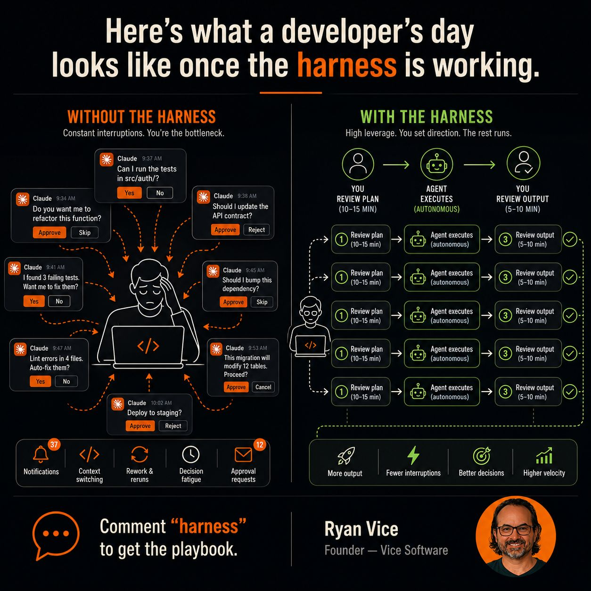

# A Developer's Day With the Harness

A before/after contrast (Ryan Vice, Vice Software) of what a developer's day looks like
once the agent harness is working.

## Without the harness

Constant interruptions — you are the bottleneck. The agent pings for approval on every
step: "Can I run the tests?", "Should I update the API contract?", "Found 3 failing
tests, want me to fix them?", "This migration will modify 12 tables. Proceed?" The costs:
context switching, rework & reruns, decision fatigue, a pile of approval requests (37
notifications, 12 approvals).

## With the harness

High leverage — you set direction, the rest runs. The loop is **you review plan
(10–15 min) → agent executes autonomously → you review output (5–10 min)**, repeated
across many parallel tasks. Payoffs: more output, fewer interruptions, better decisions,
higher velocity.

## Cross-links

The concrete daily-workflow payoff of the architecture in
[Agent Harness Engineering](agent-harness-engineering.md): orchestration + verification
mean the human reviews plan and output, not every intermediate tool call.

## References

- 
