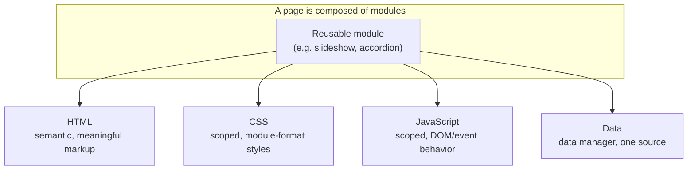

# Developing Large Web Applications

Kyle Loudon's *Developing Large Web Applications* (O'Reilly, 2010) is a book-length
argument that a website is a piece of software, and that a large one has to be
engineered with the same discipline as any other large system. Loudon wrote it out of
his work on Yahoo!, one of the biggest web properties of its era, so the running concern
throughout is what happens when a site keeps growing: features pile up, teams grow,
and the codebase that was fine at ten pages becomes unworkable at a thousand.

The book predates the modern single-page-application world — React, Vue, component
frameworks, and build toolchains didn't exist yet — so its concrete stack (server-rendered
PHP pages, hand-written CSS, DOM-manipulation JavaScript, XHTML/RDFa) reads as dated.
But that's a surface detail. The underlying principles — modularity, loose coupling,
clear interfaces, and consistency — are the durable content, and they map cleanly onto
today's component architectures. The tools changed; the reasons for the tools didn't.

## The central problem: complexity as the site grows

Loudon opens with the observation that the enemy of a growing application is complexity,
and that complexity is not a bug you fix once but a force you manage continuously.
Left alone, growth means complexity, and complexity means decay. The whole book is a
set of techniques for keeping that force in check so the site can keep growing without
collapsing under its own weight — the same motivation behind [Code Simplicity](code-simplicity.md),
which frames managing complexity over time as the core work of software.

The book's answer is a single strategy applied everywhere: **build the big thing out of
small, self-contained things that each work on their own.** A large system that works is
almost always one assembled from simple systems that work.

## Modularity across the whole stack

The distinctive move in the book is to insist that modularity is not a backend concern —
it belongs at every layer, including the parts of the stack that are usually written as an
undisciplined afterthought. A module (a slideshow, an accordion, a navigation block) is
treated as a unit that owns its own markup, styling, behavior, and data, and that can be
dropped onto any page without special-casing.

- **HTML** — write semantically meaningful markup rather than layout-driven tables and
  presentational tags. Markup describes *what* the content is; appearance is left to CSS.
  Consistent naming conventions for IDs, classes, and names make the markup predictable
  and let CSS and JavaScript hook into it reliably.
- **CSS** — scope styles to modules so a module's rules can't leak out and clobber the
  rest of the page (and the page can't reach in and break the module). Loudon leans on
  standard module formats, deliberate use of specificity, and baseline resets and font
  normalization to tame cross-browser inconsistency. This is the pre-framework ancestor
  of CSS Modules, BEM, and scoped/styled components.
- **JavaScript** — scope behavior the same way, keep data on objects rather than in
  global variables, and normalize event handling across browsers. The event-driven,
  object-oriented style he pushes is the direct predecessor of component state and
  handlers in today's frameworks.
- **Data** — put a *data manager* between a module and its source so the module doesn't
  care whether the data came from SQL, XML, a web service, JSON, cookies, or a form.
  The source can change without the module changing.

## Loose coupling and clear interfaces between layers

The reason modules can be composed freely is that each one exposes a **clear interface**
and hides its implementation behind it. Loudon is explicit about this: his PHP `Page`
and `Module` classes, and his Ajax MVC objects, are each described as a *public
interface*, an *abstract interface*, and then an *implementation*. Callers depend only
on the interface; the implementation is free to change.

This separation of interface from implementation, and of concerns across layers, is the
same principle that [Clean Architecture](clean-architecture.md) formalizes with its
dependency rule — stable boundaries so that details (a database, a rendering technique,
a browser quirk) can be swapped without rippling through the system. Loudon arrives at
the same place from the front-end side: markup, style, behavior, and data are separated
so that a change in one doesn't force changes in the others.

His Ajax chapter pushes this further with an MVC split — model, view, and controller
objects each with their own public/abstract interface — so that asynchronous
interactions are structured rather than ad hoc.

## Consistency and conventions

A recurring theme is that convention is what makes a large codebase navigable. Naming
schemes for HTML IDs and classes, standard formats for CSS modules, a uniform way of
generating pages and modules in PHP — these aren't aesthetic preferences, they're what
lets many people work on the same system without each reinventing structure. Consistency
lowers the cost of understanding any given piece, which is precisely what keeps
complexity manageable as the team and codebase scale.

## Performance and maintainability at scale

The later chapters treat performance and maintainability as first-class, structural
concerns rather than last-minute tuning:

- **Performance** — caching CSS, JavaScript, modules, pages, and Ajax responses; using
  Expires headers; placing and minifying JavaScript; removing duplicate code; serving
  assets from a CDN; minimizing DNS lookups and HTTP requests. Many of these are the
  classic Yahoo! front-end performance rules of the era, and they hold up as fundamentals
  even where the specifics (HTTP request counts, DNS costs) have shifted with HTTP/2+.
- **Maintainability** — the closing *Application Architecture* chapter is about organizing
  modules sitewide, per-section, and per-page, and about surviving change: reorganizing
  where modules are used, adding module variations, making widespread changes, swapping
  data sources, and exposing modules externally. The payoff of all the earlier modularity
  work is that these large edits stay localized instead of turning into sitewide rewrites.

## Why it still matters

Read today, the value isn't the PHP or the DOM code — it's the demonstration that the
maintainability disciplines usually reserved for backend systems apply just as hard to
the front end, and that treating markup, styles, and scripts as engineered modules with
interfaces is what lets a web application grow without decaying. The frameworks we now
use bake many of these ideas in by default; the book is a clear look at *why* they're
built that way.

## References

- [Developing Large Web Applications — O'Reilly](https://www.oreilly.com/library/view/developing-large-web/9780596806156/)
