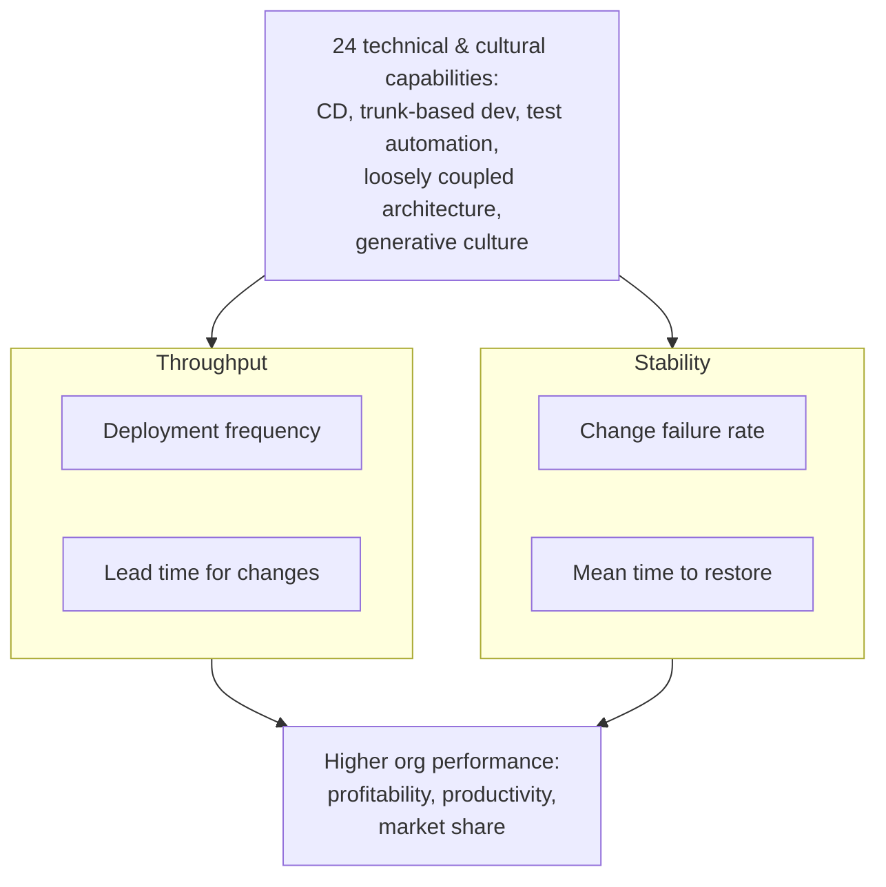

# Accelerate: The Science of Lean Software and DevOps

Nicole Forsgren, Jez Humble, and Gene Kim (IT Revolution, 2018). The book that
took software-delivery folklore and turned it into science. Drawing on years of
the *State of DevOps* survey data (tens of thousands of respondents), the authors
use rigorous statistical methods — cluster analysis, structural equation modeling
— to show that how you deliver software *causes* better organizational outcomes,
not merely correlates with them.

## The four key metrics (DORA metrics)

The central finding: software delivery performance is captured by exactly four
measures, and they do not trade off against each other. High performers are fast
*and* stable — the supposed speed/quality tension is false.

- **Deployment frequency** — how often you release to production. Throughput.
- **Lead time for changes** — time from code committed to code running in
  production. Throughput.
- **Change failure rate** — the percentage of deployments that cause a failure
  requiring remediation. Stability.
- **Mean time to restore (MTTR)** — how long to recover from a production failure.
  Stability.

Two throughput measures, two stability measures. Elite teams beat low performers
on all four simultaneously, sometimes by orders of magnitude.

## What drives the metrics

The four outcomes are produced by ~24 measurable capabilities across continuous
delivery (version control for everything, deployment automation, trunk-based
development, comprehensive test automation, shift-left on security),
architecture (loosely coupled, teams can deploy independently), lean product
management (small batches, fast feedback), and culture (Westrum's *generative*
culture predicts performance). Notably, these are capabilities you can invest in
and improve — not fixed traits.

## Why it matters

The four key metrics are the empirical backbone of modern delivery measurement and
appear throughout HAL's productivity thread: see
[Developer Productivity with Nicole Forsgren](../ai-org/developer-productivity-with-nicole-forsgren.md)
(the same author's later, richer framing), [Effective DevOps](effective-devops.md),
and [Software Development Metrics](../process-and-teams/software-development-metrics.md). The AI era
strains these metrics — deploy frequency now measures tool adoption as much as team
maturity — which is exactly the caution raised in
[Does AI Boost Developer Productivity?](../ai-org/does-ai-boost-developer-productivity.md) and
[software engineering metrics AI broke](../ai-org/software-engineering-metrics-ai-broke.md).
Contrast with the per-developer counting critiqued in [Codermetrics](../ai-org/codermetrics.md).

## References

- [Accelerate — IT Revolution](https://itrevolution.com/product/accelerate/)
